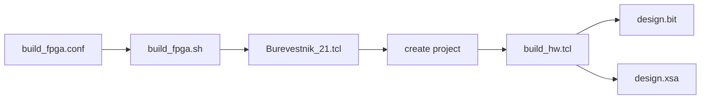

# Сборка аппаратной платформы FPGA

Скрипты каталога создают Vivado project, выполняют implementation и экспортируют
два артефакта, которые используют FreeRTOS и Neutrino:

| Артефакт | Путь по умолчанию | Назначение |
|---|---|---|
| bitstream | `artifacts/fpga/design.bit` | программирование PL |
| hardware export | `artifacts/fpga/design.xsa` | Vitis platform и target build |

## 1. Требования

Нужны Vivado, hardware repository и Tcl-проект `Burevestnik_21.tcl`:

```text
<workspace>/hw_platform/fpga/Burevestnik_21.tcl
<workspace>/bvstk/scripts/fpga/build_fpga.sh
```

При другой структуре каталогов путь задаётся через `FPGA_DIR` в конфигурации.

## 2. Конфигурация

```sh
cd <repo>/scripts/fpga
cp -n build_fpga.conf.example build_fpga.conf
```

| Переменная | Назначение | Значение по умолчанию |
|---|---|---|
| `VIVADO_BIN` | исполняемый файл Vivado | `vivado` |
| `XILINX_SETTINGS` | optional `settings64.sh` | пусто |
| `FPGA_DIR` | каталог Vivado/Tcl проекта | соседний `hw_platform/fpga` |
| `PROJ_NAME` | имя Vivado project | `Burevestnik_21` |
| `JOBS` | число implementation jobs | `8` |
| `OUTPUT_DIR` | каталог `design.bit` и `design.xsa` | `artifacts/fpga` |
| `VIVADO_LOG_DIR` | journal и log files | `artifacts/vivado/logs` |
| `CLEAN` | удалить `vivado_project` перед стартом | `0` |

## 3. Запуск



Из корня репозитория:

```sh
./scripts/fpga/build_fpga.sh
./scripts/fpga/build_fpga.sh --jobs 12
./scripts/fpga/build_fpga.sh --clean
```

CLI-параметры имеют приоритет над конфигурацией:

```sh
./scripts/fpga/build_fpga.sh \
  --vivado /opt/Xilinx/Vivado/2021.2/bin/vivado \
  --fpga-dir /data/work/hw_platform/fpga \
  --output-dir /data/work/bvstk/artifacts/fpga \
  --log-dir /data/work/bvstk/artifacts/vivado/logs
```

## 4. Результаты и логи

| Каталог | Содержимое |
|---|---|
| `artifacts/fpga/` | `design.bit`, `design.xsa` |
| `artifacts/vivado/logs/` | `create_project.*`, `build_hw.*` |
| `<FPGA_DIR>/vivado_project/` | производный Vivado project |

После экспорта проверяйте наличие обоих файлов:

```sh
test -f artifacts/fpga/design.bit
test -f artifacts/fpga/design.xsa
```

## 5. Диагностика

| Сообщение | Проверка |
|---|---|
| `Vivado executable not found` | `VIVADO_BIN`, `PATH`, `XILINX_SETTINGS` |
| `project not found` | `FPGA_DIR` и наличие `Burevestnik_21.tcl` |
| артефакт отсутствует | `artifacts/vivado/logs/build_hw.log` и запуск с `--clean` |
| XSA не принимается Vitis | соответствие XSA и текущего hardware repository |

Старый путь `~/Zynq/scripts/fpga/build_fpga.sh` обслуживается compatibility
wrapper. Для новых запусков используйте этот каталог.
