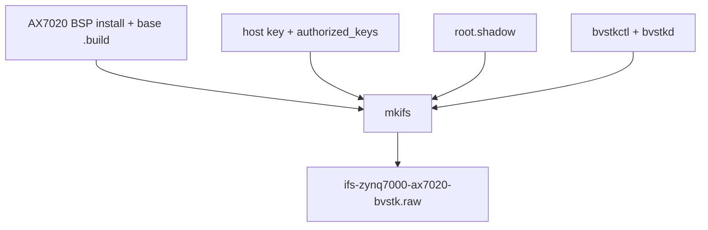

# Neutrino: сборка, IFS и JTAG

Скрипты каталога собирают приложения `bvstkctl` и `bvstkd`, формируют IFS для
AX7020 и выполняют JTAG-загрузку с последующей SSH-проверкой. Образ также
подключает PS SD и существующий FatFs-совместимый QSPI-том как Neutrino-пути
`/sd:` и `/flash:`.

## 1. Входные зависимости

| Компонента | Путь или команда | Назначение |
|---|---|---|
| SDK | `qcc`, `mkifs` | компиляция и сборка IFS |
| BSP | `third_party/neutrino/bsp/ax7020` | install tree и base `.build` |
| hardware export | `artifacts/fpga/design.xsa` | общая PL-карта |
| SSH client key | `build/neutrino/ax7020_ssh_client` | проверка target |
| host key | `build/neutrino/ssh/ssh_host_rsa_key` | SSH host identity |

При отсутствии SDK скрипты пытаются загрузить
`/etc/profile.d/kpda_env_2024.sh`.

## 2. Сборка приложений

```sh
source /etc/profile.d/kpda_env_2024.sh
./build.sh neutrino
```

Результаты:

| Файл | Назначение |
|---|---|
| `build/neutrino/bvstkctl` | CLI для PL и сервисов |
| `build/neutrino/bvstkd` | DCP2 daemon на TCP `8889` |
| `build/neutrino/bvstk-qspi-fat` | resource manager для FatFs-совместимого QSPI-окна |
| `build/neutrino/*.o` | производные object files |

`build.sh` компилирует common drivers/services/protocols и Neutrino ports
явным списком `COMMON_SOURCES`, а также отдельный QSPI resource manager.

## 3. Формирование IFS



```sh
./build.sh neutrino-image
```

Основные переменные:

| Переменная | Значение по умолчанию |
|---|---|
| `NEUTRINO_BUILD_DIR` | `build/neutrino` |
| `NEUTRINO_BSP_DIR` | `third_party/neutrino/bsp/ax7020` |
| `NEUTRINO_BASE_BUILD` | `$NEUTRINO_BSP_DIR/images/zynq7000-ax7020-ssh.build` |
| `NEUTRINO_IFS_FILE` | `build/neutrino/ifs-zynq7000-ax7020-bvstk.raw` |
| `NEUTRINO_KEY_DIR` | `build/neutrino/ssh` |
| `NEUTRINO_ROOT_SHADOW_FILE` | `build/neutrino/root.shadow` |
| `QCC_VARIANT` | `8.3.0,gcc_ntoarmv7le` |

## 4. Пароль root и SSH

По умолчанию root создаётся с заблокированной парольной строкой. Для локальной
парольной проверки сгенерируйте shadow-файл:

```sh
./scripts/neutrino/generate_root_shadow.py
./build.sh neutrino-image
```

Собственный путь задаётся так:

```sh
./scripts/neutrino/generate_root_shadow.py --output /secure/root.shadow
NEUTRINO_ROOT_SHADOW_FILE=/secure/root.shadow \
  ./build.sh neutrino-image
```

Скрипт создаёт файл с режимом `0600` и случайной солью. Host key, authorized
keys и shadow-файл относятся к локальным производным данным.

## 5. JTAG и проверка

```sh
./run.sh neutrino jtag
```

Сценарий загружает IFS, сохраняет UART log, ждёт startup signature и выполняет
через SSH:

```sh
ssh -i build/neutrino/ax7020_ssh_client \
  root@<device-ip> '/usr/bin/bvstkctl version && /usr/bin/bvstkctl pl list'
```

## 6. Диагностика

| Симптом | Проверка |
|---|---|
| `qcc` или `mkifs` не найден | загрузить Neutrino SDK environment |
| BSP install tree отсутствует | проверить `NEUTRINO_BSP_DIR` |
| base `.build` отсутствует | проверить `NEUTRINO_BASE_BUILD` |
| SSH не принимает ключ | сравнить `SSH_IDENTITY` и injected `authorized_keys` |
| пароль root не подходит | передать корректный `NEUTRINO_ROOT_SHADOW_FILE` |
| IFS не создаётся | проверить `build/neutrino/*.build` и mkifs log |
