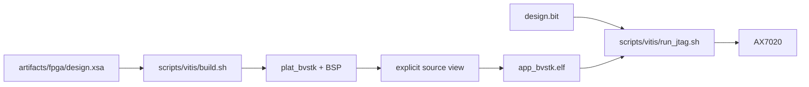

# FreeRTOS: Vitis и JTAG

Каталог содержит target-specific сценарии для создания Vitis workspace,
сборки FreeRTOS ELF и загрузки программы на Zynq-7000.

## 1. Контур сборки



## 2. Локальная конфигурация

```sh
cd <repo>/scripts/vitis
cp -n build_vitis.conf.example build_vitis.conf
cp -n run_jtag.conf.example run_jtag.conf
```

| Файл/переменная | Назначение |
|---|---|
| `build_vitis.conf` | `XSA`, `XILINX_SETTINGS`, `CLEAN_DEFAULT` |
| `run_jtag.conf` | bitstream, ELF, PS7 init и Xilinx environment |
| `BUILD_VITIS_CONFIG` | выбрать альтернативный build config |
| `RUN_JTAG_CONFIG` | выбрать альтернативный JTAG config |
| `XSA` | входной hardware export |
| `CLEAN` | удалить `vitis_ws` перед сборкой |
| `BITSTREAM_FILE` | bitstream для JTAG |
| `ELF_FILE` | ELF для загрузки |
| `PS7_INIT_TCL` | PS7 initialization script |

Путь XSA по умолчанию: `artifacts/fpga/design.xsa`. Локальные `.conf`-файлы
содержат пути рабочей станции и игнорируются Git.

## 3. Сборка FreeRTOS

Из корня проекта:

```sh
source <Vitis-install>/settings64.sh
./build.sh freertos
```

Прямой запуск скрипта эквивалентен:

```sh
./scripts/vitis/build.sh
```

Основной результат:

```text
vitis_ws/app_bvstk/Debug/app_bvstk.elf
```

При `CLEAN=1` workspace создаётся заново. Режим `CLEAN=0` подходит для
повторной компиляции при неизменном XSA и BSP.

## 4. JTAG-загрузка

```sh
./run.sh freertos jtag
```

Прямые формы:

```sh
./scripts/vitis/run_jtag.sh
./scripts/vitis/run_jtag.sh /abs/path/to/design.bit
```

Сценарий программирует PL, запускает PS7 initialization, загружает ELF и
передаёт управление CPU. Для debug-подготовки:

```sh
./scripts/vitis/run_jtag.sh --debug
```

В debug-режиме core0 остаётся остановленным на GDB-порту `3000`.

## 5. Опциональный FreeRTOS SSH

При `BVSTK_SSH_ENABLE=1` build script собирает pinned wolfSSL/wolfSSH из
`third_party/dist/` в `build/ssh-deps/`:

```sh
BVSTK_SSH_ENABLE=1 \
BVSTK_SSH_PASSWORD='your-password' \
  ./build.sh freertos
```

Пути готовых библиотек можно задать через `BVSTK_WOLFSSL_ROOT` и
`BVSTK_WOLFSSH_ROOT`. Полная таблица параметров находится в
[документе FreeRTOS SSH](../../docs/dev/freertos-ssh.md).

## 6. Связанные инструменты

| Задача | Инструмент |
|---|---|
| compile database | `scripts/vscode/gen_compile_commands.sh` |
| JTAG debug preparation | `scripts/vscode/jtag_prepare_debug.tcl` |
| CLI GDB wrapper | `scripts/vscode/arm-none-eabi-gdb.sh` |
| runtime smoke | `scripts/dcp2/monitor_notify.py` и HTTP/shell clients |
