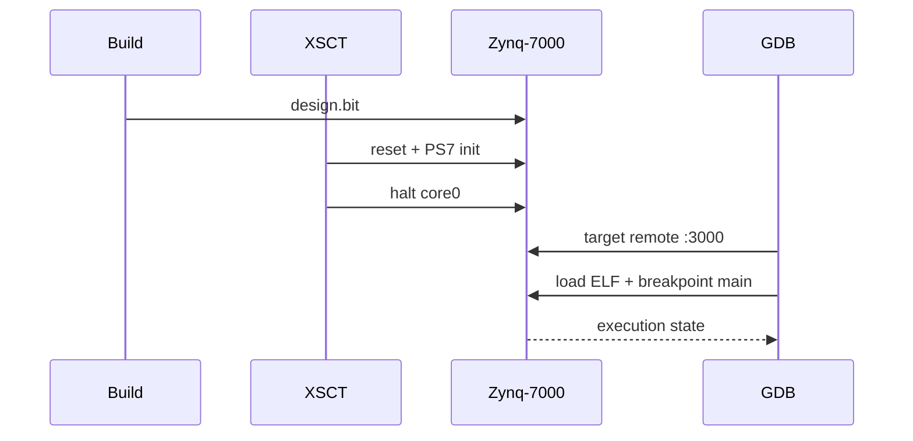

# VSCode и отладка Zynq-7000

Инструменты каталога подготавливают `compile_commands.json` и JTAG-сессию для
GDB. Runtime остаётся FreeRTOS-приложением в `vitis_ws/app_bvstk/Debug/`.

## 1. Требования

| Инструмент | Проверка |
|---|---|
| VSCode + C/C++ extension | открыть корень репозитория |
| Xilinx tools | `xsct -h`, `hw_server -h` |
| ARM toolchain | `arm-none-eabi-gcc --version`, `arm-none-eabi-gdb --version` |
| Bear | `bear --version` |

Если ARM toolchain отсутствует в `PATH`, задайте каталог:

```sh
export VITIS_ARM_GCC_BIN=/path/to/gcc-arm-none-eabi/bin
```

## 2. Навигация исходников

После сборки FreeRTOS создайте compilation database:

```sh
./scripts/vscode/gen_compile_commands.sh
```

Результат — `compile_commands.json` в корне проекта. Файл зависит от локальных
путей Vitis и пересоздаётся после изменения target source view.

VSCode использует `.vscode/c_cpp_properties.json` и
`.vscode/settings.json`. При устаревшей индексации выполните `Developer:
Reload Window`, затем `C/C++: Reset IntelliSense Database`.

## 3. JTAG debug flow



Подготовка выполняется командой:

```sh
./scripts/vitis/run_jtag.sh --debug
```

После остановки core0 выберите конфигурацию VSCode
`Attach: Zynq-7000 (hw_server GDB, core0)` либо подключите CLI GDB к `:3000`.

## 4. Пути и переопределения

| Переменная | Назначение |
|---|---|
| `BITSTREAM_FILE` | bitstream для программирования PL |
| `VITIS_ARM_GCC_BIN` | каталог ARM compiler/GDB |
| `VITIS_ARM_GDB` | полный путь к GDB wrapper target |
| `GDB_CWD` | рабочий каталог GDB |
| `BEAR_LIBRARY_PATH` | preload library Bear |

Bitstream выбирается в порядке: `artifacts/fpga/design.bit`, затем экспорт
Vitis platform. PS7 init берётся из `vitis_ws/plat_bvstk/export/plat_bvstk/hw/`.

## 5. Диагностика

| Симптом | Действие |
|---|---|
| `xsct` или `hw_server` не найден | загрузить `settings64.sh` |
| ARM compiler не найден | задать `VITIS_ARM_GCC_BIN` |
| compilation database пуст | сначала собрать FreeRTOS ELF |
| breakpoint не срабатывает | проверить debug build и запуск `--debug` |
| порт `3000` занят | остановить старый `hw_server` или изменить port pair |
