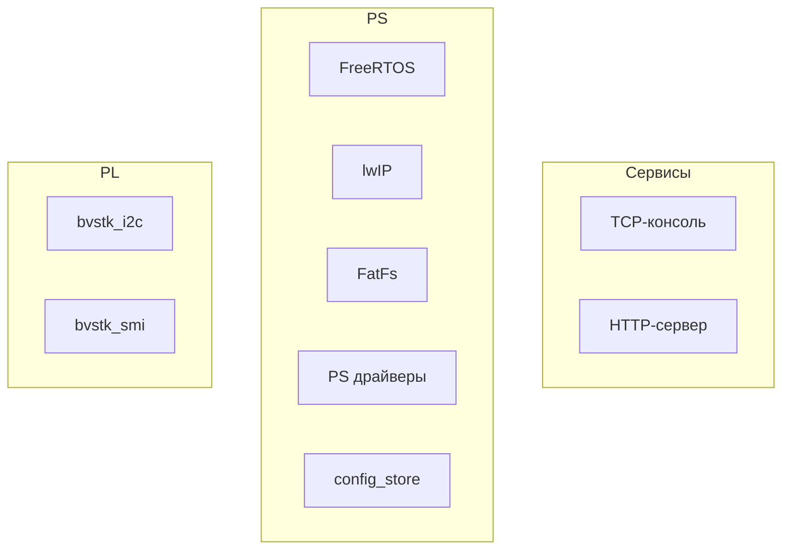
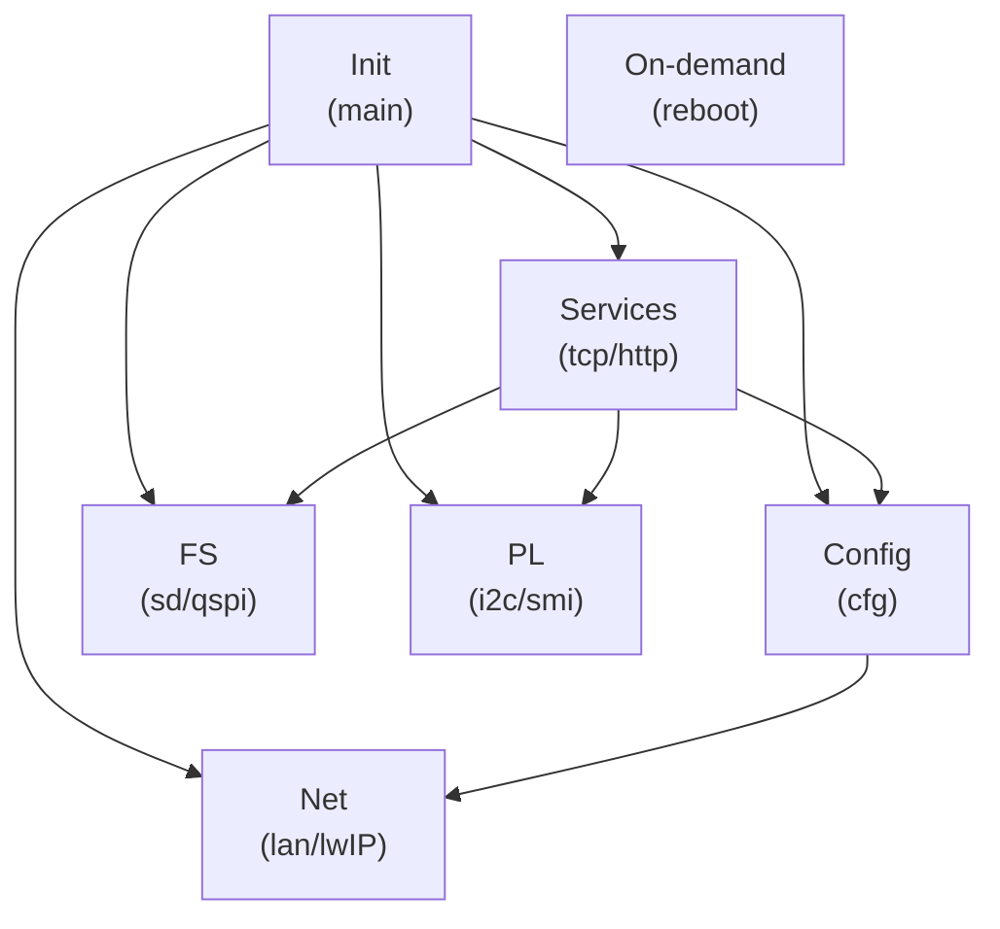
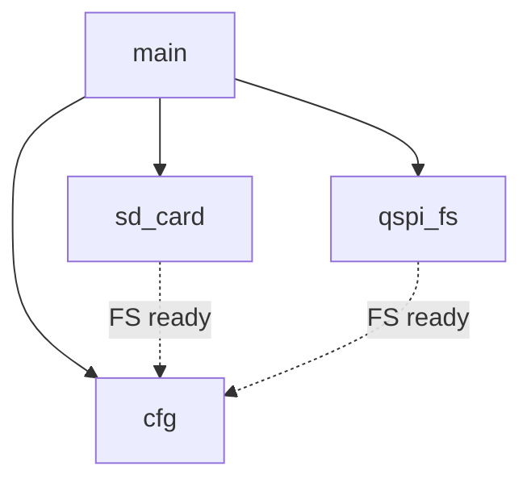
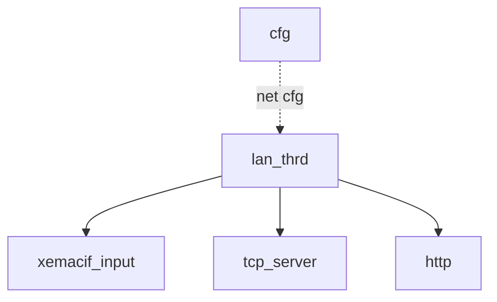
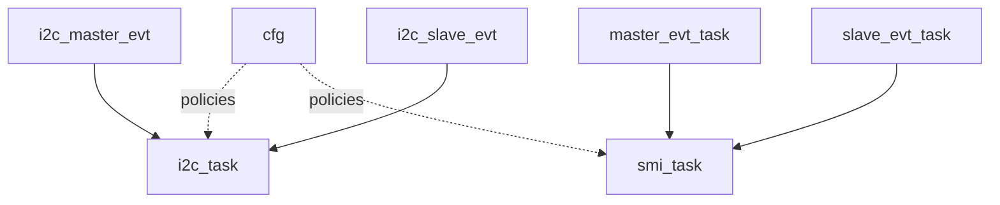

# bvstk — документация

## Оглавление

  - [Введение](#vvedenie)
    - [Назначение прошивки](#naznachenie-proshivki)
    - [Поддерживаемое железо и ограничения](#podderzhivaemoe-zhelezo-i-ogranicheniya)
    - [Термины и обозначения](#terminy-i-oboznacheniya)
  - [Архитектура системы](#arkhitektura-sistemy)
    - [Общая схема модулей](#obshchaya-skhema-moduley)
    - [Потоки/задачи FreeRTOS](#potoki-zadachi-freertos)
    - [Порядок инициализации](#poryadok-initsializatsii)
  - [Окружение разработки](#okruzhenie-razrabotki)
    - [Требования](#trebovaniya)
    - [Входные HW‑артефакты](#vkhodnye-hw-artefakty)
    - [Структура репозитория](#struktura-repozitoriya)
  - [Сборка](#sborka)
    - [Быстрый старт](#bystryy-start)
    - [Переменные сборки](#peremennye-sborki)
    - [Артефакты и структура vitis_ws](#artefakty-i-struktura-vitis_ws)
  - [Запуск и отладка](#zapusk-i-otladka)
    - [Запуск по JTAG](#zapusk-po-jtag)
    - [Подключение к TCP‑консоли](#podklyuchenie-k-tcp-konsoli)
    - [Типовые проблемы](#tipovye-problemy)
  - [Сеть (lwIP)](#set-lwip)
    - [Инициализация интерфейса](#initsializatsiya-interfeysa)
    - [Настройка IP/MAC и сохранение](#nastroyka-ip-mac-i-sokhranenie)
    - [Смена IP и восстановление доступа](#smena-ip-i-vosstanovlenie-dostupa)
  - [Файловые системы (FatFs)](#faylovye-sistemy-fatfs)
    - [Тома и пути](#toma-i-puti)
    - [Монтирование и автоформатирование](#montirovanie-i-avtoformatirovanie)
    - [Разметка QSPI FS](#razmetka-qspi-fs)
    - [Web UI в flash:/www/](#web-ui-v-flashwww)
  - [Конфигурация (JSON / config_store)](#konfiguratsiya-json-config_store)
    - [Расположение и приоритеты](#raspolozhenie-i-prioritety)
    - [Дефолты и генерация](#defolty-i-generatsiya)
    - [Миграция legacy → primary](#migratsiya-legacy--primary)
    - [Сохранение и целостность](#sokhranenie-i-tselostnost)
  - [PL‑ядра](#pl-yadra)
    - [Назначение и место в системе](#pl-naznachenie-i-mesto-v-sisteme)
    - [Общая схема PS ↔ PL core](#pl-obshchaya-skhema-ps--pl-core)
    - [Общий протокол обмена и ограничения](#pl-protokol-obmena-i-ogranicheniya)
    - [Очереди/ISR/worker tasks](#pl-ocheredi-isr-worker-tasks)
    - [Конфигурация и политики доступа](#pl-konfiguratsiya-i-politiki-dostupa)
    - [Диагностика и отладка](#pl-diagnostika-i-otladka)
  - [PL‑ядро I2C (bvstk_i2c)](#pl-yadro-i2c-bvstk_i2c)
    - [Модель устройств и JSON‑формат](#i2c-model-ustroystv-i-json-format)
    - [Политики и persisted settings](#i2c-politiki-i-persisted-settings)
    - [Autopoll и кэш](#i2c-autopoll-i-kesh)
    - [Управление (консоль/HTTP)](#i2c-upravlenie-konsol-http)
  - [PL‑ядро SMI/MDIO (bvstk_smi)](#pl-yadro-smi-mdio-bvstk_smi)
    - [Модель PHY и JSON‑формат](#smi-model-phy-i-json-format)
    - [Политики и persisted settings](#smi-politiki-i-persisted-settings)
    - [Autopoll и обработка событий](#smi-autopoll-i-obrabotka-sobytiy)
    - [Управление (консоль/HTTP)](#smi-upravlenie-konsol-http)
  - [TCP‑консоль (порт 8888)](#tcp-konsol-port-8888)
    - [Обзор и правила ответов](#tcp-obzor-i-pravila-otvetov)
    - [Команды](#tcp-komandy)
  - [HTTP‑сервер (порт 80)](#http-server-port-80)
    - [Роутинг и форматы ответов](#http-routing-i-formaty-otvetov)
    - [/api/*](#http-api)
    - [Файловый API](#http-faylovyy-api)
    - [Раздача Web UI](#http-razdacha-web-ui)
  - [Веб‑ресурсы и деплой](#web-resursy-i-deploy)
    - [Структура web/assets](#web-struktura-webassets)
    - [Загрузка в flash:/www/](#web-zagruzka-v-flashwww)
  - [Диагностика и безопасность](#diagnostika-i-bezopasnost)
    - [Диагностические команды/эндпоинты и риски](#diagnostika-komandy-endpointy-i-riski)
    - [Рекомендации по ограничению доступа](#diagnostika-rekomendatsii-po-ogranicheniyu-dostupa)
  - [FAQ / Troubleshooting](#faq--troubleshooting)
    - [xsct/окружение](#faq-xsct-okruzhenie)
    - [Bitstream/PS init](#faq-bitstream-ps-init)
    - [QSPI FS и разметка](#faq-qspi-fs-i-razmetka)
    - [Сеть/консоль/HTTP](#faq-set-konsol-http)
  - [Приложения](#prilozheniya)
    - [Карта директорий](#prilozheniya-karta-direktoriy)
    - [Таблица портов/протоколов](#prilozheniya-tablitsa-portov-protokolov)
    - [Примеры команд и запросов](#prilozheniya-primery-komand-i-zaprosov)

## Введение

### Назначение прошивки

`bvstk` — встраиваемая прошивка для SoC семейства Zynq‑7000 (PS: ARM Cortex‑A9 + PL: FPGA), которая поднимает сетевую инфраструктуру и сервисы управления устройством, а также обеспечивает унифицированный доступ к файловым системам и периферии.

Прошивка предназначена для:
- старта FreeRTOS и сетевого стека lwIP (socket API) на стороне PS;
- предоставления каналов управления и диагностики: TCP‑консоль и HTTP‑API;
- работы с двумя томами FatFs: SD (`sd:/`) и QSPI NOR (`flash:/`);
- хранения и применения конфигурации в виде JSON (в т.ч. описаний оконечных устройств/политик);
- управления кастомными PL‑ядрами (в частности `bvstk_i2c` и `bvstk_smi`) через согласованный протокол обмена, политики доступа и persist‑настройки.

Практически это “контрольная плоскость” устройства: настройка сети, перенос файлов, применение конфигов, диагностика и ручное управление/тестирование интерфейсов как со стороны PS, так и через PL‑ядра.

### Поддерживаемое железо и ограничения

Прошивка предполагает наличие согласованной аппаратной части (bitstream + HW export), с которой совпадают адреса периферии и параметры драйверов.

Поддерживаемое/ожидаемое железо (минимальный набор):
- **PS CPU**: ARM Cortex‑A9 (FreeRTOS на `ps7_cortexa9_0`).
- **Ethernet на PS**: GEM (`xemacps`, интерфейс `XPAR_XEMACPS_0_BASEADDR`) — требуется физическое подключение PHY и корректная настройка в HW design.
- **SD на PS**: SDIO (`XPAR_XSDPS_0_DEVICE_ID`) — для тома `sd:/` (FatFs).
- **QSPI NOR**: предполагается флеш объёмом **32 MiB** (см. `src/qspi_flash/qspi_flash.c`), для тома `flash:/` (FatFs в окне внутри флеша).
- **JTAG**: для старта по JTAG нужен доступ к `hw_server` и рабочий кабель/драйверы.
- **PL‑ядра**: кастомные ядра для I2C и SMI/MDIO (см. `src/bvstk_i2c/`, `src/bvstk_smi/`) должны быть включены в bitstream и иметь адреса/IRQ, соответствующие прошивке.

Ограничения и важные замечания:
- **Аппаратная часть не генерируется** этой репой: `*.xsa` и `*.bit` должны быть предоставлены извне и соответствовать ожидаемой адресной карте.
- **QSPI FS не должен пересекаться с BOOT‑областями**: окно задаётся через `QSPI_FS_BASE_BYTES`/`QSPI_FS_SIZE_BYTES`. Неверная разметка может повредить загрузочные образы.
- **Самотест QSPI** пишет/стирает тестовый сектор (с попыткой восстановить старые данные). Это потенциально рискованная операция для “боевого” устройства, если выбранный тестовый адрес пересекается с важными данными.
- **Автоформатирование FatFs**: при `FR_NO_FILESYSTEM` том будет отформатирован автоматически (это может стереть данные на соответствующем томе).
- **Отсутствует аутентификация** на TCP‑консоли и HTTP‑API. Диагностические операции (включая доступ к I2C/SMI и MMIO) должны использоваться только в доверенной сети/контуре.

### Термины и обозначения

Ниже перечислены термины и сокращения, используемые в документе и в прошивке.

- **SoC / Zynq‑7000** — система‑на‑кристалле Xilinx, объединяющая PS (процессорная часть) и PL (ПЛИС).
- **PS (Processing System)** — процессорная часть Zynq (ARM Cortex‑A9 и периферия PS: GEM, SDIO, QSPI и т.д.).
- **PL (Programmable Logic)** — программируемая логика (FPGA‑часть), в которой реализованы кастомные ядра/интерфейсы.
- **PL‑ядро / core** — аппаратный IP‑блок в PL, с которым прошивка взаимодействует через регистры/BRAM/IRQ.
- **BSP** — Board Support Package, генерируемый Vitis для выбранной платформы (драйверы, настройки, библиотеки).
- **FreeRTOS** — RTOS, на которой выполняется прикладная часть прошивки.
- **lwIP** — сетевой стек; в прошивке используется socket API.
- **FatFs / xilffs** — файловая система FAT (библиотека ChaN) и её интеграция/драйверы в экосистеме Xilinx.
- **SD / SDIO** — SD‑карта и интерфейс SDIO в PS; в прошивке представлен томом `sd:/` (также `0:/`).
- **QSPI NOR** — внешняя QSPI флеш‑память; в прошивке часть пространства отводится под том `flash:/` (также `1:/`).
- **FS / том** — файловая система, смонтированная на устройстве (SD или QSPI).
- **`sd:/`, `flash:/`** — псевдонимы путей к томам; соответствуют `0:/` и `1:/` соответственно.
- **`flash:/config/`** — основной каталог конфигурации на QSPI; **legacy** каталог: `flash:/configs/`.
- **JSON‑конфиги** — файлы конфигурации в формате JSON, хранящиеся на QSPI и/или вшитые дефолты; используются для сети, и описания оконечных устройств/политик для PL‑ядер.
- **Autopoll** — периодический опрос/сканирование регистров устройств (например, I2C/SMI) по расписанию.
- **Persisted settings** — “сохранённые настройки” (например, набор register writes), которые применяются при старте и сохраняются в JSON.
- **GEM** — Gigabit Ethernet MAC в PS (в Xilinx драйверах часто фигурирует как `xemacps`).
- **MDIO/SMI** — управляющая шина Ethernet PHY (чтение/запись регистров PHY).
- **MMIO** — доступ к регистрам по памяти (Memory‑Mapped I/O).
- **BRAM** — блоковая RAM (в PL), используемая как буфер/окно обмена между PS и PL.
- **IRQ** — прерывание; в прошивке обычно обрабатывается цепочкой ISR → очередь → задача.
- **ISR** — обработчик прерывания (Interrupt Service Routine).
- **XSCT** — Xilinx Software Command‑line Tool, используется для сборки/прошивки через TCL‑скрипты (`build.tcl`, `run_jtag.tcl`).
- **Vitis workspace (`vitis_ws/`)** — рабочая область, создаваемая скриптами сборки; содержит платформу, BSP и приложение (ELF).
- **ELF** — исполняемый файл приложения, загружаемый по JTAG (`app_bvstk.elf`).
- **HTTP API** — набор HTTP‑эндпоинтов `/api/*` и файловых маршрутов `/sd|/flash|/tar`.
- **TCP‑консоль** — интерактивная консоль по TCP (порт 8888), по смыслу близка к telnet‑сессии.

## Архитектура системы

### Общая схема модулей

Логически прошивка состоит из трёх “слоёв”:
- **Системный слой PS**: FreeRTOS, lwIP, FatFs и драйверы PS‑периферии (GEM/SDIO/QSPI).
- **Сервисы управления**: TCP‑консоль и HTTP‑сервер, которые используют сеть, файловые системы и конфигурацию.
- **Подсистемы PL‑ядер**: `bvstk_i2c` и `bvstk_smi`, управляемые со стороны PS и конфигурируемые через JSON.

Связи между слоями:

Соответствие блоков схемы модулям в `bvstk/src/`:

- **TCP‑консоль** (`tcp`)
  - `src/bvstk_tcp_server/bvstk_tcp_server.c`, `src/bvstk_tcp_server/bvstk_tcp_server.h`
  - `src/bvstk_tcp_server/utils/console_common.c`, `src/bvstk_tcp_server/utils/console_common.h`
  - `src/bvstk_tcp_server/utils/console_dispatch.c`
  - Команды: `src/bvstk_tcp_server/utils/fs_shell.c`, `src/bvstk_tcp_server/utils/ip_shell.c`, `src/bvstk_tcp_server/utils/i2c_shell.c`, `src/bvstk_tcp_server/utils/smi_shell.c`, `src/bvstk_tcp_server/utils/mem_shell.c`, `src/bvstk_tcp_server/utils/tar_shell.c`, `src/bvstk_tcp_server/utils/reg_frames.c`

- **HTTP‑сервер** (`http`)
  - `src/http/http_server.c`, `src/http/http_server.h`
  - `src/http_fs/http_fs_routes.c`
  - `src/tar/tar.c`, `src/tar/tar.h`

- **FreeRTOS** (`rtos`)
  - Запуск и init: `src/main.c`, `src/main.h`
  - Задачи/потоки: `src/bvstk_lan/bvstk_lan.c`, `src/bvstk_tcp_server/bvstk_tcp_server.c`, `src/http/http_server.c`, `src/config/config_store.c`, `src/sd_card/sd_card.c`, `src/qspi_fs/qspi_fs.c`, `src/bvstk_i2c/bvstk_i2c.c`, `src/bvstk_smi/bvstk_smi.c`
  - Glue для FatFs: `src/fs/ffsystem_freertos.c`

- **lwIP** (`lwip`)
  - `src/bvstk_lan/bvstk_lan.c`, `src/bvstk_lan/bvstk_lan.h`
  - Сокеты: `src/bvstk_tcp_server/*`, `src/http/http_server.c`, `src/http_fs/http_fs_routes.c`, `src/fs/fs_shared.c`
  - Доп. сервисы: `src/mqtt_proc/*`, `src/sntp_proc/*`

- **FatFs** (`fatfs`)
  - `src/fs/fs_shared.c`, `src/fs/fs_shared.h`
  - `src/fs/fs_devices.c`, `src/fs/fs_devices.h`
  - `src/fs/diskio.c`
  - SD том: `src/sd_card/sd_card.c`, `src/sd_card/sd_card.h`
  - QSPI том: `src/qspi_fs/qspi_fs.c`, `src/qspi_fs/qspi_fs.h`, `src/qspi_fs/qspi_fs_layout.h`

- **PS драйверы** (`psdrv`)
  - Ethernet (GEM): `src/bvstk_lan/bvstk_lan.c`
  - SDIO: `src/sd_card/sd_card.c`
  - QSPI: `src/qspi_flash/qspi_flash.c`, `src/qspi_flash/qspi_flash.h`
  - MMIO/IRQ для PL‑взаимодействия: `src/bvstk_i2c/bvstk_i2c.c`, `src/bvstk_smi/bvstk_smi.c`

- **config_store** (`cfg`)
  - `src/config/config_store.c`, `src/config/config_store.h`
  - Дефолты (генерируются при сборке): `src/config/default_configs.h`

- **bvstk_i2c** (`i2c_sw`)
  - `src/bvstk_i2c/bvstk_i2c.c`, `src/bvstk_i2c/bvstk_i2c.h`
  - Интеграции: `src/bvstk_tcp_server/utils/i2c_shell.c`, `src/http_fs/http_fs_routes.c`

- **bvstk_smi** (`smi_sw`)
  - `src/bvstk_smi/bvstk_smi.c`, `src/bvstk_smi/bvstk_smi.h`
  - Интеграции: `src/bvstk_tcp_server/utils/smi_shell.c`, `src/http_fs/http_fs_routes.c`

### Потоки/задачи FreeRTOS

В прошивке используется ОСРВ FreeRTOS. “Потоки” lwIP (`sys_thread_new`) в итоге тоже создаются как задачи FreeRTOS (через порт lwIP под FreeRTOS).

**Группы задач**

Расшифровка групп:

- **Init (main)** — *не задача*: синхронный код в `src/main.c` до `vTaskStartScheduler()`, который вызывает `start_*()` и тем самым создаёт задачи ниже.
  - Создаёт/запускает: `sd_card`, `qspi_fs`, `cfg`, `lan_thrd`, `tcp_server_thrd`, `http`, а также задачи I2C/SMI.
- **Config (cfg)** — задача `cfg` (`src/config/config_store.c`): загрузка/миграция JSON и выставление `config_store_is_ready()`.
  - Задачи: `cfg`
- **FS (sd/qspi)** — фоновые задачи, которые монтируют тома и держат флаги готовности.
  - Задачи: `sd_card`, `qspi_fs`
- **Net (lan/lwIP)** — инициализация сети и приём пакетов.
  - Задачи/потоки: `lan_thrd`, `xemacif_input_thread`
- **Services (tcp/http)** — пользовательские сервисы поверх lwIP.
  - Задачи/потоки: `tcp_server_thrd`, `http`
- **PL (i2c/smi)** — подсистемы кастомных PL‑ядер (event‑таски + worker/autopoll).
  - I2C: `i2c_master_evt`, `i2c_slave_evt`, `i2c_task`
  - SMI: `master_evt_task`, `slave_evt_task`, `smi_task`
- **On-demand (reboot)** — задачи, которые создаются на время выполнения команды.
  - Задачи: `reboot`

**Конфиг и файловые системы**

Расшифровка:

- **`main`** — `src/main.c`: синхронно вызывает `start_sd_card()`, `start_qspi_fs()`, `start_config_store()` и т.п., затем запускает планировщик.
- **`sd_card`** — `src/sd_card/sd_card.c`: задача, которая инициализирует SDIO и периодически пытается примонтировать SD‑том (`sd:/`, `0:/`).
- **`qspi_fs`** — `src/qspi_fs/qspi_fs.c`: задача, которая инициализирует QSPI и периодически пытается примонтировать QSPI‑том (`flash:/`, `1:/`).
- **`cfg`** — `src/config/config_store.c`: задача, которая ждёт готовность QSPI‑тома, создаёт каталоги `flash:/config`, мигрирует legacy‑конфиги, читает/парсит JSON и выставляет `config_store_is_ready()`.
- **`FS ready` (пунктир)** — логическая зависимость: `cfg` использует QSPI‑ФС для чтения/записи конфигов; `sd_card`/`qspi_fs` поднимают соответствующие тома и выставляют флаг готовности.

**Сеть и сервисы**

Расшифровка:

- **`cfg`** — `src/config/config_store.c`: источник сетевых параметров (IP/маска/шлюз/MAC) из `flash:/config/network.json` (или дефолт), которые используются при инициализации сети.
- **`lan_thrd`** — `src/bvstk_lan/bvstk_lan.c`: поток/задача, который читает конфиг (если готов), вызывает `lwip_init()`, поднимает `netif` и делает интерфейс “up”.
- **`xemacif_input`** — поток `xemacif_input_thread` (создаётся из `lan_thrd`): приём/обработка входящих пакетов из драйвера Ethernet и доставка их в стек lwIP.
- **`tcp_server`** — `src/bvstk_tcp_server/bvstk_tcp_server.c`: TCP‑консоль (порт 8888), работает поверх socket API lwIP.
- **`http`** — `src/http/http_server.c` + `src/http_fs/http_fs_routes.c`: HTTP‑сервер (порт 80) и маршрутизация `/api/*`, `/sd|/flash|/tar`, статика из `flash:/www/`.
- **`net cfg` (пунктир)** — логическая зависимость: `lan_thrd` пытается использовать параметры из `cfg` (если `config_store_is_ready()`), иначе поднимается с дефолтными значениями.

**PL подсистемы**

Расшифровка:

- **`cfg`** — `src/config/config_store.c`: источник конфигов/политик для PL‑подсистем (I2C/SMI), доступных через `config_store_*`.
- **I2C задачи** — `src/bvstk_i2c/bvstk_i2c.c`:
  - **`i2c_master_evt`** — event‑задача: получает события от IRQ/очереди “master” и инициирует обработку.
  - **`i2c_slave_evt`** — event‑задача: получает события “slave” (кадры/команды) и инициирует обработку.
  - **`i2c_task`** — рабочая задача: autopoll, применение persisted settings, операции чтения/записи с учётом политик.
- **SMI задачи** — `src/bvstk_smi/bvstk_smi.c`:
  - **`master_evt_task`** — event‑задача “master”: обработка событий от IRQ/очереди.
  - **`slave_evt_task`** — event‑задача “slave”: обработка команд/событий хоста.
  - **`smi_task`** — рабочая задача: autopoll PHY, применение persisted settings, операции чтения/записи с учётом политик.
- **`policies` (пунктир)** — логическая зависимость: рабочие задачи используют данные из `cfg` (конфиги устройств/PHY и политики), когда `config_store_is_ready()` установлен.
- **Стрелки `*_evt → *_task`** — упрощённо: ISR кладёт событие в очередь → event‑задача извлекает → основная логика выполняется в worker‑задаче.

**Постоянные задачи (создаются при старте)**
- **`cfg`** — загрузка/миграция JSON‑конфигов и установка флага готовности (`start_config_store()` → `config_task`). `CONFIG_TASK_STACK=2048`, `CONFIG_TASK_PRIO=tskIDLE_PRIORITY+3`. Код: `src/config/config_store.c`.
- **`sd_card`** — фоновое монтирование SD (`0:/`, `sd:/`) с периодическими попытками. `SD_TASK_STACK=1024`, `SD_TASK_PRIO=tskIDLE_PRIORITY+2`. Код: `src/sd_card/sd_card.c`.
- **`qspi_fs`** — фоновое монтирование QSPI‑тома (`1:/`, `flash:/`). `QSPI_TASK_STACK=1024`, `QSPI_TASK_PRIO=tskIDLE_PRIORITY+1`. Код: `src/qspi_fs/qspi_fs.c`.
- **`lan_thrd`** — инициализация сети (lwIP + netif) и запуск input‑треда `xemacif_input_thread`. Код: `src/bvstk_lan/bvstk_lan.c`.
- **`tcp_server_thrd`** — TCP‑консоль на порту 8888. Стек: `TCP_THREAD_STACKSIZE=12288`. Код: `src/bvstk_tcp_server/bvstk_tcp_server.c`, `src/bvstk_tcp_server/bvstk_tcp_server.h`.
- **`http`** — HTTP‑сервер на порту 80. Стек: `HTTP_THREAD_STACK=2048`. Код: `src/http/http_server.c`.
- **I2C подсистема** — `i2c_master_evt`, `i2c_slave_evt`, `i2c_task` (очереди + обработка событий + autopoll). `I2C_TASK_STACK_SIZE=512`, `I2C_TASK_PRIORITY=tskIDLE_PRIORITY+1`. Код: `src/bvstk_i2c/bvstk_i2c.c`, `src/bvstk_i2c/bvstk_i2c.h`.
- **SMI подсистема** — `master_evt_task`, `slave_evt_task`, `smi_task` (очереди + обработка событий + autopoll). `SMI_TASK_STACK_SIZE=1024`, `SMI_TASK_PRIORITY=tskIDLE_PRIORITY+1` (evt‑таски: `SMI_TASK_PRIORITY+1`). Код: `src/bvstk_smi/bvstk_smi.c`, `src/bvstk_smi/bvstk_smi.h`.

**Задачи “по требованию”**
- **`reboot`** — отложенная перезагрузка (создаётся по команде из консоли или HTTP). Код: `src/bvstk_tcp_server/utils/console_dispatch.c`, `src/http_fs/http_fs_routes.c`.

**Синхронизация и обмен**
- Очереди FreeRTOS используются в I2C/SMI для доставки событий из ISR в задачи (например, `q_master/q_slave`).
- Mutex’ы используются для шины/доступа к общим ресурсам (например, `i2c_bus_mutex`, `smi_bus_mutex`, а также mutex’ы контекстов ФС SD/QSPI).

### Порядок инициализации

Порядок старта задаётся `src/main.c`. Важно: до `vTaskStartScheduler()` выполняется “синхронный” код `main()`, который **создаёт задачи**; сами задачи начинают выполняться после запуска планировщика.

**Шаги `main()` (по порядку вызова)**
1. `qspi_flash_self_test()` — быстрый тест записи/чтения QSPI (и попытка восстановить исходные данные тестового сектора).
2. `start_sd_card()` — создаёт задачу `sd_card` и делает первую попытку монтирования SD‑тома.
3. `start_qspi_fs()` — создаёт задачу `qspi_fs` и делает первую попытку монтирования QSPI‑тома.
4. `fs_devices_init()` — связывает “устройства” `sd`/`flash` с их контекстами (маршрутизация `sd:/` и `flash:/`).
5. `start_config_store()` — создаёт задачу `cfg`:
   - ждёт готовность QSPI‑тома (порядка десятков секунд),
   - создаёт `flash:/config/`,
   - мигрирует legacy `flash:/configs/` при необходимости,
   - загружает JSON‑конфиги в RAM и выставляет `config_store_is_ready()`.
6. `start_lan()` — создаёт поток `lan_thrd`, который:
   - пытается дождаться `config_store` (короткий таймаут),
   - вызывает `lwip_init()`, поднимает `netif`,
   - создаёт поток `xemacif_input_thread`.
7. `start_tcp_server()` — создаёт поток `tcp_server_thrd` (TCP‑консоль `:8888`).
8. `start_http_server()` — создаёт поток `http` (HTTP `:80`).
9. `start_smi()` — создаёт задачи SMI: `master_evt_task`, `slave_evt_task`, `smi_task`.
10. `start_i2c()` — создаёт задачи I2C: `i2c_master_evt`, `i2c_slave_evt`, `i2c_task`.
11. `vTaskStartScheduler()` — запуск планировщика; после этого управление переходит задачам.

**Ключевые зависимости**
- `cfg` использует QSPI‑том для чтения/записи конфигов; пока QSPI не смонтирован, используется fallback на “вшитые” дефолты.
- `lan_thrd` пытается применить сетевой конфиг из `cfg`; если `config_store` ещё не готов, сеть поднимется с дефолтными параметрами.
- `tcp_server_thrd` и `http` предполагают, что сеть/стек lwIP уже подняты (поэтому `start_lan()` вызывается раньше).

## Окружение разработки

### Требования

### Входные HW‑артефакты

### Структура репозитория

## Сборка

### Быстрый старт

### Переменные сборки

### Артефакты и структура vitis_ws

## Запуск и отладка

### Запуск по JTAG

### Подключение к TCP‑консоли

### Типовые проблемы

## Сеть (lwIP)

### Инициализация интерфейса

### Настройка IP/MAC и сохранение

### Смена IP и восстановление доступа

## Файловые системы (FatFs)

### Тома и пути

### Монтирование и автоформатирование

### Разметка QSPI FS

### Web UI в flash:/www/

## Конфигурация (JSON / config_store)

### Расположение и приоритеты

### Дефолты и генерация

### Миграция legacy → primary

### Сохранение и целостность

## PL‑ядра

### Назначение и место в системе

### Общая схема PS ↔ PL core

### Общий протокол обмена и ограничения

### Очереди/ISR/worker tasks

### Конфигурация и политики доступа

### Диагностика и отладка

## PL‑ядро I2C (bvstk_i2c)

### Модель устройств и JSON‑формат

### Политики и persisted settings

### Autopoll и кэш

### Управление (консоль/HTTP)

## PL‑ядро SMI/MDIO (bvstk_smi)

### Модель PHY и JSON‑формат

### Политики и persisted settings

### Autopoll и обработка событий

### Управление (консоль/HTTP)

## TCP‑консоль (порт 8888)

### Обзор и правила ответов

### Команды

## HTTP‑сервер (порт 80)

### Роутинг и форматы ответов

### /api/*

### Файловый API

### Раздача Web UI

## Веб‑ресурсы и деплой

### Структура web/assets

### Загрузка в flash:/www/

## Диагностика и безопасность

### Диагностические команды/эндпоинты и риски

### Рекомендации по ограничению доступа

## FAQ / Troubleshooting

### xsct/окружение

### Bitstream/PS init

### QSPI FS и разметка

### Сеть/консоль/HTTP

## Приложения

### Карта директорий

### Таблица портов/протоколов

### Примеры команд и запросов
