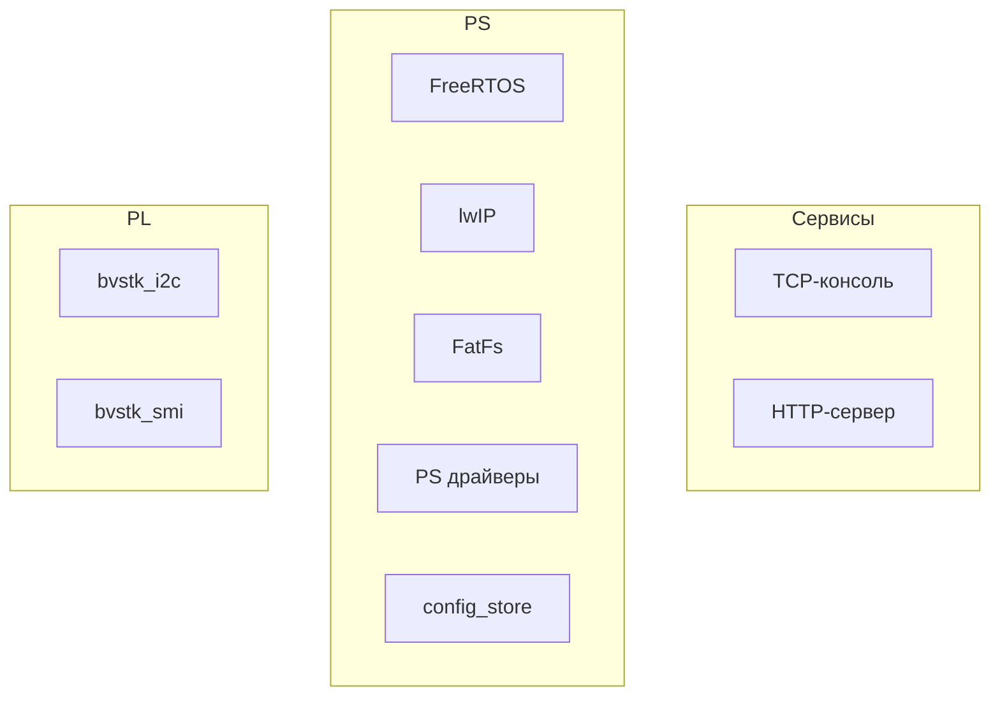
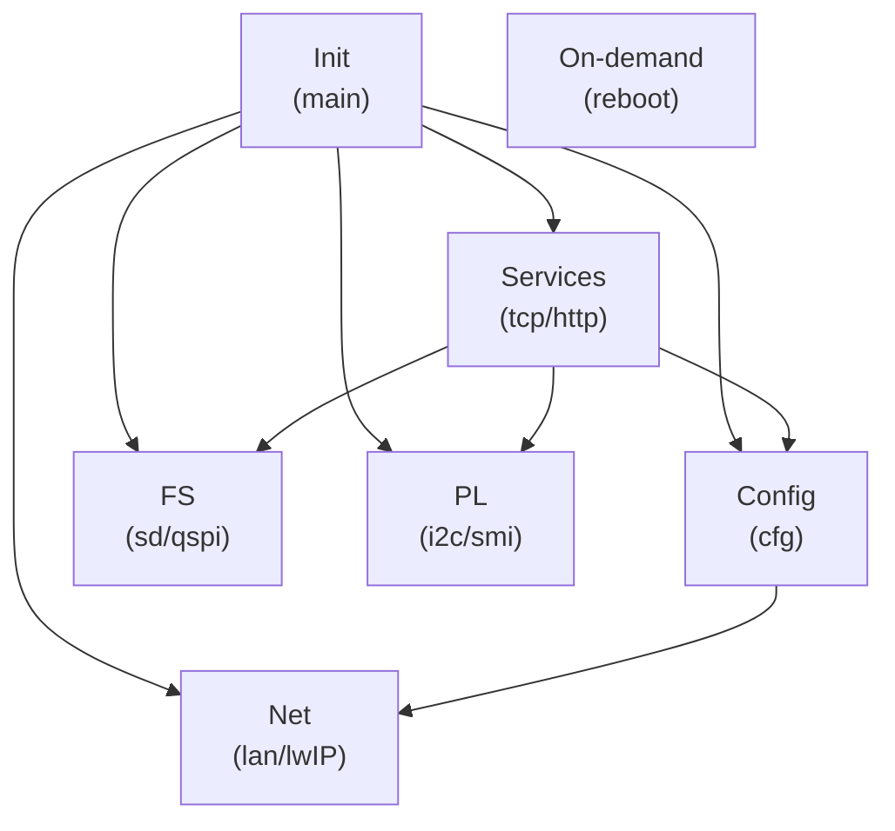
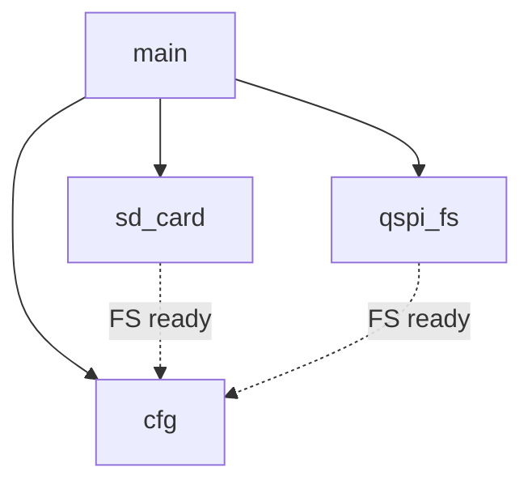
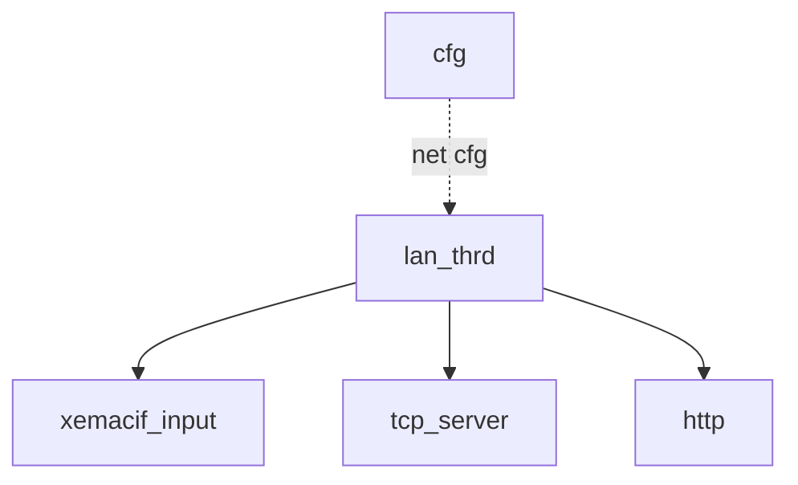
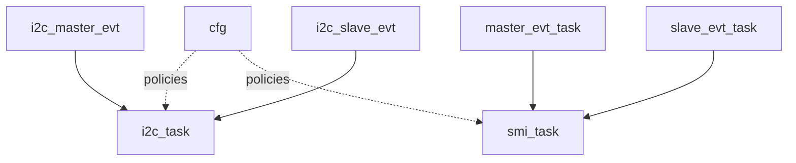
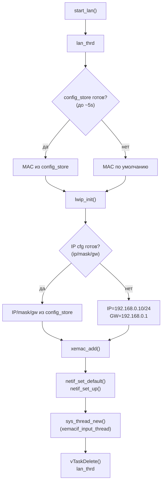

# bvstk — документация

## Оглавление

  - [Введение](#vvedenie)
    - [Назначение прошивки](#naznachenie-proshivki)
    - [Поддерживаемое железо и ограничения](#podderzhivaemoe-zhelezo-i-ogranicheniya)
    - [Термины и обозначения](#terminy-i-oboznacheniya)
  - [Архитектура системы](#arkhitektura-sistemy)
    - [Общая схема модулей](#obshchaya-skhema-moduley)
    - [Потоки/задачи FreeRTOS](#potoki-zadachi-freertos)
    - [Порядок инициализации](#poryadok-initsializatsii)
  - [Окружение разработки](#okruzhenie-razrabotki)
    - [Требования](#trebovaniya)
    - [Входные HW‑артефакты](#vkhodnye-hw-artefakty)
    - [Структура репозитория](#struktura-repozitoriya)
  - [Сборка](#sborka)
    - [Быстрый старт](#bystryy-start)
    - [Переменные сборки](#peremennye-sborki)
    - [Артефакты и структура vitis_ws](#artefakty-i-struktura-vitis_ws)
  - [Запуск и отладка](#zapusk-i-otladka)
    - [Запуск по JTAG](#zapusk-po-jtag)
    - [Подключение к TCP‑консоли](#podklyuchenie-k-tcp-konsoli)
  - [Сеть (lwIP)](#set-lwip)
    - [Инициализация интерфейса](#initsializatsiya-interfeysa)
    - [Настройка IP/MAC и сохранение](#nastroyka-ip-mac-i-sokhranenie)
    - [Смена IP и восстановление доступа](#smena-ip-i-vosstanovlenie-dostupa)
  - [Файловые системы (FatFs)](#faylovye-sistemy-fatfs)
    - [Тома и пути](#toma-i-puti)
    - [Монтирование и автоформатирование](#montirovanie-i-avtoformatirovanie)
    - [Разметка QSPI FS](#razmetka-qspi-fs)
    - [Web UI в flash:/www/](#web-ui-v-flashwww)
  - [Конфигурация (JSON / config_store)](#konfiguratsiya-json-config_store)
    - [Расположение и приоритеты](#raspolozhenie-i-prioritety)
    - [Дефолты и генерация](#defolty-i-generatsiya)
    - [Миграция legacy → primary](#migratsiya-legacy--primary)
    - [Сохранение и целостность](#sokhranenie-i-tselostnost)
  - [PL‑ядра](#pl-yadra)
    - [Назначение и место в системе](#pl-naznachenie-i-mesto-v-sisteme)
    - [Общая схема PS ↔ PL core](#pl-obshchaya-skhema-ps--pl-core)
    - [Общий протокол обмена и ограничения](#pl-protokol-obmena-i-ogranicheniya)
    - [Очереди/ISR/worker tasks](#pl-ocheredi-isr-worker-tasks)
    - [Конфигурация и политики доступа](#pl-konfiguratsiya-i-politiki-dostupa)
    - [Диагностика и отладка](#pl-diagnostika-i-otladka)
  - [PL‑ядро I2C (bvstk_i2c)](#pl-yadro-i2c-bvstk_i2c)
    - [Модель устройств и JSON‑формат](#i2c-model-ustroystv-i-json-format)
    - [Политики и persisted settings](#i2c-politiki-i-persisted-settings)
    - [Autopoll и кэш](#i2c-autopoll-i-kesh)
    - [Управление (консоль/HTTP)](#i2c-upravlenie-konsol-http)
  - [PL‑ядро SMI/MDIO (bvstk_smi)](#pl-yadro-smi-mdio-bvstk_smi)
    - [Модель PHY и JSON‑формат](#smi-model-phy-i-json-format)
    - [Политики и persisted settings](#smi-politiki-i-persisted-settings)
    - [Autopoll и обработка событий](#smi-autopoll-i-obrabotka-sobytiy)
    - [Управление (консоль/HTTP)](#smi-upravlenie-konsol-http)
  - [TCP‑консоль (порт 8888)](#tcp-konsol-port-8888)
    - [Обзор и правила ответов](#tcp-obzor-i-pravila-otvetov)
    - [Команды](#tcp-komandy)
  - [HTTP‑сервер (порт 80)](#http-server-port-80)
    - [Роутинг и форматы ответов](#http-routing-i-formaty-otvetov)
    - [/api/*](#http-api)
    - [Файловый API](#http-faylovyy-api)
    - [Раздача Web UI](#http-razdacha-web-ui)
  - [Веб‑ресурсы и деплой](#web-resursy-i-deploy)
    - [Структура web/assets](#web-struktura-webassets)
    - [Загрузка в flash:/www/](#web-zagruzka-v-flashwww)
  - [Диагностика и безопасность](#diagnostika-i-bezopasnost)
    - [Диагностические команды/эндпоинты и риски](#diagnostika-komandy-endpointy-i-riski)
    - [Рекомендации по ограничению доступа](#diagnostika-rekomendatsii-po-ogranicheniyu-dostupa)
  - [FAQ / Troubleshooting](#faq--troubleshooting)
    - [xsct/окружение](#faq-xsct-okruzhenie)
    - [Bitstream/PS init](#faq-bitstream-ps-init)
    - [QSPI FS и разметка](#faq-qspi-fs-i-razmetka)
    - [Сеть/консоль/HTTP](#faq-set-konsol-http)
  - [Приложения](#prilozheniya)
    - [Карта директорий](#prilozheniya-karta-direktoriy)
    - [Таблица портов/протоколов](#prilozheniya-tablitsa-portov-protokolov)
    - [Примеры команд и запросов](#prilozheniya-primery-komand-i-zaprosov)

<a id="vvedenie"></a>
## Введение

<a id="naznachenie-proshivki"></a>
### Назначение прошивки

`bvstk` — встраиваемая прошивка для SoC семейства Zynq‑7000 (PS: ARM Cortex‑A9 + PL: FPGA), которая поднимает сетевую инфраструктуру и сервисы управления устройством, а также обеспечивает унифицированный доступ к файловым системам и периферии.

Прошивка предназначена для:
- старта FreeRTOS и сетевого стека lwIP (socket API) на стороне PS;
- предоставления каналов управления и диагностики: TCP‑консоль и HTTP‑API;
- работы с двумя томами FatFs: SD (`sd:/`) и QSPI NOR (`flash:/`);
- хранения и применения конфигурации в виде JSON (в т.ч. описаний оконечных устройств/политик);
- управления кастомными PL‑ядрами (в частности `bvstk_i2c` и `bvstk_smi`) через согласованный протокол обмена, политики доступа и persist‑настройки.

Практически это “контрольная плоскость” устройства: настройка сети, перенос файлов, применение конфигов, диагностика и ручное управление/тестирование интерфейсов как со стороны PS, так и через PL‑ядра.

<a id="podderzhivaemoe-zhelezo-i-ogranicheniya"></a>
### Поддерживаемое железо и ограничения

Прошивка предполагает наличие согласованной аппаратной части (bitstream + HW export), с которой совпадают адреса периферии и параметры драйверов.

Поддерживаемое/ожидаемое железо (минимальный набор):
- **PS CPU**: ARM Cortex‑A9 (FreeRTOS на `ps7_cortexa9_0`).
- **Ethernet на PS**: GEM (`xemacps`, интерфейс `XPAR_XEMACPS_0_BASEADDR`) — требуется физическое подключение PHY и корректная настройка в HW design.
- **SD на PS**: SDIO (`XPAR_XSDPS_0_DEVICE_ID`) — для тома `sd:/` (FatFs).
- **QSPI NOR**: предполагается флеш объёмом **32 MiB** (см. `src/qspi_flash/qspi_flash.c`), для тома `flash:/` (FatFs в окне внутри флеша).
- **JTAG**: для старта по JTAG нужен доступ к `hw_server` и рабочий кабель/драйверы.
- **PL‑ядра**: кастомные ядра для I2C и SMI/MDIO (см. `src/bvstk_i2c/`, `src/bvstk_smi/`) должны быть включены в bitstream и иметь адреса/IRQ, соответствующие прошивке.

Ограничения и важные замечания:
- **Аппаратная часть не генерируется** этой репой: `*.xsa` и `*.bit` должны быть предоставлены извне и соответствовать ожидаемой адресной карте.
- **QSPI FS не должен пересекаться с BOOT‑областями**: окно задаётся через `QSPI_FS_BASE_BYTES`/`QSPI_FS_SIZE_BYTES`. Неверная разметка может повредить загрузочные образы.
- **Самотест QSPI** пишет/стирает тестовый сектор (с попыткой восстановить старые данные). Это потенциально рискованная операция для “боевого” устройства, если выбранный тестовый адрес пересекается с важными данными.
- **Автоформатирование FatFs**: при `FR_NO_FILESYSTEM` том будет отформатирован автоматически (это может стереть данные на соответствующем томе).
- **Отсутствует аутентификация** на TCP‑консоли и HTTP‑API. Диагностические операции (включая доступ к I2C/SMI и MMIO) должны использоваться только в доверенной сети/контуре.

<a id="terminy-i-oboznacheniya"></a>
### Термины и обозначения

Ниже перечислены термины и сокращения, используемые в документе и в прошивке.

- **SoC / Zynq‑7000** — система‑на‑кристалле Xilinx, объединяющая PS (процессорная часть) и PL (ПЛИС).
- **PS (Processing System)** — процессорная часть Zynq (ARM Cortex‑A9 и периферия PS: GEM, SDIO, QSPI и т.д.).
- **PL (Programmable Logic)** — программируемая логика (FPGA‑часть), в которой реализованы кастомные ядра/интерфейсы.
- **PL‑ядро / core** — аппаратный IP‑блок в PL, с которым прошивка взаимодействует через регистры/BRAM/IRQ.
- **BSP** — Board Support Package, генерируемый Vitis для выбранной платформы (драйверы, настройки, библиотеки).
- **FreeRTOS** — RTOS, на которой выполняется прикладная часть прошивки.
- **lwIP** — сетевой стек; в прошивке используется socket API.
- **FatFs / xilffs** — файловая система FAT (библиотека ChaN) и её интеграция/драйверы в экосистеме Xilinx.
- **SD / SDIO** — SD‑карта и интерфейс SDIO в PS; в прошивке представлен томом `sd:/` (также `0:/`).
- **QSPI NOR** — внешняя QSPI флеш‑память; в прошивке часть пространства отводится под том `flash:/` (также `1:/`).
- **FS / том** — файловая система, смонтированная на устройстве (SD или QSPI).
- **`sd:/`, `flash:/`** — псевдонимы путей к томам; соответствуют `0:/` и `1:/` соответственно.
- **`flash:/config/`** — основной каталог конфигурации на QSPI; **legacy** каталог: `flash:/configs/`.
- **JSON‑конфиги** — файлы конфигурации в формате JSON, хранящиеся на QSPI и/или вшитые дефолты; используются для сети, и описания оконечных устройств/политик для PL‑ядер.
- **Autopoll** — периодический опрос/сканирование регистров устройств (например, I2C/SMI) по расписанию.
- **Persisted settings** — “сохранённые настройки” (например, набор register writes), которые применяются при старте и сохраняются в JSON.
- **GEM** — Gigabit Ethernet MAC в PS (в Xilinx драйверах часто фигурирует как `xemacps`).
- **MDIO/SMI** — управляющая шина Ethernet PHY (чтение/запись регистров PHY).
- **MMIO** — доступ к регистрам по памяти (Memory‑Mapped I/O).
- **BRAM** — блоковая RAM (в PL), используемая как буфер/окно обмена между PS и PL.
- **IRQ** — прерывание; в прошивке обычно обрабатывается цепочкой ISR → очередь → задача.
- **ISR** — обработчик прерывания (Interrupt Service Routine).
- **XSCT** — Xilinx Software Command‑line Tool, используется для сборки/прошивки через TCL‑скрипты (`build.tcl`, `run_jtag.tcl`).
- **Vitis workspace (`vitis_ws/`)** — рабочая область, создаваемая скриптами сборки; содержит платформу, BSP и приложение (ELF).
- **ELF** — исполняемый файл приложения, загружаемый по JTAG (`app_bvstk.elf`).
- **HTTP API** — набор HTTP‑эндпоинтов `/api/*` и файловых маршрутов `/sd|/flash|/tar`.
- **TCP‑консоль** — интерактивная консоль по TCP (порт 8888), по смыслу близка к telnet‑сессии.

<a id="arkhitektura-sistemy"></a>
## Архитектура системы

<a id="obshchaya-skhema-moduley"></a>
### Общая схема модулей

Логически прошивка состоит из трёх “слоёв”:
- **Системный слой PS**: FreeRTOS, lwIP, FatFs и драйверы PS‑периферии (GEM/SDIO/QSPI).
- **Сервисы управления**: TCP‑консоль и HTTP‑сервер, которые используют сеть, файловые системы и конфигурацию.
- **Подсистемы PL‑ядер**: `bvstk_i2c` и `bvstk_smi`, управляемые со стороны PS и конфигурируемые через JSON.

Связи между слоями:



Соответствие блоков схемы модулям в `bvstk/src/`:

- **TCP‑консоль** (`tcp`)
  - `src/bvstk_tcp_server/bvstk_tcp_server.c`, `src/bvstk_tcp_server/bvstk_tcp_server.h`
  - `src/bvstk_tcp_server/utils/console_common.c`, `src/bvstk_tcp_server/utils/console_common.h`
  - `src/bvstk_tcp_server/utils/console_dispatch.c`
  - Команды: `src/bvstk_tcp_server/utils/fs_shell.c`, `src/bvstk_tcp_server/utils/ip_shell.c`, `src/bvstk_tcp_server/utils/i2c_shell.c`, `src/bvstk_tcp_server/utils/smi_shell.c`, `src/bvstk_tcp_server/utils/mem_shell.c`, `src/bvstk_tcp_server/utils/tar_shell.c`, `src/bvstk_tcp_server/utils/reg_frames.c`

- **HTTP‑сервер** (`http`)
  - `src/http/http_server.c`, `src/http/http_server.h`
  - `src/http_fs/http_fs_routes.c`
  - `src/tar/tar.c`, `src/tar/tar.h`

- **FreeRTOS** (`rtos`)
  - Запуск и init: `src/main.c`, `src/main.h`
  - Задачи/потоки: `src/bvstk_lan/bvstk_lan.c`, `src/bvstk_tcp_server/bvstk_tcp_server.c`, `src/http/http_server.c`, `src/config/config_store.c`, `src/sd_card/sd_card.c`, `src/qspi_fs/qspi_fs.c`, `src/bvstk_i2c/bvstk_i2c.c`, `src/bvstk_smi/bvstk_smi.c`
  - Glue для FatFs: `src/fs/ffsystem_freertos.c`

- **lwIP** (`lwip`)
  - `src/bvstk_lan/bvstk_lan.c`, `src/bvstk_lan/bvstk_lan.h`
  - Сокеты: `src/bvstk_tcp_server/*`, `src/http/http_server.c`, `src/http_fs/http_fs_routes.c`, `src/fs/fs_shared.c`
  - Доп. сервисы: `src/mqtt_proc/*`, `src/sntp_proc/*`

- **FatFs** (`fatfs`)
  - `src/fs/fs_shared.c`, `src/fs/fs_shared.h`
  - `src/fs/fs_devices.c`, `src/fs/fs_devices.h`
  - `src/fs/diskio.c`
  - SD том: `src/sd_card/sd_card.c`, `src/sd_card/sd_card.h`
  - QSPI том: `src/qspi_fs/qspi_fs.c`, `src/qspi_fs/qspi_fs.h`, `src/qspi_fs/qspi_fs_layout.h`

- **PS драйверы** (`psdrv`)
  - Ethernet (GEM): `src/bvstk_lan/bvstk_lan.c`
  - SDIO: `src/sd_card/sd_card.c`
  - QSPI: `src/qspi_flash/qspi_flash.c`, `src/qspi_flash/qspi_flash.h`
  - MMIO/IRQ для PL‑взаимодействия: `src/bvstk_i2c/bvstk_i2c.c`, `src/bvstk_smi/bvstk_smi.c`

- **config_store** (`cfg`)
  - `src/config/config_store.c`, `src/config/config_store.h`
  - Дефолты (генерируются при сборке): `src/config/default_configs.h`

- **bvstk_i2c** (`i2c_sw`)
  - `src/bvstk_i2c/bvstk_i2c.c`, `src/bvstk_i2c/bvstk_i2c.h`
  - Интеграции: `src/bvstk_tcp_server/utils/i2c_shell.c`, `src/http_fs/http_fs_routes.c`

- **bvstk_smi** (`smi_sw`)
  - `src/bvstk_smi/bvstk_smi.c`, `src/bvstk_smi/bvstk_smi.h`
  - Интеграции: `src/bvstk_tcp_server/utils/smi_shell.c`, `src/http_fs/http_fs_routes.c`

<a id="potoki-zadachi-freertos"></a>
### Потоки/задачи FreeRTOS

В прошивке используется ОСРВ FreeRTOS. “Потоки” lwIP (`sys_thread_new`) в итоге тоже создаются как задачи FreeRTOS (через порт lwIP под FreeRTOS).

**Группы задач**



Расшифровка групп:

- **Init (main)** — *не задача*: синхронный код в `src/main.c` до `vTaskStartScheduler()`, который вызывает `start_*()` и тем самым создаёт задачи ниже.
  - Создаёт/запускает: `sd_card`, `qspi_fs`, `cfg`, `lan_thrd`, `tcp_server_thrd`, `http`, а также задачи I2C/SMI.
- **Config (cfg)** — задача `cfg` (`src/config/config_store.c`): загрузка/миграция JSON и выставление `config_store_is_ready()`.
  - Задачи: `cfg`
- **FS (sd/qspi)** — фоновые задачи, которые монтируют тома и держат флаги готовности.
  - Задачи: `sd_card`, `qspi_fs`
- **Net (lan/lwIP)** — инициализация сети и приём пакетов.
  - Задачи/потоки: `lan_thrd`, `xemacif_input_thread`
- **Services (tcp/http)** — пользовательские сервисы поверх lwIP.
  - Задачи/потоки: `tcp_server_thrd`, `http`
- **PL (i2c/smi)** — подсистемы кастомных PL‑ядер (event‑таски + worker/autopoll).
  - I2C: `i2c_master_evt`, `i2c_slave_evt`, `i2c_task`
  - SMI: `master_evt_task`, `slave_evt_task`, `smi_task`
- **On-demand (reboot)** — задачи, которые создаются на время выполнения команды.
  - Задачи: `reboot`

**Конфиг и файловые системы**



Расшифровка:

- **`main`** — `src/main.c`: синхронно вызывает `start_sd_card()`, `start_qspi_fs()`, `start_config_store()` и т.п., затем запускает планировщик.
- **`sd_card`** — `src/sd_card/sd_card.c`: задача, которая инициализирует SDIO и периодически пытается примонтировать SD‑том (`sd:/`, `0:/`).
- **`qspi_fs`** — `src/qspi_fs/qspi_fs.c`: задача, которая инициализирует QSPI и периодически пытается примонтировать QSPI‑том (`flash:/`, `1:/`).
- **`cfg`** — `src/config/config_store.c`: задача, которая ждёт готовность QSPI‑тома, создаёт каталоги `flash:/config`, мигрирует legacy‑конфиги, читает/парсит JSON и выставляет `config_store_is_ready()`.
- **`FS ready` (пунктир)** — логическая зависимость: `cfg` использует QSPI‑ФС для чтения/записи конфигов; `sd_card`/`qspi_fs` поднимают соответствующие тома и выставляют флаг готовности.

**Сеть и сервисы**



Расшифровка:

- **`cfg`** — `src/config/config_store.c`: источник сетевых параметров (IP/маска/шлюз/MAC) из `flash:/config/network.json` (или дефолт), которые используются при инициализации сети.
- **`lan_thrd`** — `src/bvstk_lan/bvstk_lan.c`: поток/задача, который читает конфиг (если готов), вызывает `lwip_init()`, поднимает `netif` и делает интерфейс “up”.
- **`xemacif_input`** — поток `xemacif_input_thread` (создаётся из `lan_thrd`): приём/обработка входящих пакетов из драйвера Ethernet и доставка их в стек lwIP.
- **`tcp_server`** — `src/bvstk_tcp_server/bvstk_tcp_server.c`: TCP‑консоль (порт 8888), работает поверх socket API lwIP.
- **`http`** — `src/http/http_server.c` + `src/http_fs/http_fs_routes.c`: HTTP‑сервер (порт 80) и маршрутизация `/api/*`, `/sd|/flash|/tar`, статика из `flash:/www/`.
- **`net cfg` (пунктир)** — логическая зависимость: `lan_thrd` пытается использовать параметры из `cfg` (если `config_store_is_ready()`), иначе поднимается с дефолтными значениями.

**PL подсистемы**



Расшифровка:

- **`cfg`** — `src/config/config_store.c`: источник конфигов/политик для PL‑подсистем (I2C/SMI), доступных через `config_store_*`.
- **I2C задачи** — `src/bvstk_i2c/bvstk_i2c.c`:
  - **`i2c_master_evt`** — event‑задача: получает события от IRQ/очереди “master” и инициирует обработку.
  - **`i2c_slave_evt`** — event‑задача: получает события “slave” (кадры/команды) и инициирует обработку.
  - **`i2c_task`** — рабочая задача: autopoll, применение persisted settings, операции чтения/записи с учётом политик.
- **SMI задачи** — `src/bvstk_smi/bvstk_smi.c`:
  - **`master_evt_task`** — event‑задача “master”: обработка событий от IRQ/очереди.
  - **`slave_evt_task`** — event‑задача “slave”: обработка команд/событий хоста.
  - **`smi_task`** — рабочая задача: autopoll PHY, применение persisted settings, операции чтения/записи с учётом политик.
- **`policies` (пунктир)** — логическая зависимость: рабочие задачи используют данные из `cfg` (конфиги устройств/PHY и политики), когда `config_store_is_ready()` установлен.
- **Стрелки `*_evt → *_task`** — упрощённо: ISR кладёт событие в очередь → event‑задача извлекает → основная логика выполняется в worker‑задаче.

**Постоянные задачи (создаются при старте)**
- **`cfg`** — загрузка/миграция JSON‑конфигов и установка флага готовности (`start_config_store()` → `config_task`). `CONFIG_TASK_STACK=2048`, `CONFIG_TASK_PRIO=tskIDLE_PRIORITY+3`. Код: `src/config/config_store.c`.
- **`sd_card`** — фоновое монтирование SD (`0:/`, `sd:/`) с периодическими попытками. `SD_TASK_STACK=1024`, `SD_TASK_PRIO=tskIDLE_PRIORITY+2`. Код: `src/sd_card/sd_card.c`.
- **`qspi_fs`** — фоновое монтирование QSPI‑тома (`1:/`, `flash:/`). `QSPI_TASK_STACK=1024`, `QSPI_TASK_PRIO=tskIDLE_PRIORITY+1`. Код: `src/qspi_fs/qspi_fs.c`.
- **`lan_thrd`** — инициализация сети (lwIP + netif) и запуск input‑треда `xemacif_input_thread`. Код: `src/bvstk_lan/bvstk_lan.c`.
- **`tcp_server_thrd`** — TCP‑консоль на порту 8888. Стек: `TCP_THREAD_STACKSIZE=12288`. Код: `src/bvstk_tcp_server/bvstk_tcp_server.c`, `src/bvstk_tcp_server/bvstk_tcp_server.h`.
- **`http`** — HTTP‑сервер на порту 80. Стек: `HTTP_THREAD_STACK=2048`. Код: `src/http/http_server.c`.
- **I2C подсистема** — `i2c_master_evt`, `i2c_slave_evt`, `i2c_task` (очереди + обработка событий + autopoll). `I2C_TASK_STACK_SIZE=512`, `I2C_TASK_PRIORITY=tskIDLE_PRIORITY+1`. Код: `src/bvstk_i2c/bvstk_i2c.c`, `src/bvstk_i2c/bvstk_i2c.h`.
- **SMI подсистема** — `master_evt_task`, `slave_evt_task`, `smi_task` (очереди + обработка событий + autopoll). `SMI_TASK_STACK_SIZE=1024`, `SMI_TASK_PRIORITY=tskIDLE_PRIORITY+1` (evt‑таски: `SMI_TASK_PRIORITY+1`). Код: `src/bvstk_smi/bvstk_smi.c`, `src/bvstk_smi/bvstk_smi.h`.

**Задачи “по требованию”**
- **`reboot`** — отложенная перезагрузка (создаётся по команде из консоли или HTTP). Код: `src/bvstk_tcp_server/utils/console_dispatch.c`, `src/http_fs/http_fs_routes.c`.

**Синхронизация и обмен**
- Очереди FreeRTOS используются в I2C/SMI для доставки событий из ISR в задачи (например, `q_master/q_slave`).
- Mutex’ы используются для шины/доступа к общим ресурсам (например, `i2c_bus_mutex`, `smi_bus_mutex`, а также mutex’ы контекстов ФС SD/QSPI).

<a id="poryadok-initsializatsii"></a>
### Порядок инициализации

Порядок старта задаётся `src/main.c`. Важно: до `vTaskStartScheduler()` выполняется “синхронный” код `main()`, который **создаёт задачи**; сами задачи начинают выполняться после запуска планировщика.

**Шаги `main()` (по порядку вызова)**
1. `qspi_flash_self_test()` — быстрый тест записи/чтения QSPI (и попытка восстановить исходные данные тестового сектора).
2. `start_sd_card()` — создаёт задачу `sd_card` и делает первую попытку монтирования SD‑тома.
3. `start_qspi_fs()` — создаёт задачу `qspi_fs` и делает первую попытку монтирования QSPI‑тома.
4. `fs_devices_init()` — связывает “устройства” `sd`/`flash` с их контекстами (маршрутизация `sd:/` и `flash:/`).
5. `start_config_store()` — создаёт задачу `cfg`:
   - ждёт готовность QSPI‑тома (порядка десятков секунд),
   - создаёт `flash:/config/`,
   - мигрирует legacy `flash:/configs/` при необходимости,
   - загружает JSON‑конфиги в RAM и выставляет `config_store_is_ready()`.
6. `start_lan()` — создаёт поток `lan_thrd`, который:
   - пытается дождаться `config_store` (короткий таймаут),
   - вызывает `lwip_init()`, поднимает `netif`,
   - создаёт поток `xemacif_input_thread`.
7. `start_tcp_server()` — создаёт поток `tcp_server_thrd` (TCP‑консоль `:8888`).
8. `start_http_server()` — создаёт поток `http` (HTTP `:80`).
9. `start_smi()` — создаёт задачи SMI: `master_evt_task`, `slave_evt_task`, `smi_task`.
10. `start_i2c()` — создаёт задачи I2C: `i2c_master_evt`, `i2c_slave_evt`, `i2c_task`.
11. `vTaskStartScheduler()` — запуск планировщика; после этого управление переходит задачам.

**Ключевые зависимости**
- `cfg` использует QSPI‑том для чтения/записи конфигов; пока QSPI не смонтирован, используется fallback на “вшитые” дефолты.
- `lan_thrd` пытается применить сетевой конфиг из `cfg`; если `config_store` ещё не готов, сеть поднимется с дефолтными параметрами.
- `tcp_server_thrd` и `http` предполагают, что сеть/стек lwIP уже подняты (поэтому `start_lan()` вызывается раньше).

<a id="okruzhenie-razrabotki"></a>
## Окружение разработки

<a id="trebovaniya"></a>
### Требования

Для сборки и запуска через JTAG требуется окружение Xilinx и несколько утилит на хост‑ПК.

**Обязательное**
- **Xilinx Vitis / XSCT**: `xsct` должен быть доступен в `PATH` (обычно после `source <Vitis-install>/settings64.sh`).
- **Python 3**: используется вспомогательными скриптами сборки (генерация дефолтных конфигов и патчи FatFs).
- **Hardware Export (`*.xsa`)**: соответствует вашему HW‑design (адреса/IRQ/периферия должны совпадать с прошивкой).

**Для запуска по JTAG**
- **hw_server** и драйверы JTAG‑кабеля (Xilinx Cable Drivers).
- **Bitstream (`*.bit`)** для программирования PL.

**Проверка окружения**
```sh
source <Vitis-install>/settings64.sh
xsct -version
python3 --version
```

<a id="vkhodnye-hw-artefakty"></a>
### Входные HW‑артефакты

Прошивка собирается и запускается поверх конкретного HW‑design. Поэтому нужны артефакты аппаратной части:

**1) Hardware Export (`*.xsa`)**
- Используется при сборке платформы Vitis (создание `plat_bvstk` и BSP).
- Должен соответствовать вашему bitstream’у и адресной карте (PS‑периферия, IRQ, MMIO/BRAM для PL‑ядер).
- Как передать:
  - через переменную окружения для сборки: `XSA=/abs/path/design.xsa ./build.sh`
  - если `XSA` не задан, по умолчанию берётся путь из `build.sh`/`build.tcl` (см. `DEFAULT_XSA`).

**2) Bitstream (`*.bit`)**
- Нужен для программирования PL при запуске по JTAG.
- Как передать:
  - аргументом: `./run_jtag.sh /abs/path/design.bit`
  - либо через `BITSTREAM_FILE=/abs/path/design.bit` (учитывается в `run_jtag.sh`)
  - либо через жёстко заданный `BITSTREAM_PATH_OVERRIDE` в `run_jtag.tcl` (если он не пустой)
  - иначе используется `vitis_ws/plat_bvstk/export/.../hw/*.bit` (если такой файл есть).

**3) PS7 init (`ps7_init.tcl`)**
- Требуется для JTAG‑старта: инициализация PS перед загрузкой ELF.
- Скрипт берётся из export’а платформы: `vitis_ws/plat_bvstk/export/plat_bvstk/hw/ps7_init.tcl`.
- Появляется после успешной сборки `./build.sh`.

**4) (Опционально) Device/board‑specific файлы**
- В зависимости от HW‑design могут потребоваться дополнительные файлы/настройки вне репозитория (например, проекты Vivado, constraints, генерация XSA/bit).

<a id="struktura-repozitoriya"></a>
### Структура репозитория

Ключевые каталоги и файлы:

- `build.sh` — обёртка для сборки: проверяет наличие `xsct` и запускает `xsct build.tcl`.
- `build.tcl` — “one‑stop” XSCT‑скрипт: создаёт `vitis_ws/`, генерирует платформу/BSP, подключает исходники `src/` и собирает ELF.
- `run_jtag.sh` — обёртка запуска по JTAG: принимает `.bit` как аргумент (опционально) и запускает `xsct run_jtag.tcl`.
- `run_jtag.tcl` — сценарий JTAG‑запуска: connect → reset/halt → `fpga -f` → `ps7_init` → `dow` ELF → `con`.
- `configs/` — шаблоны JSON, которые встраиваются в прошивку как дефолты (сеть, I2C, SMI).
- `src/` — исходники прошивки (линкуются в Vitis‑проект как `vitis_ws/app_bvstk/src -> ./src`).
  - `src/main.c` — порядок инициализации и запуск планировщика.
  - `src/config/` — `config_store` (загрузка/миграция/сохранение JSON) и `default_configs.h` (генерируется при сборке).
  - `src/fs/` — общий слой FatFs (`fs_shared`, `fs_devices`), `diskio.c` (SD + QSPI как тома), FreeRTOS glue.
  - `src/sd_card/` — SDIO + задача монтирования SD.
  - `src/qspi_flash/` — низкоуровневый доступ к QSPI NOR и self‑test.
  - `src/qspi_fs/` — задача монтирования QSPI‑тома и разметка окна в флеше.
  - `src/bvstk_lan/` — инициализация lwIP/netif (MAC/IP из config_store).
  - `src/bvstk_tcp_server/` — TCP‑консоль и утилиты (`fs/ip/i2c/smi/mem/tar`).
  - `src/http/` и `src/http_fs/` — HTTP‑сервер, API `/api/*`, файловый доступ `/sd|/flash|/tar`, раздача `flash:/www/`.
  - `src/bvstk_i2c/`, `src/bvstk_smi/` — подсистемы кастомных PL‑ядер I2C и SMI/MDIO.
  - `src/mqtt_proc/`, `src/sntp_proc/` — дополнительные сетевые обработчики (если включены/используются).
  - `src/tar/` — tar‑упаковка/распаковка (используется для `/tar/*`).
- `vitis_ws/` — генерируемая рабочая область Vitis (платформа/BSP/ELF). Может быть удалена и пересоздана сборкой.
- `web/` — утилиты загрузки web‑ресурсов в `flash:/www/` (скрипты + `web/assets/`).
- `dot/` — вспомогательные материалы/черновики (не участвует в сборке прошивки).

<a id="sborka"></a>
## Сборка

<a id="bystryy-start"></a>
### Быстрый старт

Минимальный сценарий сборки (с нуля):

1) Активировать окружение Xilinx:
```sh
source <Vitis-install>/settings64.sh
```

2) Собрать прошивку, указав `*.xsa`:
```sh
XSA=/abs/path/to/design.xsa ./build.sh
```

Примечание:
- В `build.sh` задан “дефолтный” путь `DEFAULT_XSA=...`. Если вы не хотите каждый раз указывать `XSA=...`, можно **отредактировать `DEFAULT_XSA` прямо в `build.sh`** под ваш локальный путь.
- Аналогично, для JTAG‑старта в `run_jtag.tcl` есть `BITSTREAM_PATH_OVERRIDE`. Если он не пустой — используется именно он (его тоже можно поменять под вашу систему).

Результат:
- ELF приложения: `vitis_ws/app_bvstk/Debug/app_bvstk.elf`
- Экспорт платформы (в т.ч. `ps7_init.tcl`): `vitis_ws/plat_bvstk/export/plat_bvstk/hw/`

Если нужно пересобирать без удаления `vitis_ws/`:
```sh
XSA=/abs/path/to/design.xsa CLEAN=0 ./build.sh
```

<a id="peremennye-sborki"></a>
### Переменные сборки

Скрипты сборки/запуска читают настройки из **переменных окружения** (environment variables).

Как задавать переменные (в bash):

1) **Только для одной команды**:
```sh
XSA=/abs/path/to/design.xsa CLEAN=0 ./build.sh
```

2) **Экспортировать в текущую сессию**:
```sh
export XSA=/abs/path/to/design.xsa
export CLEAN=0
./build.sh
```

3) Эквивалент через `env`:
```sh
env XSA=/abs/path/to/design.xsa CLEAN=0 ./build.sh
```

**`XSA`**
- Путь к Hardware Export (`*.xsa`), который используется для создания платформы Vitis.
- Если не задан, берётся `DEFAULT_XSA` из `build.sh` (и аналогичный default внутри `build.tcl`).
- Пример:
```sh
XSA=/abs/path/to/design.xsa ./build.sh
```

**`CLEAN`**
- Управляет пересозданием `vitis_ws/`.
- `CLEAN=1` (по умолчанию) — удалить `vitis_ws/` перед сборкой.
- `CLEAN=0` — оставить существующий `vitis_ws/` и пересобрать внутри него.
- Пример:
```sh
XSA=/abs/path/to/design.xsa CLEAN=0 ./build.sh
```

**`LWIP_LIB`**
- Выбор имени lwIP‑библиотеки в BSP (зависит от установленной версии Vitis/BSP).
- Если не задан, скрипт пробует по очереди `lwip220`, затем `lwip211`.
- Пример:
```sh
XSA=/abs/path/to/design.xsa LWIP_LIB=lwip220 ./build.sh
```

**`BITSTREAM_FILE`** (JTAG‑запуск)
- Путь к `.bit`, который будет использован `run_jtag.tcl`.
- Учитывается, только если в `run_jtag.tcl` переменная `BITSTREAM_PATH_OVERRIDE` пустая, и если не передан путь через аргумент `run_jtag.sh`.
- Пример:
```sh
BITSTREAM_FILE=/abs/path/to/design.bit ./run_jtag.sh
```

<a id="artefakty-i-struktura-vitis_ws"></a>
### Артефакты и структура vitis_ws

`vitis_ws/` — генерируемая рабочая область Vitis/XSCT. По умолчанию `build.sh` удаляет её и создаёт заново (см. `CLEAN`).

Типовая структура:

- `vitis_ws/app_bvstk/` — проект приложения.
  - `vitis_ws/app_bvstk/src` — **symlink** на `./src` репозитория (исходники не копируются).
  - `vitis_ws/app_bvstk/Debug/app_bvstk.elf` — собранный ELF приложения.
  - `vitis_ws/app_bvstk/_ide/` — служебные артефакты IDE (в т.ч. копии `.bit`/`ps7_init.tcl`).

- `vitis_ws/plat_bvstk/` — платформа (hardware + domains + BSP).
  - `vitis_ws/plat_bvstk/hw/` — локальная копия/снимок hardware (`*.xsa`, `*.bit`, `ps7_init.tcl`).
  - `vitis_ws/plat_bvstk/export/plat_bvstk/hw/` — export платформы, используемый `run_jtag.tcl`:
    - `ps7_init.tcl` — инициализация PS7 для JTAG‑старта
    - `*.bit` — bitstream (если присутствует)
    - `*.xsa` — hardware export
  - `vitis_ws/plat_bvstk/ps7_cortexa9_0/freertos10_xilinx_domain/bsp/` — BSP FreeRTOS‑домена (Makefile, `system.mss`, `libsrc/...`).

- `vitis_ws/plat_bvstk/zynq_fsbl/` — проект FSBL (может собираться/использоваться отдельно).
  - `vitis_ws/plat_bvstk/zynq_fsbl/fsbl.elf` — ELF FSBL.

Замечания:
- `src/config/default_configs.h` генерируется при сборке и входит в `app_bvstk` через symlink на `src/`.
- Скрипты сборки патчат файлы FatFs в BSP (LFN + FreeRTOS) внутри `.../bsp/.../libsrc/` — это нормально, но значит, что состояние `vitis_ws/` зависит от прогонов сборки (поэтому `CLEAN=1` полезен для “чистой” пересборки).

<a id="zapusk-i-otladka"></a>
## Запуск и отладка

<a id="zapusk-po-jtag"></a>
### Запуск по JTAG

JTAG‑запуск используется для разработки/отладки: программируется PL (bitstream), инициализируется PS7, загружается ELF приложения и выполняется `con` (run).

**Предусловия**
- Активировано окружение Xilinx (чтобы `xsct` был в `PATH`): `source <Vitis-install>/settings64.sh`
- Запущен `hw_server` (локально или на удалённой машине) и доступен JTAG‑кабель.
- Собран ELF: `vitis_ws/app_bvstk/Debug/app_bvstk.elf`

**Команда**
```sh
./run_jtag.sh /abs/path/to/design.bit
```
Если не передавать аргумент, `run_jtag.sh` использует настройки внутри `run_jtag.tcl` (см. `BITSTREAM_PATH_OVERRIDE`) или пытается взять `.bit` из `vitis_ws/plat_bvstk/export/.../hw/`.

**Что делает `run_jtag.tcl` (упрощённо)**
1. `connect` к `hw_server`
2. `rst -system` + остановка CPU
3. `fpga -f <bit>` — программирование PL
4. `source ps7_init.tcl`, затем `ps7_init` и `ps7_post_config`
5. `dow <app_bvstk.elf>` — загрузка ELF в core0
6. `con` — запуск выполнения

**Замечания**
- Путь к ELF фиксирован: `vitis_ws/app_bvstk/Debug/app_bvstk.elf`.
- Путь к `ps7_init.tcl` берётся из export платформы: `vitis_ws/plat_bvstk/export/plat_bvstk/hw/ps7_init.tcl`.
- При проблемах с `.bit` проверьте приоритет: аргумент `run_jtag.sh` → `BITSTREAM_PATH_OVERRIDE` → `BITSTREAM_FILE` → `BITSTREAM_DEFAULT`.

<a id="podklyuchenie-k-tcp-konsoli"></a>
### Подключение к TCP‑консоли

TCP‑консоль — основной интерактивный канал управления (порт `8888`). Подключение похоже на telnet‑сессию: ввод команд строками, вывод — текст с `OK/ERR`.

**Подключение**
```sh
telnet <device-ip> 8888
```

Если `telnet` не установлен, можно использовать `nc`:
```sh
nc <device-ip> 8888
```

**Первичные проверки**
```
help
ip addr show
fs pwd
fs ls
```

**Важно**
- Если вы меняете IP через `ip addr set ...`, текущая сессия может оборваться — это ожидаемо, переподключайтесь к новому адресу.
- Для работы команд `fs` должны быть смонтированы тома `sd:/` и/или `flash:/` (монтирование делается фоновыми задачами).

<a id="set-lwip"></a>
## Сеть (lwIP)

<a id="initsializatsiya-interfeysa"></a>
### Инициализация интерфейса

Инициализация сетевого интерфейса выполняется в `src/bvstk_lan/bvstk_lan.c` и запускается из `main()` через `start_lan()`.

Поток `lan_thrd` делает следующее:



1) **Подхватывает MAC из конфигурации (если успела загрузиться)**  
`lan_thread()` ждёт готовность `config_store` до ~5 секунд и, если в конфиге задан MAC, копирует его в глобальный `mac_ethernet_address[]`.

2) **Поднимает lwIP**  
Вызывается `lwip_init()`.

3) **Настраивает IPv4 адресацию**  
Если `config_store` готов и есть `ip/netmask/gateway`, они применяются. Иначе используются дефолты:
- IP: `192.168.0.10`
- mask: `255.255.255.0`
- gw: `192.168.0.1`

4) **Создаёт netif на PS Ethernet (GEM)**  
Вызов `xemac_add(..., XPAR_XEMACPS_0_BASEADDR)` добавляет интерфейс, после чего делается:
- `netif_set_default(netif)`
- `netif_set_up(netif)`

5) **Запускает input‑поток драйвера**  
Создаётся `xemacif_input_thread` (через `sys_thread_new("xemacif_input_thread", ...)`) для приёма/обработки входящих пакетов.

После успешной инициализации `lan_thrd` завершает работу (`vTaskDelete(NULL)`).

<a id="nastroyka-ip-mac-i-sokhranenie"></a>
### Настройка IP/MAC и сохранение

Параметры сети хранятся в `config_store` (и сохраняются в `flash:/config/network.json`) и могут применяться:
- **в рантайме** (на текущий `netif`) — чтобы изменения вступили сразу;
- **персистентно** — чтобы применялись после перезагрузки.

Доступные способы изменения:

**1) TCP‑консоль: команда `ip`**

Показать текущие значения:
```
ip addr show
ip link show
ip route show
```

Задать IP/маску (CIDR) и применить сразу:
```
ip addr set 192.168.0.10/24
```

Задать default gateway и применить сразу:
```
ip route set default via 192.168.0.1
```

Задать MAC и применить сразу:
```
ip link set address 00:0a:35:00:01:02
```

Сохранить *текущие* runtime‑параметры `netif` в `flash:/config/network.json` (без изменения адресов):
```
ip save
```

Как это реализовано:
- Парсинг и команды — `src/bvstk_tcp_server/utils/ip_shell.c`
- Сохранение — `config_store_save_network()` (`src/config/config_store.c`)
- Runtime‑применение — `netif_set_ipaddr/netif_set_netmask/netif_set_gw` + обновление `mac_ethernet_address` и `netif->hwaddr` (если доступно)

**2) HTTP API: `PUT /api/net`**

Эндпоинт принимает JSON и может (опционально) применить конфиг сразу.

Пример (применить сразу):
```sh
curl -X PUT http://<device-ip>/api/net \
  -H 'Content-Type: application/json' \
  --data '{"ip":"192.168.0.10/24","gateway":"192.168.0.1","mac":"00:0a:35:00:01:02","apply":true}'
```

Пример (только сохранить, не применять):
```sh
curl -X PUT http://<device-ip>/api/net \
  -H 'Content-Type: application/json' \
  --data '{"ip":"192.168.0.10/24","gateway":"192.168.0.1","mac":"00:0a:35:00:01:02","apply":false}'
```

Замечания по формату:
- `ip` можно задавать как `"a.b.c.d/prefix"`, либо `"ip"+"netmask"` (или `"prefix"` числом).
- `gateway` и `mac` обязательны для `PUT /api/net`.
- Реализация: `api_handle_net_put()` в `src/http_fs/http_fs_routes.c`.

**3) Файловый способ (через `flash:/config/network.json`)**

Если удобнее управлять конфигом как файлом, можно заменить `flash:/config/network.json` через файловый API:
- `PUT /flash/config/network.json` (запись файла на QSPI)

Важно: замена файла сама по себе не гарантирует немедленное применение в рантайме — для “живого” применения используйте `ip ... set` или `PUT /api/net` с `"apply":true`.

**Поведение при смене IP**
- Любое runtime‑применение IP может разорвать текущие TCP/HTTP соединения — это нормально; переподключайтесь к новому адресу.

<a id="smena-ip-i-vosstanovlenie-dostupa"></a>
### Смена IP и восстановление доступа

Смена IP выполняется “на лету” (в рантайме) и почти всегда приводит к потере текущих соединений (TCP‑консоль и/или HTTP), потому что удалённая сторона продолжает слать пакеты на старый адрес.

**Как сменить IP**

Через TCP‑консоль:
```
ip addr set 192.168.0.20/24
ip route set default via 192.168.0.1
ip link set address 00:0a:35:00:01:02
ip save
```

Через HTTP (с немедленным применением):
```sh
curl -X PUT http://<old-ip>/api/net \
  -H 'Content-Type: application/json' \
  --data '{"ip":"192.168.0.20/24","gateway":"192.168.0.1","mac":"00:0a:35:00:01:02","apply":true}'
```

**Как восстановить доступ**
1. Подключитесь к **новому адресу**:
   - `telnet 192.168.0.20 8888`
   - `curl http://192.168.0.20/api/net`
2. Если вы потеряли адрес устройства:
   - проверьте таблицу ARP на ПК (по MAC): `ip neigh` / `arp -a`
   - используйте сканирование подсети (например, `nmap -sn 192.168.0.0/24`) и затем проверьте порт `8888` или `80`.
3. Если устройство перестало отвечать после смены параметров:
   - верните конфиг через JTAG‑старт и TCP‑консоль,
   - либо замените `flash:/config/network.json` на корректный файл (через SD или HTTP‑файловый API, если доступен).

**Примечания**
- Изменения, записанные через `ip save` или `PUT /api/net` (saved), применятся и после перезагрузки.
- Если `config_store`/QSPI недоступны, устройство может стартовать с дефолтным IP (см. раздел про инициализацию интерфейса).

<a id="faylovye-sistemy-fatfs"></a>
## Файловые системы (FatFs)

<a id="toma-i-puti"></a>
### Тома и пути

В прошивке используется FatFs с двумя логическими томами:

- **SD**: `0:/` (псевдоним **`sd:/`**) — том на SD‑карте (PS SDIO).  
  Корень задаётся как `SD_ROOT="0:/"` (`src/sd_card/sd_card.h`).

- **QSPI**: `1:/` (псевдоним **`flash:/`**) — том внутри QSPI NOR (окно во флеше).  
  Корень задаётся как `QSPI_ROOT="<N>:/"`, где `<N>=XPAR_XSDPS_NUM_INSTANCES` (`src/qspi_fs/qspi_fs.h`). На типовой конфигурации с одним SD‑контроллером это даёт `1:/`.

Псевдонимы `sd:/` и `flash:/` реализованы через слой устройств `fs_devices`:
- список устройств: `sd`, `flash` (`src/fs/fs_devices.c`)
- привязка контекстов выполняется в `fs_devices_init()` (вызывается из `main()`).

Где используются пути:
- **TCP‑консоль (`fs`)** понимает:
  - явные пути `0:/...`, `1:/...`
  - псевдонимы `sd:/...`, `flash:/...`
  - “переключение” устройства командами `fs cd sd` / `fs cd flash`
- **HTTP файловый API** маппит:
  - `GET/PUT /sd/<path>` → `sd:/<path>`
  - `GET/PUT /flash/<path>` → `flash:/<path>`
  - `GET/PUT /tar/sd/<dir>` и `.../tar/flash/<dir>` → tar‑поток в/из каталога
- **Web UI** раздаётся как статика из `flash:/www/` (каталог `www` внутри QSPI‑тома).

<a id="montirovanie-i-avtoformatirovanie"></a>
### Монтирование и автоформатирование

Монтирование томов выполняется фоновыми задачами `sd_card` и `qspi_fs`. Оба тома используют общий слой `fs_shared` и считаются “готовыми” только после успешного `f_mount(...)`.

**Как устроено монтирование**
- `start_sd_card()` создаёт задачу `sd_card`, которая раз в 1 секунду пытается примонтировать `SD_ROOT` (`0:/`). Код: `src/sd_card/sd_card.c`.
- `start_qspi_fs()` создаёт задачу `qspi_fs`, которая раз в 1 секунду пытается примонтировать `QSPI_ROOT` (обычно `1:/`). Перед монтированием выполняется `qspi_flash_init()`. Код: `src/qspi_fs/qspi_fs.c`.
- Фактическая операция монтирования делегируется в `fs_shared_mount(ctx, label)` (`src/fs/fs_shared.c`).
- Ряд потребителей (HTTP файловый API, консольные команды) дополнительно вызывают `fs_device_prepare()` (`src/fs/fs_devices.c`), чтобы сделать несколько быстрых попыток монтирования перед операцией.

**Автоформатирование (важно)**
В `fs_shared_mount()` при `FR_NO_FILESYSTEM` выполняется форматирование:
- `f_mkfs(ctx->root, FM_ANY|FM_SFD, ...)`, затем повторный `f_mount(...)`.

Это означает:
- если носитель “чистый” или таблица FAT повреждена, прошивка может **создать новую файловую систему** автоматически;
- данные на соответствующем томе при этом будут **потеряны**.

**Сигналы готовности**
- Готовность тома хранится как `ctx->ready` и выставляется в `1` после успешного монтирования.
- При обращении к ФС до готовности команды возвращают “FS not ready” / ошибку, пока фоновые задачи не смонтируют том.

<a id="razmetka-qspi-fs"></a>
### Разметка QSPI FS

QSPI‑том `flash:/` не занимает весь флеш “с нуля”: чтобы не затронуть загрузочные образы (например, `BOOT.bin`), FatFs для QSPI отображается на **окно** внутри QSPI NOR.

**Параметры окна**
Определены в `src/qspi_fs/qspi_fs_layout.h`:
- `QSPI_FS_BASE_BYTES` — смещение начала окна (по умолчанию **8 MiB**).
- `QSPI_FS_SIZE_BYTES` — размер окна (по умолчанию `QSPI_FLASH_SIZE_BYTES - QSPI_FS_BASE_BYTES`).

**Ограничения (проверяются на этапе компиляции)**
- `QSPI_FS_BASE_BYTES` должен быть выровнен на размер сектора стирания `QSPI_FLASH_SECTOR_SIZE` (в текущем драйвере это **4 KiB**).
- `QSPI_FS_SIZE_BYTES` должен быть кратен 512 (размер сектора FatFs).
- Окно не должно выходить за `QSPI_FLASH_SIZE_BYTES` (в текущем драйвере это **32 MiB**).

**Как это применяется**
- `src/fs/diskio.c` для QSPI‑диска вычисляет физический адрес как:
  - `flash_addr = QSPI_FS_BASE_BYTES + byte_addr_within_fs`
  и ограничивает операции размером `QSPI_FS_SIZE_BYTES`.
- Логический “диск” QSPI назначается на drive number `DISKIO_QSPI_PDRV`, который равен `DISKIO_SD_PDRV_COUNT` (т.е. обычно `1:/` при одном SD‑инстансе).

**Практические рекомендации**
- Установите `QSPI_FS_BASE_BYTES` так, чтобы он гарантированно перекрывал все boot‑области (BOOT.bin/образы, таблицы и т.п.) в вашей разметке.
- Если меняете размер/смещение окна, делайте это согласованно с содержимым флеша: автоформатирование может создать новую FAT в начале окна.

<a id="web-ui-v-flashwww"></a>
### Web UI в flash:/www/

Веб‑интерфейс хранится на QSPI‑томе в каталоге **`flash:/www/`** и раздаётся HTTP‑сервером как статика.

**Как работает раздача**
- Любой `GET /...`, который **не** начинается с `/api/`, `/sd/`, `/flash/`, `/tar/`, рассматривается как запрос статического файла.
- Путь маппится на `flash:/www/<path>` (root dir `www` задаётся как `WEB_ROOT_DIR="www"` в `src/http_fs/http_fs_routes.c`).
- Если запрошен `/` (пустой путь), отдаётся `index.html`.
- Если запрошенный путь оканчивается на `/`, также добавляется `index.html`.

**Где лежат исходники UI**
- Хост‑каталог: `web/assets/` (HTML/CSS/JS/картинки).

**Как загрузить UI на устройство**
1) Убедитесь, что устройство доступно по сети и QSPI‑том (`flash:/`) смонтирован.
2) Запустите загрузку:
```sh
./web/upload_flash_www.sh <device-ip>
```
Скрипт создаёт директории через TCP‑консоль (`:8888`) и загружает файлы через HTTP PUT в `/flash/www/...` (т.е. в `flash:/www/...`).

Примечание:
- В `web/upload_flash_www.sh` IP по умолчанию прописан в переменной `DEVICE_IP` (можно поменять).
- Также доступен `web/upload_flash_www.py` (более “умная” загрузка с manifest/sha256).

<a id="konfiguratsiya-json-config_store"></a>
## Конфигурация (JSON / config_store)

<a id="raspolozhenie-i-prioritety"></a>
### Расположение и приоритеты

Конфигурация хранится на QSPI‑томе `flash:/` в виде JSON‑файлов и загружается модулем `config_store` (`src/config/config_store.c`).

**Каталоги конфигурации**
- Основной (primary): **`flash:/config/`**
- Legacy (fallback): **`flash:/configs/`**

`config_store` всегда строит пару путей (primary+fallback) и читает “первый доступный” (primary имеет приоритет).

**Ключевые файлы**
- Сеть: `flash:/config/network.json` (fallback: `flash:/configs/network.json`)
- I2C устройства: `flash:/config/i2c/*.json` (fallback: `flash:/configs/i2c/*.json`)
- SMI/MDIO устройства: `flash:/config/smi/*.json` (fallback: `flash:/configs/smi/*.json`)

**Приоритет и поведение**
- Если файл существует в `flash:/config/...`, используется он.
- Если в primary файла нет, но он есть в legacy `flash:/configs/...`, используется legacy.
- При старте `config_store` может выполнить **одноразовую миграцию** legacy → primary (копированием файлов), чтобы дальше всё жило в `flash:/config/`.

**Fallback на “вшитые” дефолты**
- Если QSPI‑том не смонтирован/недоступен, или файлы отсутствуют/не читаются, `config_store` использует дефолты, встроенные в прошивку (генерируются из `configs/` при сборке в `src/config/default_configs.h`).

<a id="defolty-i-generatsiya"></a>
### Дефолты и генерация

Дефолтные конфиги нужны для “первого старта” (когда `flash:/config/` ещё пустой) и как fallback, если QSPI недоступен.

**Источник дефолтов**
- `configs/network.json`
- `configs/i2c/*.json`
- `configs/smi/*.json`

**Как генерируются дефолты в прошивку**
1. При сборке `build.tcl` запускает скрипт:
   - `src/scripts/gen_default_configs.py`
2. Скрипт читает файлы из `configs/` и генерирует заголовок:
   - `src/config/default_configs.h`
3. `src/config/config_store.c` включает `default_configs.h` и использует:
   - `DEFAULT_NETWORK_JSON` / `DEFAULT_NETWORK_JSON_LEN`
   - `DEFAULT_I2C_CONFIG_FILES[]` (список `{file_name, json, json_len}`)
   - `DEFAULT_SMI_CONFIG_FILES[]`

**Как дефолты применяются на устройстве**
- Если QSPI‑том смонтирован:
  - при отсутствии `flash:/config/network.json` и legacy‑файла, `config_store` создаёт `flash:/config/network.json` из `DEFAULT_NETWORK_JSON`;
  - аналогично создаются дефолтные `flash:/config/i2c/*.json` и `flash:/config/smi/*.json` (если нет ни primary, ни legacy).
- Если QSPI‑том не готов:
  - `config_store` использует дефолты “в памяти” и не пытается записывать их в QSPI до появления тома.

**Что важно**
- `src/config/default_configs.h` — артефакт сборки (его содержимое зависит от `configs/` на момент сборки).
- Если вы меняете файлы в `configs/`, нужно пересобрать проект, чтобы обновились вшитые дефолты.

<a id="migratsiya-legacy--primary"></a>
### Миграция legacy → primary

<a id="sokhranenie-i-tselostnost"></a>
### Сохранение и целостность

<a id="pl-yadra"></a>
## PL‑ядра

<a id="pl-naznachenie-i-mesto-v-sisteme"></a>
### Назначение и место в системе

<a id="pl-obshchaya-skhema-ps--pl-core"></a>
### Общая схема PS ↔ PL core

<a id="pl-protokol-obmena-i-ogranicheniya"></a>
### Общий протокол обмена и ограничения

<a id="pl-ocheredi-isr-worker-tasks"></a>
### Очереди/ISR/worker tasks

<a id="pl-konfiguratsiya-i-politiki-dostupa"></a>
### Конфигурация и политики доступа

<a id="pl-diagnostika-i-otladka"></a>
### Диагностика и отладка

<a id="pl-yadro-i2c-bvstk_i2c"></a>
## PL‑ядро I2C (bvstk_i2c)

<a id="i2c-model-ustroystv-i-json-format"></a>
### Модель устройств и JSON‑формат

<a id="i2c-politiki-i-persisted-settings"></a>
### Политики и persisted settings

<a id="i2c-autopoll-i-kesh"></a>
### Autopoll и кэш

<a id="i2c-upravlenie-konsol-http"></a>
### Управление (консоль/HTTP)

<a id="pl-yadro-smi-mdio-bvstk_smi"></a>
## PL‑ядро SMI/MDIO (bvstk_smi)

<a id="smi-model-phy-i-json-format"></a>
### Модель PHY и JSON‑формат

<a id="smi-politiki-i-persisted-settings"></a>
### Политики и persisted settings

<a id="smi-autopoll-i-obrabotka-sobytiy"></a>
### Autopoll и обработка событий

<a id="smi-upravlenie-konsol-http"></a>
### Управление (консоль/HTTP)

<a id="tcp-konsol-port-8888"></a>
## TCP‑консоль (порт 8888)

<a id="tcp-obzor-i-pravila-otvetov"></a>
### Обзор и правила ответов

<a id="tcp-komandy"></a>
### Команды

<a id="http-server-port-80"></a>
## HTTP‑сервер (порт 80)

<a id="http-routing-i-formaty-otvetov"></a>
### Роутинг и форматы ответов

<a id="http-api"></a>
### /api/*

<a id="http-faylovyy-api"></a>
### Файловый API

<a id="http-razdacha-web-ui"></a>
### Раздача Web UI

<a id="web-resursy-i-deploy"></a>
## Веб‑ресурсы и деплой

<a id="web-struktura-webassets"></a>
### Структура web/assets

<a id="web-zagruzka-v-flashwww"></a>
### Загрузка в flash:/www/

<a id="diagnostika-i-bezopasnost"></a>
## Диагностика и безопасность

<a id="diagnostika-komandy-endpointy-i-riski"></a>
### Диагностические команды/эндпоинты и риски

<a id="diagnostika-rekomendatsii-po-ogranicheniyu-dostupa"></a>
### Рекомендации по ограничению доступа

<a id="faq--troubleshooting"></a>
## FAQ / Troubleshooting

<a id="faq-xsct-okruzhenie"></a>
### xsct/окружение

<a id="faq-bitstream-ps-init"></a>
### Bitstream/PS init

<a id="faq-qspi-fs-i-razmetka"></a>
### QSPI FS и разметка

<a id="faq-set-konsol-http"></a>
### Сеть/консоль/HTTP

<a id="prilozheniya"></a>
## Приложения

<a id="prilozheniya-karta-direktoriy"></a>
### Карта директорий

<a id="prilozheniya-tablitsa-portov-protokolov"></a>
### Таблица портов/протоколов

<a id="prilozheniya-primery-komand-i-zaprosov"></a>
### Примеры команд и запросов
