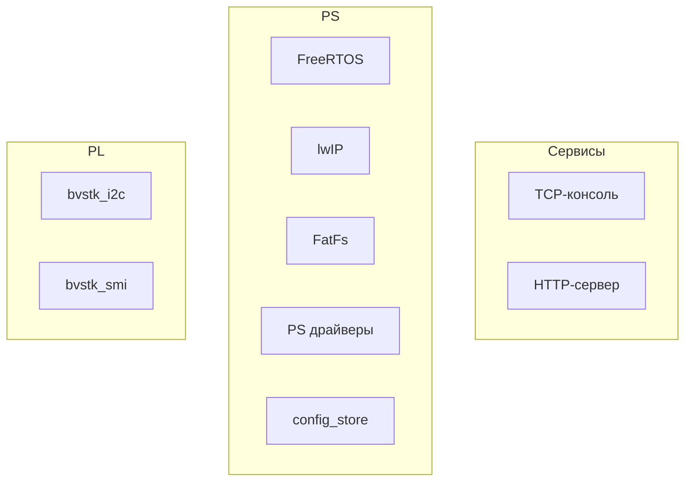
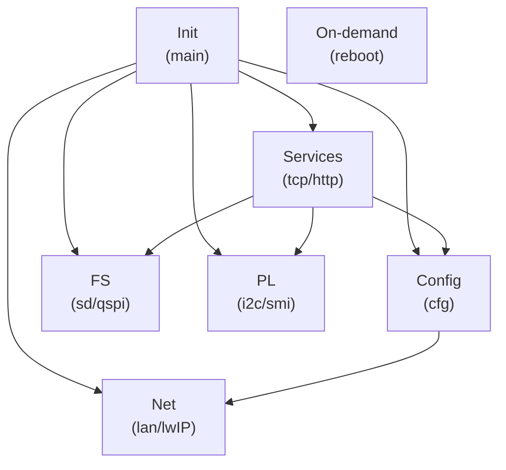
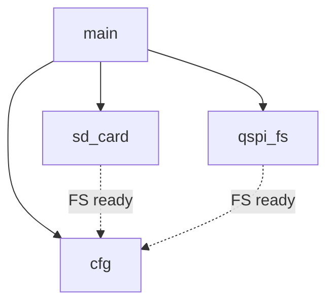
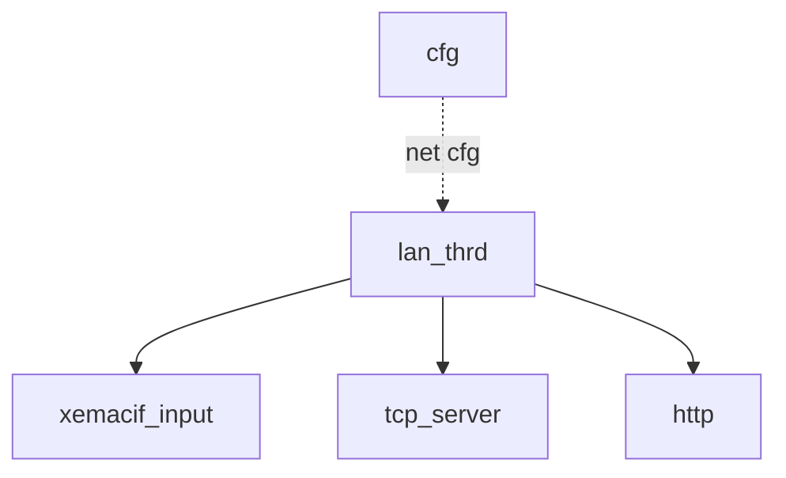
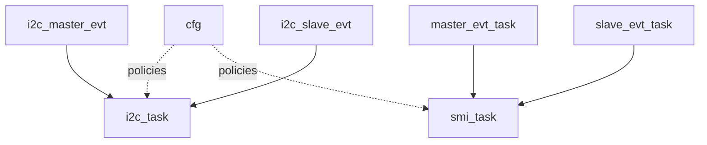
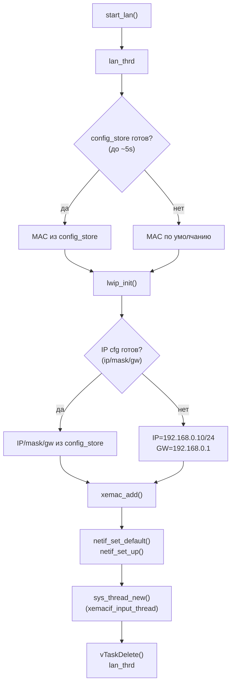
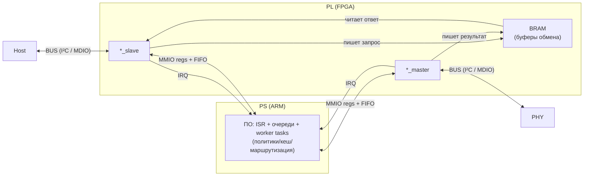
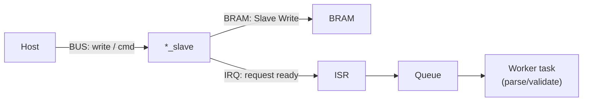
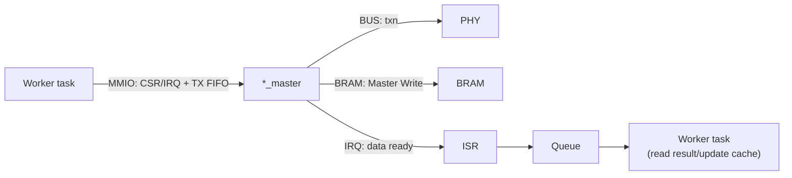

# bvstk — документация

## Оглавление

  - [Введение](#vvedenie)
    - [Назначение прошивки](#naznachenie-proshivki)
    - [Поддерживаемое железо и ограничения](#podderzhivaemoe-zhelezo-i-ogranicheniya)
    - [Термины и обозначения](#terminy-i-oboznacheniya)
  - [Архитектура системы](#arkhitektura-sistemy)
    - [Общая схема модулей](#obshchaya-skhema-moduley)
    - [Потоки/задачи FreeRTOS](#potoki-zadachi-freertos)
    - [Порядок инициализации](#poryadok-initsializatsii)
  - [Окружение разработки](#okruzhenie-razrabotki)
    - [Требования](#trebovaniya)
    - [Входные HW‑артефакты](#vkhodnye-hw-artefakty)
    - [Структура репозитория](#struktura-repozitoriya)
  - [Сборка](#sborka)
    - [Быстрый старт](#bystryy-start)
    - [Переменные сборки](#peremennye-sborki)
    - [Артефакты и структура vitis_ws](#artefakty-i-struktura-vitis_ws)
  - [Запуск и отладка](#zapusk-i-otladka)
    - [Запуск по JTAG](#zapusk-po-jtag)
    - [Подключение к TCP‑консоли](#podklyuchenie-k-tcp-konsoli)
  - [Сеть (lwIP)](#set-lwip)
    - [Инициализация интерфейса](#initsializatsiya-interfeysa)
    - [Настройка IP/MAC и сохранение](#nastroyka-ip-mac-i-sokhranenie)
    - [Смена IP и восстановление доступа](#smena-ip-i-vosstanovlenie-dostupa)
  - [Файловые системы (FatFs)](#faylovye-sistemy-fatfs)
    - [Тома и пути](#toma-i-puti)
    - [Монтирование и автоформатирование](#montirovanie-i-avtoformatirovanie)
    - [Разметка QSPI FS](#razmetka-qspi-fs)
    - [Web UI в flash:/www/](#web-ui-v-flashwww)
  - [Конфигурация (JSON / config_store)](#konfiguratsiya-json-config_store)
    - [Расположение и приоритеты](#raspolozhenie-i-prioritety)
    - [Дефолты и генерация](#defolty-i-generatsiya)
    - [Миграция legacy → primary](#migratsiya-legacy--primary)
    - [Сохранение и целостность](#sokhranenie-i-tselostnost)
  - [PL‑ядра](#pl-yadra)
    - [Назначение и место в системе](#pl-naznachenie-i-mesto-v-sisteme)
    - [Общая схема PS ↔ PL core](#pl-obshchaya-skhema-ps--pl-core)
    - [Общий протокол обмена и ограничения](#pl-protokol-obmena-i-ogranicheniya)
    - [Очереди/ISR/worker tasks](#pl-ocheredi-isr-worker-tasks)
    - [Конфигурация и политики доступа](#pl-konfiguratsiya-i-politiki-dostupa)
    - [Диагностика и отладка](#pl-diagnostika-i-otladka)
    - [PL‑ядро I2C (bvstk_i2c)](#pl-yadro-i2c-bvstk_i2c)
      - [Модель устройств и JSON‑формат](#i2c-model-ustroystv-i-json-format)
      - [Политики и persisted settings](#i2c-politiki-i-persisted-settings)
      - [Autopoll и кэш](#i2c-autopoll-i-kesh)
      - [Управление (консоль/HTTP)](#i2c-upravlenie-konsol-http)
    - [PL‑ядро SMI/MDIO (bvstk_smi)](#pl-yadro-smi-mdio-bvstk_smi)
      - [Модель PHY и JSON‑формат](#smi-model-phy-i-json-format)
      - [Политики и persisted settings](#smi-politiki-i-persisted-settings)
      - [Autopoll и обработка событий](#smi-autopoll-i-obrabotka-sobytiy)
      - [Управление (консоль/HTTP)](#smi-upravlenie-konsol-http)
  - [TCP‑консоль (порт 8888)](#tcp-konsol-port-8888)
    - [Обзор и правила ответов](#tcp-obzor-i-pravila-otvetov)
    - [Команды](#tcp-komandy)
  - [HTTP‑сервер (порт 80)](#http-server-port-80)
    - [Роутинг и форматы ответов](#http-routing-i-formaty-otvetov)
    - [/api/*](#http-api)
    - [Файловый API](#http-faylovyy-api)
    - [Раздача Web UI](#http-razdacha-web-ui)
  - [Веб‑ресурсы и деплой](#web-resursy-i-deploy)
    - [Структура web/assets](#web-struktura-webassets)
    - [Загрузка в flash:/www/](#web-zagruzka-v-flashwww)
  - [Приложения](#prilozheniya)
    - [Карта директорий](#prilozheniya-karta-direktoriy)
    - [Таблица портов/протоколов](#prilozheniya-tablitsa-portov-protokolov)
    - [Примеры команд и запросов](#prilozheniya-primery-komand-i-zaprosov)

<a id="vvedenie"></a>
## Введение

<a id="naznachenie-proshivki"></a>
### Назначение прошивки

`bvstk` — встраиваемая прошивка для SoC семейства Zynq‑7000 (PS: ARM Cortex‑A9 + PL: FPGA), которая поднимает сетевую инфраструктуру и сервисы управления устройством, а также обеспечивает унифицированный доступ к файловым системам и периферии.

Прошивка предназначена для:
- старта FreeRTOS и сетевого стека lwIP (socket API) на стороне PS;
- предоставления каналов управления и диагностики: TCP‑консоль и HTTP‑API;
- работы с двумя томами FatFs: SD (`sd:/`) и QSPI NOR (`flash:/`);
- хранения и применения конфигурации в виде JSON (в т.ч. описаний оконечных устройств/политик);
- управления кастомными PL‑ядрами (в частности `bvstk_i2c` и `bvstk_smi`) через согласованный протокол обмена, политики доступа и persist‑настройки.

Практически это “контрольная плоскость” устройства: настройка сети, перенос файлов, применение конфигов, диагностика и ручное управление/тестирование интерфейсов как со стороны PS, так и через PL‑ядра.

<a id="podderzhivaemoe-zhelezo-i-ogranicheniya"></a>
### Поддерживаемое железо и ограничения

Прошивка предполагает наличие согласованной аппаратной части (bitstream + HW export), с которой совпадают адреса периферии и параметры драйверов.

Поддерживаемое/ожидаемое железо (минимальный набор):
- **PS CPU**: ARM Cortex‑A9 (FreeRTOS на `ps7_cortexa9_0`).
- **Ethernet на PS**: GEM (`xemacps`, интерфейс `XPAR_XEMACPS_0_BASEADDR`) — требуется физическое подключение PHY и корректная настройка в HW design.
- **SD на PS**: SDIO (`XPAR_XSDPS_0_DEVICE_ID`) — для тома `sd:/` (FatFs).
- **QSPI NOR**: предполагается флеш объёмом **32 MiB** (см. `src/qspi_flash/qspi_flash.c`), для тома `flash:/` (FatFs в окне внутри флеша).
- **JTAG**: для старта по JTAG нужен доступ к `hw_server` и рабочий кабель/драйверы.
- **PL‑ядра**: кастомные ядра для I2C и SMI/MDIO (см. `src/bvstk_i2c/`, `src/bvstk_smi/`) должны быть включены в bitstream и иметь адреса/IRQ, соответствующие прошивке.

Ограничения и важные замечания:
- **Аппаратная часть не генерируется** этой репой: `*.xsa` и `*.bit` должны быть предоставлены извне и соответствовать ожидаемой адресной карте.
- **QSPI FS не должен пересекаться с BOOT‑областями**: окно задаётся через `QSPI_FS_BASE_BYTES`/`QSPI_FS_SIZE_BYTES`. Неверная разметка может повредить загрузочные образы.
- **Самотест QSPI** пишет/стирает тестовый сектор (с попыткой восстановить старые данные). Это потенциально рискованная операция для “боевого” устройства, если выбранный тестовый адрес пересекается с важными данными.
- **Автоформатирование FatFs**: при `FR_NO_FILESYSTEM` том будет отформатирован автоматически (это может стереть данные на соответствующем томе).
- **Отсутствует аутентификация** на TCP‑консоли и HTTP‑API. Диагностические операции (включая доступ к I2C/SMI и MMIO) должны использоваться только в доверенной сети/контуре.

<a id="terminy-i-oboznacheniya"></a>
### Термины и обозначения

Ниже перечислены термины и сокращения, используемые в документе и в прошивке.

- **SoC / Zynq‑7000** — система‑на‑кристалле Xilinx, объединяющая PS (процессорная часть) и PL (ПЛИС).
- **PS (Processing System)** — процессорная часть Zynq (ARM Cortex‑A9 и периферия PS: GEM, SDIO, QSPI и т.д.).
- **PL (Programmable Logic)** — программируемая логика (FPGA‑часть), в которой реализованы кастомные ядра/интерфейсы.
- **PL‑ядро / core** — аппаратный IP‑блок в PL, с которым прошивка взаимодействует через регистры/BRAM/IRQ.
- **BSP** — Board Support Package, генерируемый Vitis для выбранной платформы (драйверы, настройки, библиотеки).
- **FreeRTOS** — RTOS, на которой выполняется прикладная часть прошивки.
- **lwIP** — сетевой стек; в прошивке используется socket API.
- **FatFs / xilffs** — файловая система FAT (библиотека ChaN) и её интеграция/драйверы в экосистеме Xilinx.
- **SD / SDIO** — SD‑карта и интерфейс SDIO в PS; в прошивке представлен томом `sd:/` (также `0:/`).
- **QSPI NOR** — внешняя QSPI флеш‑память; в прошивке часть пространства отводится под том `flash:/` (также `1:/`).
- **FS / том** — файловая система, смонтированная на устройстве (SD или QSPI).
- **`sd:/`, `flash:/`** — псевдонимы путей к томам; соответствуют `0:/` и `1:/` соответственно.
- **`flash:/config/`** — основной каталог конфигурации на QSPI; **legacy** каталог: `flash:/configs/`.
- **JSON‑конфиги** — файлы конфигурации в формате JSON, хранящиеся на QSPI и/или вшитые дефолты; используются для сети, и описания оконечных устройств/политик для PL‑ядер.
- **Autopoll** — периодический опрос/сканирование регистров устройств (например, I2C/SMI) по расписанию.
- **Persisted settings** — “сохранённые настройки” (например, набор register writes), которые применяются при старте и сохраняются в JSON.
- **GEM** — Gigabit Ethernet MAC в PS (в Xilinx драйверах часто фигурирует как `xemacps`).
- **MDIO/SMI** — управляющая шина Ethernet PHY (чтение/запись регистров PHY).
- **MMIO** — доступ к регистрам по памяти (Memory‑Mapped I/O).
- **BRAM** — блоковая RAM (в PL), используемая как буфер/окно обмена между PS и PL.
- **IRQ** — прерывание; в прошивке обычно обрабатывается цепочкой ISR → очередь → задача.
- **ISR** — обработчик прерывания (Interrupt Service Routine).
- **XSCT** — Xilinx Software Command‑line Tool, используется для сборки/прошивки через TCL‑скрипты (`build.tcl`, `run_jtag.tcl`).
- **Vitis workspace (`vitis_ws/`)** — рабочая область, создаваемая скриптами сборки; содержит платформу, BSP и приложение (ELF).
- **ELF** — исполняемый файл приложения, загружаемый по JTAG (`app_bvstk.elf`).
- **HTTP API** — набор HTTP‑эндпоинтов `/api/*` и файловых маршрутов `/sd|/flash|/tar`.
- **TCP‑консоль** — интерактивная консоль по TCP (порт 8888), по смыслу близка к telnet‑сессии.

<a id="arkhitektura-sistemy"></a>
## Архитектура системы

<a id="obshchaya-skhema-moduley"></a>
### Общая схема модулей

Логически прошивка состоит из трёх “слоёв”:
- **Системный слой PS**: FreeRTOS, lwIP, FatFs и драйверы PS‑периферии (GEM/SDIO/QSPI).
- **Сервисы управления**: TCP‑консоль и HTTP‑сервер, которые используют сеть, файловые системы и конфигурацию.
- **Подсистемы PL‑ядер**: `bvstk_i2c` и `bvstk_smi`, управляемые со стороны PS и конфигурируемые через JSON.

Связи между слоями:



Соответствие блоков схемы модулям в `bvstk/src/`:

- **TCP‑консоль** (`tcp`)
  - `src/bvstk_tcp_server/bvstk_tcp_server.c`, `src/bvstk_tcp_server/bvstk_tcp_server.h`
  - `src/bvstk_tcp_server/utils/console_common.c`, `src/bvstk_tcp_server/utils/console_common.h`
  - `src/bvstk_tcp_server/utils/console_dispatch.c`
  - Команды: `src/bvstk_tcp_server/utils/fs_shell.c`, `src/bvstk_tcp_server/utils/ip_shell.c`, `src/bvstk_tcp_server/utils/i2c_shell.c`, `src/bvstk_tcp_server/utils/smi_shell.c`, `src/bvstk_tcp_server/utils/mem_shell.c`, `src/bvstk_tcp_server/utils/tar_shell.c`, `src/bvstk_tcp_server/utils/reg_frames.c`

- **HTTP‑сервер** (`http`)
  - `src/http/http_server.c`, `src/http/http_server.h`
  - `src/http_fs/http_fs_routes.c`
  - `src/tar/tar.c`, `src/tar/tar.h`

- **FreeRTOS** (`rtos`)
  - Запуск и init: `src/main.c`, `src/main.h`
  - Задачи/потоки: `src/bvstk_lan/bvstk_lan.c`, `src/bvstk_tcp_server/bvstk_tcp_server.c`, `src/http/http_server.c`, `src/config/config_store.c`, `src/sd_card/sd_card.c`, `src/qspi_fs/qspi_fs.c`, `src/bvstk_i2c/bvstk_i2c.c`, `src/bvstk_smi/bvstk_smi.c`
  - Glue для FatFs: `src/fs/ffsystem_freertos.c`

- **lwIP** (`lwip`)
  - `src/bvstk_lan/bvstk_lan.c`, `src/bvstk_lan/bvstk_lan.h`
  - Сокеты: `src/bvstk_tcp_server/*`, `src/http/http_server.c`, `src/http_fs/http_fs_routes.c`, `src/fs/fs_shared.c`
  - Доп. сервисы: `src/mqtt_proc/*`, `src/sntp_proc/*`

- **FatFs** (`fatfs`)
  - `src/fs/fs_shared.c`, `src/fs/fs_shared.h`
  - `src/fs/fs_devices.c`, `src/fs/fs_devices.h`
  - `src/fs/diskio.c`
  - SD том: `src/sd_card/sd_card.c`, `src/sd_card/sd_card.h`
  - QSPI том: `src/qspi_fs/qspi_fs.c`, `src/qspi_fs/qspi_fs.h`, `src/qspi_fs/qspi_fs_layout.h`

- **PS драйверы** (`psdrv`)
  - Ethernet (GEM): `src/bvstk_lan/bvstk_lan.c`
  - SDIO: `src/sd_card/sd_card.c`
  - QSPI: `src/qspi_flash/qspi_flash.c`, `src/qspi_flash/qspi_flash.h`
  - MMIO/IRQ для PL‑взаимодействия: `src/bvstk_i2c/bvstk_i2c.c`, `src/bvstk_smi/bvstk_smi.c`

- **config_store** (`cfg`)
  - `src/config/config_store.c`, `src/config/config_store.h`
  - Дефолты (генерируются при сборке): `src/config/default_configs.h`

- **bvstk_i2c** (`i2c_sw`)
  - `src/bvstk_i2c/bvstk_i2c.c`, `src/bvstk_i2c/bvstk_i2c.h`
  - Интеграции: `src/bvstk_tcp_server/utils/i2c_shell.c`, `src/http_fs/http_fs_routes.c`

- **bvstk_smi** (`smi_sw`)
  - `src/bvstk_smi/bvstk_smi.c`, `src/bvstk_smi/bvstk_smi.h`
  - Интеграции: `src/bvstk_tcp_server/utils/smi_shell.c`, `src/http_fs/http_fs_routes.c`

<a id="potoki-zadachi-freertos"></a>
### Потоки/задачи FreeRTOS

В прошивке используется ОСРВ FreeRTOS. “Потоки” lwIP (`sys_thread_new`) в итоге тоже создаются как задачи FreeRTOS (через порт lwIP под FreeRTOS).

**Группы задач**



Расшифровка групп:

- **Init (main)** — *не задача*: синхронный код в `src/main.c` до `vTaskStartScheduler()`, который вызывает `start_*()` и тем самым создаёт задачи ниже.
  - Создаёт/запускает: `sd_card`, `qspi_fs`, `cfg`, `lan_thrd`, `tcp_server_thrd`, `http`, а также задачи I2C/SMI.
- **Config (cfg)** — задача `cfg` (`src/config/config_store.c`): загрузка/миграция JSON и выставление `config_store_is_ready()`.
  - Задачи: `cfg`
- **FS (sd/qspi)** — фоновые задачи, которые монтируют тома и держат флаги готовности.
  - Задачи: `sd_card`, `qspi_fs`
- **Net (lan/lwIP)** — инициализация сети и приём пакетов.
  - Задачи/потоки: `lan_thrd`, `xemacif_input_thread`
- **Services (tcp/http)** — пользовательские сервисы поверх lwIP.
  - Задачи/потоки: `tcp_server_thrd`, `http`
- **PL (i2c/smi)** — подсистемы кастомных PL‑ядер (event‑таски + worker/autopoll).
  - I2C: `i2c_master_evt`, `i2c_slave_evt`, `i2c_task`
  - SMI: `master_evt_task`, `slave_evt_task`, `smi_task`
- **On-demand (reboot)** — задачи, которые создаются на время выполнения команды.
  - Задачи: `reboot`

**Конфиг и файловые системы**



Расшифровка:

- **`main`** — `src/main.c`: синхронно вызывает `start_sd_card()`, `start_qspi_fs()`, `start_config_store()` и т.п., затем запускает планировщик.
- **`sd_card`** — `src/sd_card/sd_card.c`: задача, которая инициализирует SDIO и периодически пытается примонтировать SD‑том (`sd:/`, `0:/`).
- **`qspi_fs`** — `src/qspi_fs/qspi_fs.c`: задача, которая инициализирует QSPI и периодически пытается примонтировать QSPI‑том (`flash:/`, `1:/`).
- **`cfg`** — `src/config/config_store.c`: задача, которая ждёт готовность QSPI‑тома, создаёт каталоги `flash:/config`, мигрирует legacy‑конфиги, читает/парсит JSON и выставляет `config_store_is_ready()`.
- **`FS ready` (пунктир)** — логическая зависимость: `cfg` использует QSPI‑ФС для чтения/записи конфигов; `sd_card`/`qspi_fs` поднимают соответствующие тома и выставляют флаг готовности.

**Сеть и сервисы**



Расшифровка:

- **`cfg`** — `src/config/config_store.c`: источник сетевых параметров (IP/маска/шлюз/MAC) из `flash:/config/network.json` (или дефолт), которые используются при инициализации сети.
- **`lan_thrd`** — `src/bvstk_lan/bvstk_lan.c`: поток/задача, который читает конфиг (если готов), вызывает `lwip_init()`, поднимает `netif` и делает интерфейс “up”.
- **`xemacif_input`** — поток `xemacif_input_thread` (создаётся из `lan_thrd`): приём/обработка входящих пакетов из драйвера Ethernet и доставка их в стек lwIP.
- **`tcp_server`** — `src/bvstk_tcp_server/bvstk_tcp_server.c`: TCP‑консоль (порт 8888), работает поверх socket API lwIP.
- **`http`** — `src/http/http_server.c` + `src/http_fs/http_fs_routes.c`: HTTP‑сервер (порт 80) и маршрутизация `/api/*`, `/sd|/flash|/tar`, статика из `flash:/www/`.
- **`net cfg` (пунктир)** — логическая зависимость: `lan_thrd` пытается использовать параметры из `cfg` (если `config_store_is_ready()`), иначе поднимается с дефолтными значениями.

**PL подсистемы**



Расшифровка:

- **`cfg`** — `src/config/config_store.c`: источник конфигов/политик для PL‑подсистем (I2C/SMI), доступных через `config_store_*`.
- **I2C задачи** — `src/bvstk_i2c/bvstk_i2c.c`:
  - **`i2c_master_evt`** — event‑задача: получает события от IRQ/очереди “master” и инициирует обработку.
  - **`i2c_slave_evt`** — event‑задача: получает события “slave” (кадры/команды) и инициирует обработку.
  - **`i2c_task`** — рабочая задача: autopoll, применение persisted settings, операции чтения/записи с учётом политик.
- **SMI задачи** — `src/bvstk_smi/bvstk_smi.c`:
  - **`master_evt_task`** — event‑задача “master”: обработка событий от IRQ/очереди.
  - **`slave_evt_task`** — event‑задача “slave”: обработка команд/событий хоста.
  - **`smi_task`** — рабочая задача: autopoll PHY, применение persisted settings, операции чтения/записи с учётом политик.
- **`policies` (пунктир)** — логическая зависимость: рабочие задачи используют данные из `cfg` (конфиги устройств/PHY и политики), когда `config_store_is_ready()` установлен.
- **Стрелки `*_evt → *_task`** — упрощённо: ISR кладёт событие в очередь → event‑задача извлекает → основная логика выполняется в worker‑задаче.

**Постоянные задачи (создаются при старте)**
- **`cfg`** — загрузка/миграция JSON‑конфигов и установка флага готовности (`start_config_store()` → `config_task`). `CONFIG_TASK_STACK=2048`, `CONFIG_TASK_PRIO=tskIDLE_PRIORITY+3`. Код: `src/config/config_store.c`.
- **`sd_card`** — фоновое монтирование SD (`0:/`, `sd:/`) с периодическими попытками. `SD_TASK_STACK=1024`, `SD_TASK_PRIO=tskIDLE_PRIORITY+2`. Код: `src/sd_card/sd_card.c`.
- **`qspi_fs`** — фоновое монтирование QSPI‑тома (`1:/`, `flash:/`). `QSPI_TASK_STACK=1024`, `QSPI_TASK_PRIO=tskIDLE_PRIORITY+1`. Код: `src/qspi_fs/qspi_fs.c`.
- **`lan_thrd`** — инициализация сети (lwIP + netif) и запуск input‑треда `xemacif_input_thread`. Код: `src/bvstk_lan/bvstk_lan.c`.
- **`tcp_server_thrd`** — TCP‑консоль на порту 8888. Стек: `TCP_THREAD_STACKSIZE=12288`. Код: `src/bvstk_tcp_server/bvstk_tcp_server.c`, `src/bvstk_tcp_server/bvstk_tcp_server.h`.
- **`http`** — HTTP‑сервер на порту 80. Стек: `HTTP_THREAD_STACK=2048`. Код: `src/http/http_server.c`.
- **I2C подсистема** — `i2c_master_evt`, `i2c_slave_evt`, `i2c_task` (очереди + обработка событий + autopoll). `I2C_TASK_STACK_SIZE=512`, `I2C_TASK_PRIORITY=tskIDLE_PRIORITY+1`. Код: `src/bvstk_i2c/bvstk_i2c.c`, `src/bvstk_i2c/bvstk_i2c.h`.
- **SMI подсистема** — `master_evt_task`, `slave_evt_task`, `smi_task` (очереди + обработка событий + autopoll). `SMI_TASK_STACK_SIZE=1024`, `SMI_TASK_PRIORITY=tskIDLE_PRIORITY+1` (evt‑таски: `SMI_TASK_PRIORITY+1`). Код: `src/bvstk_smi/bvstk_smi.c`, `src/bvstk_smi/bvstk_smi.h`.

**Задачи “по требованию”**
- **`reboot`** — отложенная перезагрузка (создаётся по команде из консоли или HTTP). Код: `src/bvstk_tcp_server/utils/console_dispatch.c`, `src/http_fs/http_fs_routes.c`.

**Синхронизация и обмен**
- Очереди FreeRTOS используются в I2C/SMI для доставки событий из ISR в задачи (например, `q_master/q_slave`).
- Mutex’ы используются для шины/доступа к общим ресурсам (например, `i2c_bus_mutex`, `smi_bus_mutex`, а также mutex’ы контекстов ФС SD/QSPI).

<a id="poryadok-initsializatsii"></a>
### Порядок инициализации

Порядок старта задаётся `src/main.c`. Важно: до `vTaskStartScheduler()` выполняется “синхронный” код `main()`, который **создаёт задачи**; сами задачи начинают выполняться после запуска планировщика.

**Шаги `main()` (по порядку вызова)**
1. `qspi_flash_self_test()` — быстрый тест записи/чтения QSPI (и попытка восстановить исходные данные тестового сектора).
2. `start_sd_card()` — создаёт задачу `sd_card` и делает первую попытку монтирования SD‑тома.
3. `start_qspi_fs()` — создаёт задачу `qspi_fs` и делает первую попытку монтирования QSPI‑тома.
4. `fs_devices_init()` — связывает “устройства” `sd`/`flash` с их контекстами (маршрутизация `sd:/` и `flash:/`).
5. `start_config_store()` — создаёт задачу `cfg`:
   - ждёт готовность QSPI‑тома (порядка десятков секунд),
   - создаёт `flash:/config/`,
   - мигрирует legacy `flash:/configs/` при необходимости,
   - загружает JSON‑конфиги в RAM и выставляет `config_store_is_ready()`.
6. `start_lan()` — создаёт поток `lan_thrd`, который:
   - пытается дождаться `config_store` (короткий таймаут),
   - вызывает `lwip_init()`, поднимает `netif`,
   - создаёт поток `xemacif_input_thread`.
7. `start_tcp_server()` — создаёт поток `tcp_server_thrd` (TCP‑консоль `:8888`).
8. `start_http_server()` — создаёт поток `http` (HTTP `:80`).
9. `start_smi()` — создаёт задачи SMI: `master_evt_task`, `slave_evt_task`, `smi_task`.
10. `start_i2c()` — создаёт задачи I2C: `i2c_master_evt`, `i2c_slave_evt`, `i2c_task`.
11. `vTaskStartScheduler()` — запуск планировщика; после этого управление переходит задачам.

**Ключевые зависимости**
- `cfg` использует QSPI‑том для чтения/записи конфигов; пока QSPI не смонтирован, используется fallback на “вшитые” дефолты.
- `lan_thrd` пытается применить сетевой конфиг из `cfg`; если `config_store` ещё не готов, сеть поднимется с дефолтными параметрами.
- `tcp_server_thrd` и `http` предполагают, что сеть/стек lwIP уже подняты (поэтому `start_lan()` вызывается раньше).

<a id="okruzhenie-razrabotki"></a>
## Окружение разработки

<a id="trebovaniya"></a>
### Требования

Для сборки и запуска через JTAG требуется окружение Xilinx и несколько утилит на хост‑ПК.

**Обязательное**
- **Xilinx Vitis / XSCT**: `xsct` должен быть доступен в `PATH` (обычно после `source <Vitis-install>/settings64.sh`).
- **Python 3**: используется вспомогательными скриптами сборки (генерация дефолтных конфигов и патчи FatFs).
- **Hardware Export (`*.xsa`)**: соответствует вашему HW‑design (адреса/IRQ/периферия должны совпадать с прошивкой).

**Для запуска по JTAG**
- **hw_server** и драйверы JTAG‑кабеля (Xilinx Cable Drivers).
- **Bitstream (`*.bit`)** для программирования PL.

**Проверка окружения**
```sh
source <Vitis-install>/settings64.sh
xsct -version
python3 --version
```

<a id="vkhodnye-hw-artefakty"></a>
### Входные HW‑артефакты

Прошивка собирается и запускается поверх конкретного HW‑design. Поэтому нужны артефакты аппаратной части:

**1) Hardware Export (`*.xsa`)**
- Используется при сборке платформы Vitis (создание `plat_bvstk` и BSP).
- Должен соответствовать вашему bitstream’у и адресной карте (PS‑периферия, IRQ, MMIO/BRAM для PL‑ядер).
- Как передать:
  - через переменную окружения для сборки: `XSA=/abs/path/design.xsa ./build.sh`
  - если `XSA` не задан, по умолчанию берётся путь из `build.sh`/`build.tcl` (см. `DEFAULT_XSA`).

**2) Bitstream (`*.bit`)**
- Нужен для программирования PL при запуске по JTAG.
- Как передать:
  - аргументом: `./run_jtag.sh /abs/path/design.bit`
  - либо через `BITSTREAM_FILE=/abs/path/design.bit` (учитывается в `run_jtag.sh`)
  - либо через жёстко заданный `BITSTREAM_PATH_OVERRIDE` в `run_jtag.tcl` (если он не пустой)
  - иначе используется `vitis_ws/plat_bvstk/export/.../hw/*.bit` (если такой файл есть).

**3) PS7 init (`ps7_init.tcl`)**
- Требуется для JTAG‑старта: инициализация PS перед загрузкой ELF.
- Скрипт берётся из export’а платформы: `vitis_ws/plat_bvstk/export/plat_bvstk/hw/ps7_init.tcl`.
- Появляется после успешной сборки `./build.sh`.

**4) (Опционально) Device/board‑specific файлы**
- В зависимости от HW‑design могут потребоваться дополнительные файлы/настройки вне репозитория (например, проекты Vivado, constraints, генерация XSA/bit).

<a id="struktura-repozitoriya"></a>
### Структура репозитория

Ключевые каталоги и файлы:

- `build.sh` — обёртка для сборки: проверяет наличие `xsct` и запускает `xsct build.tcl`.
- `build.tcl` — “one‑stop” XSCT‑скрипт: создаёт `vitis_ws/`, генерирует платформу/BSP, подключает исходники `src/` и собирает ELF.
- `run_jtag.sh` — обёртка запуска по JTAG: принимает `.bit` как аргумент (опционально) и запускает `xsct run_jtag.tcl`.
- `run_jtag.tcl` — сценарий JTAG‑запуска: connect → reset/halt → `fpga -f` → `ps7_init` → `dow` ELF → `con`.
- `configs/` — шаблоны JSON, которые встраиваются в прошивку как дефолты (сеть, I2C, SMI).
- `src/` — исходники прошивки (линкуются в Vitis‑проект как `vitis_ws/app_bvstk/src -> ./src`).
  - `src/main.c` — порядок инициализации и запуск планировщика.
  - `src/config/` — `config_store` (загрузка/миграция/сохранение JSON) и `default_configs.h` (генерируется при сборке).
  - `src/fs/` — общий слой FatFs (`fs_shared`, `fs_devices`), `diskio.c` (SD + QSPI как тома), FreeRTOS glue.
  - `src/sd_card/` — SDIO + задача монтирования SD.
  - `src/qspi_flash/` — низкоуровневый доступ к QSPI NOR и self‑test.
  - `src/qspi_fs/` — задача монтирования QSPI‑тома и разметка окна в флеше.
  - `src/bvstk_lan/` — инициализация lwIP/netif (MAC/IP из config_store).
  - `src/bvstk_tcp_server/` — TCP‑консоль и утилиты (`fs/ip/i2c/smi/mem/tar`).
  - `src/http/` и `src/http_fs/` — HTTP‑сервер, API `/api/*`, файловый доступ `/sd|/flash|/tar`, раздача `flash:/www/`.
  - `src/bvstk_i2c/`, `src/bvstk_smi/` — подсистемы кастомных PL‑ядер I2C и SMI/MDIO.
  - `src/mqtt_proc/`, `src/sntp_proc/` — дополнительные сетевые обработчики (если включены/используются).
  - `src/tar/` — tar‑упаковка/распаковка (используется для `/tar/*`).
- `vitis_ws/` — генерируемая рабочая область Vitis (платформа/BSP/ELF). Может быть удалена и пересоздана сборкой.
- `web/` — утилиты загрузки web‑ресурсов в `flash:/www/` (скрипты + `web/assets/`).
- `dot/` — вспомогательные материалы/черновики (не участвует в сборке прошивки).

<a id="sborka"></a>
## Сборка

<a id="bystryy-start"></a>
### Быстрый старт

Минимальный сценарий сборки (с нуля):

1) Активировать окружение Xilinx:
```sh
source <Vitis-install>/settings64.sh
```

2) Собрать прошивку, указав `*.xsa`:
```sh
XSA=/abs/path/to/design.xsa ./build.sh
```

Примечание:
- В `build.sh` задан “дефолтный” путь `DEFAULT_XSA=...`. Если вы не хотите каждый раз указывать `XSA=...`, можно **отредактировать `DEFAULT_XSA` прямо в `build.sh`** под ваш локальный путь.
- Аналогично, для JTAG‑старта в `run_jtag.tcl` есть `BITSTREAM_PATH_OVERRIDE`. Если он не пустой — используется именно он (его тоже можно поменять под вашу систему).

Результат:
- ELF приложения: `vitis_ws/app_bvstk/Debug/app_bvstk.elf`
- Экспорт платформы (в т.ч. `ps7_init.tcl`): `vitis_ws/plat_bvstk/export/plat_bvstk/hw/`

Если нужно пересобирать без удаления `vitis_ws/`:
```sh
XSA=/abs/path/to/design.xsa CLEAN=0 ./build.sh
```

<a id="peremennye-sborki"></a>
### Переменные сборки

Скрипты сборки/запуска читают настройки из **переменных окружения** (environment variables).

Как задавать переменные (в bash):

1) **Только для одной команды**:
```sh
XSA=/abs/path/to/design.xsa CLEAN=0 ./build.sh
```

2) **Экспортировать в текущую сессию**:
```sh
export XSA=/abs/path/to/design.xsa
export CLEAN=0
./build.sh
```

3) Эквивалент через `env`:
```sh
env XSA=/abs/path/to/design.xsa CLEAN=0 ./build.sh
```

**`XSA`**
- Путь к Hardware Export (`*.xsa`), который используется для создания платформы Vitis.
- Если не задан, берётся `DEFAULT_XSA` из `build.sh` (и аналогичный default внутри `build.tcl`).
- Пример:
```sh
XSA=/abs/path/to/design.xsa ./build.sh
```

**`CLEAN`**
- Управляет пересозданием `vitis_ws/`.
- `CLEAN=1` (по умолчанию) — удалить `vitis_ws/` перед сборкой.
- `CLEAN=0` — оставить существующий `vitis_ws/` и пересобрать внутри него.
- Пример:
```sh
XSA=/abs/path/to/design.xsa CLEAN=0 ./build.sh
```

**`LWIP_LIB`**
- Выбор имени lwIP‑библиотеки в BSP (зависит от установленной версии Vitis/BSP).
- Если не задан, скрипт пробует по очереди `lwip220`, затем `lwip211`.
- Пример:
```sh
XSA=/abs/path/to/design.xsa LWIP_LIB=lwip220 ./build.sh
```

**`BITSTREAM_FILE`** (JTAG‑запуск)
- Путь к `.bit`, который будет использован `run_jtag.tcl`.
- Учитывается, только если в `run_jtag.tcl` переменная `BITSTREAM_PATH_OVERRIDE` пустая, и если не передан путь через аргумент `run_jtag.sh`.
- Пример:
```sh
BITSTREAM_FILE=/abs/path/to/design.bit ./run_jtag.sh
```

<a id="artefakty-i-struktura-vitis_ws"></a>
### Артефакты и структура vitis_ws

`vitis_ws/` — генерируемая рабочая область Vitis/XSCT. По умолчанию `build.sh` удаляет её и создаёт заново (см. `CLEAN`).

Типовая структура:

- `vitis_ws/app_bvstk/` — проект приложения.
  - `vitis_ws/app_bvstk/src` — **symlink** на `./src` репозитория (исходники не копируются).
  - `vitis_ws/app_bvstk/Debug/app_bvstk.elf` — собранный ELF приложения.
  - `vitis_ws/app_bvstk/_ide/` — служебные артефакты IDE (в т.ч. копии `.bit`/`ps7_init.tcl`).

- `vitis_ws/plat_bvstk/` — платформа (hardware + domains + BSP).
  - `vitis_ws/plat_bvstk/hw/` — локальная копия/снимок hardware (`*.xsa`, `*.bit`, `ps7_init.tcl`).
  - `vitis_ws/plat_bvstk/export/plat_bvstk/hw/` — export платформы, используемый `run_jtag.tcl`:
    - `ps7_init.tcl` — инициализация PS7 для JTAG‑старта
    - `*.bit` — bitstream (если присутствует)
    - `*.xsa` — hardware export
  - `vitis_ws/plat_bvstk/ps7_cortexa9_0/freertos10_xilinx_domain/bsp/` — BSP FreeRTOS‑домена (Makefile, `system.mss`, `libsrc/...`).

- `vitis_ws/plat_bvstk/zynq_fsbl/` — проект FSBL (может собираться/использоваться отдельно).
  - `vitis_ws/plat_bvstk/zynq_fsbl/fsbl.elf` — ELF FSBL.

Замечания:
- `src/config/default_configs.h` генерируется при сборке и входит в `app_bvstk` через symlink на `src/`.
- Скрипты сборки патчат файлы FatFs в BSP (LFN + FreeRTOS) внутри `.../bsp/.../libsrc/` — это нормально, но значит, что состояние `vitis_ws/` зависит от прогонов сборки (поэтому `CLEAN=1` полезен для “чистой” пересборки).

<a id="zapusk-i-otladka"></a>
## Запуск и отладка

<a id="zapusk-po-jtag"></a>
### Запуск по JTAG

JTAG‑запуск используется для разработки/отладки: программируется PL (bitstream), инициализируется PS7, загружается ELF приложения и выполняется `con` (run).

**Предусловия**
- Активировано окружение Xilinx (чтобы `xsct` был в `PATH`): `source <Vitis-install>/settings64.sh`
- Запущен `hw_server` (локально или на удалённой машине) и доступен JTAG‑кабель.
- Собран ELF: `vitis_ws/app_bvstk/Debug/app_bvstk.elf`

**Команда**
```sh
./run_jtag.sh /abs/path/to/design.bit
```
Если не передавать аргумент, `run_jtag.sh` использует настройки внутри `run_jtag.tcl` (см. `BITSTREAM_PATH_OVERRIDE`) или пытается взять `.bit` из `vitis_ws/plat_bvstk/export/.../hw/`.

**Что делает `run_jtag.tcl` (упрощённо)**
1. `connect` к `hw_server`
2. `rst -system` + остановка CPU
3. `fpga -f <bit>` — программирование PL
4. `source ps7_init.tcl`, затем `ps7_init` и `ps7_post_config`
5. `dow <app_bvstk.elf>` — загрузка ELF в core0
6. `con` — запуск выполнения

**Замечания**
- Путь к ELF фиксирован: `vitis_ws/app_bvstk/Debug/app_bvstk.elf`.
- Путь к `ps7_init.tcl` берётся из export платформы: `vitis_ws/plat_bvstk/export/plat_bvstk/hw/ps7_init.tcl`.
- При проблемах с `.bit` проверьте приоритет: аргумент `run_jtag.sh` → `BITSTREAM_PATH_OVERRIDE` → `BITSTREAM_FILE` → `BITSTREAM_DEFAULT`.

<a id="podklyuchenie-k-tcp-konsoli"></a>
### Подключение к TCP‑консоли

TCP‑консоль — основной интерактивный канал управления (порт `8888`). Подключение похоже на telnet‑сессию: ввод команд строками, вывод — текст с `OK/ERR`.

**Подключение**
```sh
telnet <device-ip> 8888
```

Если `telnet` не установлен, можно использовать `nc`:
```sh
nc <device-ip> 8888
```

**Первичные проверки**
```
help
ip addr show
fs pwd
fs ls
```

**Важно**
- Если вы меняете IP через `ip addr set ...`, текущая сессия может оборваться — это ожидаемо, переподключайтесь к новому адресу.
- Для работы команд `fs` должны быть смонтированы тома `sd:/` и/или `flash:/` (монтирование делается фоновыми задачами).

<a id="set-lwip"></a>
## Сеть (lwIP)

<a id="initsializatsiya-interfeysa"></a>
### Инициализация интерфейса

Инициализация сетевого интерфейса выполняется в `src/bvstk_lan/bvstk_lan.c` и запускается из `main()` через `start_lan()`.

Поток `lan_thrd` делает следующее:



1) **Подхватывает MAC из конфигурации (если успела загрузиться)**  
`lan_thread()` ждёт готовность `config_store` до ~5 секунд и, если в конфиге задан MAC, копирует его в глобальный `mac_ethernet_address[]`.

2) **Поднимает lwIP**  
Вызывается `lwip_init()`.

3) **Настраивает IPv4 адресацию**  
Если `config_store` готов и есть `ip/netmask/gateway`, они применяются. Иначе используются дефолты:
- IP: `192.168.0.10`
- mask: `255.255.255.0`
- gw: `192.168.0.1`

4) **Создаёт netif на PS Ethernet (GEM)**  
Вызов `xemac_add(..., XPAR_XEMACPS_0_BASEADDR)` добавляет интерфейс, после чего делается:
- `netif_set_default(netif)`
- `netif_set_up(netif)`

5) **Запускает input‑поток драйвера**  
Создаётся `xemacif_input_thread` (через `sys_thread_new("xemacif_input_thread", ...)`) для приёма/обработки входящих пакетов.

После успешной инициализации `lan_thrd` завершает работу (`vTaskDelete(NULL)`).

<a id="nastroyka-ip-mac-i-sokhranenie"></a>
### Настройка IP/MAC и сохранение

Параметры сети хранятся в `config_store` (и сохраняются в `flash:/config/network.json`) и могут применяться:
- **в рантайме** (на текущий `netif`) — чтобы изменения вступили сразу;
- **персистентно** — чтобы применялись после перезагрузки.

Доступные способы изменения:

**1) TCP‑консоль: команда `ip`**

Показать текущие значения:
```
ip addr show
ip link show
ip route show
```

Задать IP/маску (CIDR) и применить сразу:
```
ip addr set 192.168.0.10/24
```

Задать default gateway и применить сразу:
```
ip route set default via 192.168.0.1
```

Задать MAC и применить сразу:
```
ip link set address 00:0a:35:00:01:02
```

Сохранить *текущие* runtime‑параметры `netif` в `flash:/config/network.json` (без изменения адресов):
```
ip save
```

Как это реализовано:
- Парсинг и команды — `src/bvstk_tcp_server/utils/ip_shell.c`
- Сохранение — `config_store_save_network()` (`src/config/config_store.c`)
- Runtime‑применение — `netif_set_ipaddr/netif_set_netmask/netif_set_gw` + обновление `mac_ethernet_address` и `netif->hwaddr` (если доступно)

**2) HTTP API: `PUT /api/net`**

Эндпоинт принимает JSON и может (опционально) применить конфиг сразу.

Пример (применить сразу):
```sh
curl -X PUT http://<device-ip>/api/net \
  -H 'Content-Type: application/json' \
  --data '{"ip":"192.168.0.10/24","gateway":"192.168.0.1","mac":"00:0a:35:00:01:02","apply":true}'
```

Пример (только сохранить, не применять):
```sh
curl -X PUT http://<device-ip>/api/net \
  -H 'Content-Type: application/json' \
  --data '{"ip":"192.168.0.10/24","gateway":"192.168.0.1","mac":"00:0a:35:00:01:02","apply":false}'
```

Замечания по формату:
- `ip` можно задавать как `"a.b.c.d/prefix"`, либо `"ip"+"netmask"` (или `"prefix"` числом).
- `gateway` и `mac` обязательны для `PUT /api/net`.
- Реализация: `api_handle_net_put()` в `src/http_fs/http_fs_routes.c`.

**3) Файловый способ (через `flash:/config/network.json`)**

Если удобнее управлять конфигом как файлом, можно заменить `flash:/config/network.json` через файловый API:
- `PUT /flash/config/network.json` (запись файла на QSPI)

Важно: замена файла сама по себе не гарантирует немедленное применение в рантайме — для “живого” применения используйте `ip ... set` или `PUT /api/net` с `"apply":true`.

**Поведение при смене IP**
- Любое runtime‑применение IP может разорвать текущие TCP/HTTP соединения — это нормально; переподключайтесь к новому адресу.

<a id="smena-ip-i-vosstanovlenie-dostupa"></a>
### Смена IP и восстановление доступа

Смена IP выполняется “на лету” (в рантайме) и почти всегда приводит к потере текущих соединений (TCP‑консоль и/или HTTP), потому что удалённая сторона продолжает слать пакеты на старый адрес.

**Как сменить IP**

Через TCP‑консоль:
```
ip addr set 192.168.0.20/24
ip route set default via 192.168.0.1
ip link set address 00:0a:35:00:01:02
ip save
```

Через HTTP (с немедленным применением):
```sh
curl -X PUT http://<old-ip>/api/net \
  -H 'Content-Type: application/json' \
  --data '{"ip":"192.168.0.20/24","gateway":"192.168.0.1","mac":"00:0a:35:00:01:02","apply":true}'
```

**Как восстановить доступ**
1. Подключитесь к **новому адресу**:
   - `telnet 192.168.0.20 8888`
   - `curl http://192.168.0.20/api/net`
2. Если вы потеряли адрес устройства:
   - проверьте таблицу ARP на ПК (по MAC): `ip neigh` / `arp -a`
   - используйте сканирование подсети (например, `nmap -sn 192.168.0.0/24`) и затем проверьте порт `8888` или `80`.
3. Если устройство перестало отвечать после смены параметров:
   - верните конфиг через JTAG‑старт и TCP‑консоль,
   - либо замените `flash:/config/network.json` на корректный файл (через SD или HTTP‑файловый API, если доступен).

**Примечания**
- Изменения, записанные через `ip save` или `PUT /api/net` (saved), применятся и после перезагрузки.
- Если `config_store`/QSPI недоступны, устройство может стартовать с дефолтным IP (см. раздел про инициализацию интерфейса).

<a id="faylovye-sistemy-fatfs"></a>
## Файловые системы (FatFs)

<a id="toma-i-puti"></a>
### Тома и пути

В прошивке используется FatFs с двумя логическими томами:

- **SD**: `0:/` (псевдоним **`sd:/`**) — том на SD‑карте (PS SDIO).  
  Корень задаётся как `SD_ROOT="0:/"` (`src/sd_card/sd_card.h`).

- **QSPI**: `1:/` (псевдоним **`flash:/`**) — том внутри QSPI NOR (окно во флеше).  
  Корень задаётся как `QSPI_ROOT="<N>:/"`, где `<N>=XPAR_XSDPS_NUM_INSTANCES` (`src/qspi_fs/qspi_fs.h`). На типовой конфигурации с одним SD‑контроллером это даёт `1:/`.

Псевдонимы `sd:/` и `flash:/` реализованы через слой устройств `fs_devices`:
- список устройств: `sd`, `flash` (`src/fs/fs_devices.c`)
- привязка контекстов выполняется в `fs_devices_init()` (вызывается из `main()`).

Где используются пути:
- **TCP‑консоль (`fs`)** понимает:
  - явные пути `0:/...`, `1:/...`
  - псевдонимы `sd:/...`, `flash:/...`
  - “переключение” устройства командами `fs cd sd` / `fs cd flash`
- **HTTP файловый API** маппит:
  - `GET/PUT /sd/<path>` → `sd:/<path>`
  - `GET/PUT /flash/<path>` → `flash:/<path>`
  - `GET/PUT /tar/sd/<dir>` и `.../tar/flash/<dir>` → tar‑поток в/из каталога
- **Web UI** раздаётся как статика из `flash:/www/` (каталог `www` внутри QSPI‑тома).

<a id="montirovanie-i-avtoformatirovanie"></a>
### Монтирование и автоформатирование

Монтирование томов выполняется фоновыми задачами `sd_card` и `qspi_fs`. Оба тома используют общий слой `fs_shared` и считаются “готовыми” только после успешного `f_mount(...)`.

**Как устроено монтирование**
- `start_sd_card()` создаёт задачу `sd_card`, которая раз в 1 секунду пытается примонтировать `SD_ROOT` (`0:/`). Код: `src/sd_card/sd_card.c`.
- `start_qspi_fs()` создаёт задачу `qspi_fs`, которая раз в 1 секунду пытается примонтировать `QSPI_ROOT` (обычно `1:/`). Перед монтированием выполняется `qspi_flash_init()`. Код: `src/qspi_fs/qspi_fs.c`.
- Фактическая операция монтирования делегируется в `fs_shared_mount(ctx, label)` (`src/fs/fs_shared.c`).
- Ряд потребителей (HTTP файловый API, консольные команды) дополнительно вызывают `fs_device_prepare()` (`src/fs/fs_devices.c`), чтобы сделать несколько быстрых попыток монтирования перед операцией.

**Автоформатирование (важно)**
В `fs_shared_mount()` при `FR_NO_FILESYSTEM` выполняется форматирование:
- `f_mkfs(ctx->root, FM_ANY|FM_SFD, ...)`, затем повторный `f_mount(...)`.

Это означает:
- если носитель “чистый” или таблица FAT повреждена, прошивка может **создать новую файловую систему** автоматически;
- данные на соответствующем томе при этом будут **потеряны**.

**Сигналы готовности**
- Готовность тома хранится как `ctx->ready` и выставляется в `1` после успешного монтирования.
- При обращении к ФС до готовности команды возвращают “FS not ready” / ошибку, пока фоновые задачи не смонтируют том.

<a id="razmetka-qspi-fs"></a>
### Разметка QSPI FS

QSPI‑том `flash:/` не занимает весь флеш “с нуля”: чтобы не затронуть загрузочные образы (например, `BOOT.bin`), FatFs для QSPI отображается на **окно** внутри QSPI NOR.

**Параметры окна**
Определены в `src/qspi_fs/qspi_fs_layout.h`:
- `QSPI_FS_BASE_BYTES` — смещение начала окна (по умолчанию **8 MiB**).
- `QSPI_FS_SIZE_BYTES` — размер окна (по умолчанию `QSPI_FLASH_SIZE_BYTES - QSPI_FS_BASE_BYTES`).

**Ограничения (проверяются на этапе компиляции)**
- `QSPI_FS_BASE_BYTES` должен быть выровнен на размер сектора стирания `QSPI_FLASH_SECTOR_SIZE` (в текущем драйвере это **4 KiB**).
- `QSPI_FS_SIZE_BYTES` должен быть кратен 512 (размер сектора FatFs).
- Окно не должно выходить за `QSPI_FLASH_SIZE_BYTES` (в текущем драйвере это **32 MiB**).

**Как это применяется**
- `src/fs/diskio.c` для QSPI‑диска вычисляет физический адрес как:
  - `flash_addr = QSPI_FS_BASE_BYTES + byte_addr_within_fs`
  и ограничивает операции размером `QSPI_FS_SIZE_BYTES`.
- Логический “диск” QSPI назначается на drive number `DISKIO_QSPI_PDRV`, который равен `DISKIO_SD_PDRV_COUNT` (т.е. обычно `1:/` при одном SD‑инстансе).

**Практические рекомендации**
- Установите `QSPI_FS_BASE_BYTES` так, чтобы он гарантированно перекрывал все boot‑области (BOOT.bin/образы, таблицы и т.п.) в вашей разметке.
- Если меняете размер/смещение окна, делайте это согласованно с содержимым флеша: автоформатирование может создать новую FAT в начале окна.

<a id="web-ui-v-flashwww"></a>
### Web UI в flash:/www/

Веб‑интерфейс хранится на QSPI‑томе в каталоге **`flash:/www/`** и раздаётся HTTP‑сервером как статика.

**Как работает раздача**
- Любой `GET /...`, который **не** начинается с `/api/`, `/sd/`, `/flash/`, `/tar/`, рассматривается как запрос статического файла.
- Путь маппится на `flash:/www/<path>` (root dir `www` задаётся как `WEB_ROOT_DIR="www"` в `src/http_fs/http_fs_routes.c`).
- Если запрошен `/` (пустой путь), отдаётся `index.html`.
- Если запрошенный путь оканчивается на `/`, также добавляется `index.html`.

**Где лежат исходники UI**
- Хост‑каталог: `web/assets/` (HTML/CSS/JS/картинки).

**Как загрузить UI на устройство**
1) Убедитесь, что устройство доступно по сети и QSPI‑том (`flash:/`) смонтирован.
2) Запустите загрузку:
```sh
./web/upload_flash_www.sh <device-ip>
```
Скрипт создаёт директории через TCP‑консоль (`:8888`) и загружает файлы через HTTP PUT в `/flash/www/...` (т.е. в `flash:/www/...`).

Примечание:
- В `web/upload_flash_www.sh` IP по умолчанию прописан в переменной `DEVICE_IP` (можно поменять).
- Также доступен `web/upload_flash_www.py` (более “умная” загрузка с manifest/sha256).

<a id="konfiguratsiya-json-config_store"></a>
## Конфигурация (JSON / config_store)

<a id="raspolozhenie-i-prioritety"></a>
### Расположение и приоритеты

Конфигурация хранится на QSPI‑томе `flash:/` в виде JSON‑файлов и загружается модулем `config_store` (`src/config/config_store.c`).

**Каталоги конфигурации**
- Основной (primary): **`flash:/config/`**
- Legacy (fallback): **`flash:/configs/`**

`config_store` всегда строит пару путей (primary+fallback) и читает “первый доступный” (primary имеет приоритет).

**Ключевые файлы**
- Сеть: `flash:/config/network.json` (fallback: `flash:/configs/network.json`)
- I2C устройства: `flash:/config/i2c/*.json` (fallback: `flash:/configs/i2c/*.json`)
- SMI/MDIO устройства: `flash:/config/smi/*.json` (fallback: `flash:/configs/smi/*.json`)

**Приоритет и поведение**
- Если файл существует в `flash:/config/...`, используется он.
- Если в primary файла нет, но он есть в legacy `flash:/configs/...`, используется legacy.
- При старте `config_store` может выполнить **одноразовую миграцию** legacy → primary (копированием файлов), чтобы дальше всё жило в `flash:/config/`.

**Fallback на “вшитые” дефолты**
- Если QSPI‑том не смонтирован/недоступен, или файлы отсутствуют/не читаются, `config_store` использует дефолты, встроенные в прошивку (генерируются из `configs/` при сборке в `src/config/default_configs.h`).

<a id="defolty-i-generatsiya"></a>
### Дефолты и генерация

Дефолтные конфиги нужны для “первого старта” (когда `flash:/config/` ещё пустой) и как fallback, если QSPI недоступен.

**Источник дефолтов**
- `configs/network.json`
- `configs/i2c/*.json`
- `configs/smi/*.json`

**Как генерируются дефолты в прошивку**
1. При сборке `build.tcl` запускает скрипт:
   - `src/scripts/gen_default_configs.py`
2. Скрипт читает файлы из `configs/` и генерирует заголовок:
   - `src/config/default_configs.h`
3. `src/config/config_store.c` включает `default_configs.h` и использует:
   - `DEFAULT_NETWORK_JSON` / `DEFAULT_NETWORK_JSON_LEN`
   - `DEFAULT_I2C_CONFIG_FILES[]` (список `{file_name, json, json_len}`)
   - `DEFAULT_SMI_CONFIG_FILES[]`

**Как дефолты применяются на устройстве**
- Если QSPI‑том смонтирован:
  - при отсутствии `flash:/config/network.json` и legacy‑файла, `config_store` создаёт `flash:/config/network.json` из `DEFAULT_NETWORK_JSON`;
  - аналогично создаются дефолтные `flash:/config/i2c/*.json` и `flash:/config/smi/*.json` (если нет ни primary, ни legacy).
- Если QSPI‑том не готов:
  - `config_store` использует дефолты “в памяти” и не пытается записывать их в QSPI до появления тома.

**Что важно**
- `src/config/default_configs.h` — артефакт сборки (его содержимое зависит от `configs/` на момент сборки).
- Если вы меняете файлы в `configs/`, нужно пересобрать проект, чтобы обновились вшитые дефолты.

<a id="migratsiya-legacy--primary"></a>
### Миграция legacy → primary

В прошивке поддерживается “legacy” расположение конфигов `flash:/configs/...`. При старте `config_store` выполняет одноразовую миграцию в primary‑каталог `flash:/config/...`, чтобы дальше использовать единый путь.

**Что именно мигрируется**
- `flash:/configs/network.json` → `flash:/config/network.json` (если primary отсутствует)
- `flash:/configs/i2c/*.json` → `flash:/config/i2c/*.json` (только отсутствующие в primary)
- `flash:/configs/smi/*.json` → `flash:/config/smi/*.json` (только отсутствующие в primary)

**Правила и приоритет**
- Primary всегда имеет приоритет: если файл уже есть в `flash:/config/...`, он **не перезаписывается**.
- Миграция делается только если QSPI‑том смонтирован (есть доступ к `flash:/`).
- Копирование выполняется “атомарно” через временный файл (`*.tmp`) и `rename`, чтобы не оставлять частично записанные файлы.

**Зачем это нужно**
- Позволяет безболезненно перейти со старой структуры каталогов на новую.
- После миграции можно поддерживать только `flash:/config/...` (а legacy оставить как read‑only совместимость).

<a id="sokhranenie-i-tselostnost"></a>
### Сохранение и целостность

Сохранение конфигов выполняется модулем `config_store` и ориентировано на минимизацию риска “частично записанного” файла при сбое питания/перезагрузке.

**Куда сохраняется**
- Основной путь: `flash:/config/...`
- Дополнительно (если существует legacy‑каталог): может дублироваться в `flash:/configs/...` для совместимости.

**Механизм записи**
`config_store` использует функцию `write_file_atomic()` (`src/config/config_store.c`):
1. Создаётся временный файл `<final>.tmp` и в него пишется содержимое (`f_write`).
2. Выполняется `f_sync()` и закрытие файла.
3. Затем делается `f_rename(<final>.tmp, <final>)` (предварительно удаляется `<final>`).

Для миграции legacy → primary используется `copy_file_atomic()`, которая читает исходный файл в буфер и пишет его через тот же `write_file_atomic()`.

**Что это гарантирует / чего не гарантирует**
- Обычно защищает от ситуации “файл существует, но содержит обрыв/мусор”, потому что запись идёт в `.tmp`.
- Но в текущей реализации перед `rename` вызывается `f_unlink(final_path)`: если `rename` не удастся, **возможна потеря** исходного `final_path`. Это компромисс выбранного алгоритма.

**Ограничения и типовые причины ошибок**
- Сохранение возможно только когда QSPI‑том смонтирован (`qspi_fs_is_ready()`), иначе `config_store_save_*()` вернёт ошибку.
- Все операции идут через FatFs, поэтому ошибки могут быть связаны с монтированием/форматированием, повреждением ФС или отсутствием места.

**Практика**
- Для критически важных настроек (например, сетевых) используйте `ip save` или `PUT /api/net` и проверяйте `saved:true`.
- Если есть подозрение на повреждение ФС, начните с проверки готовности `flash:/` и свободного места (через HTTP `/api/fs` или консольные команды `fs`).

<a id="pl-yadra"></a>
## PL‑ядра

<a id="pl-naznachenie-i-mesto-v-sisteme"></a>
### Назначение и место в системе

PL‑ядра в этом проекте — это аппаратно‑программные “прокси/мониторы” для низкоуровневых шин, которые отделяют **интерфейс Host** от **интерфейса к реальному PHY**. Непосредственный обмен (тайминги/фреймы/буферизация) выполняется в PL (FPGA), а анализ, перенос данных между буферами и политика доступа — в ПО на PS (ARM) под FreeRTOS.

Для обеих подсистем (`bvstk_i2c` и `bvstk_smi`) используется один и тот же архитектурный паттерн:

**1) Два PL‑ядра: `*_slave` и `*_master`**
- `*_slave` “подменяет” собой ведомое устройство со стороны Host: принимает транзакции Host→устройство, сохраняет параметры/данные в BRAM и поднимает IRQ, чтобы процессор мог обработать запрос. При операциях чтения Host ядро читает подготовленный процессором ответ из BRAM и выдаёт его на шину.
- `*_master` “подменяет” собой мастера со стороны PHY: получает от процессора команды/данные через MMIO (регистры управления + FIFO), выполняет реальные транзакции к PHY и складывает результаты в BRAM, после чего поднимает IRQ о готовности данных.

**2) Общая BRAM как буфер и точка синхронизации**
- BRAM используется как общий “быстрый буфер” между PL и PS и логически делится минимум на три области:  
  - *Master Write/Read* (данные от PHY через `*_master` → CPU)  
  - *Slave Write* (запросы/данные от Host через `*_slave` → CPU)  
  - *Slave Read* (ответ CPU → Host через `*_slave`)
- В прошивке адреса задаются как **смещения** относительно базового адреса BRAM из `xparameters.h` (реальный физический адрес зависит от HW‑design).
  - Для SMI: `BRAM_BASEADDR` + `MASTER_WR_OFFSET`/`SLAVE_WR_OFFSET`/`SLAVE_RD_OFFSET` (см. `src/bvstk_smi/bvstk_smi.h`).
  - Для I2C: `BRAM_BASE_ADDR` + `I2C_BRAM_MASTER`/`I2C_BRAM_SLAVE_WR`/`I2C_BRAM_SLAVE_RD` (см. `src/bvstk_i2c/bvstk_i2c.h`).

**3) Роль PS (ARM)**
- PS обрабатывает события по IRQ (ISR → очередь → worker‑задача), извлекает данные из *Slave Write*, при необходимости модифицирует/фильтрует транзакции, инициирует операции через `*_master` и формирует ответ, заполняя *Slave Read*.
- На уровне ПО реализуются защитные механизмы: политики доступа к регистрам (whitelist/blacklist), persisted settings, а также (где применимо) autopoll/кеширование для снижения латентности и нагрузки на шину/CPU.

<a id="pl-obshchaya-skhema-ps--pl-core"></a>
### Общая схема PS ↔ PL core

PS (ARM) управляет PL‑ядрами через MMIO‑регистры и FIFO, а события от PL получает по IRQ. PL‑ядра буферизуют запросы/ответы в общей BRAM, а PS читает/записывает эти буферы и решает, что делать с транзакцией (разобрать, применить политики, сходить в PHY, обновить кеш). Таким образом PS выполняет “контрольную логику”, а PL — “транспорт/тайминги” внешней шины.

**0) Абстрактная схема (блоки)**


**1) Host → `*_slave` → PS (приём запроса)**

- `*_slave` буферизует запрос в *Slave Write* и сигнализирует IRQ (для Host‑чтения IRQ может не формироваться — зависит от ядра/события).
- Worker‑задача решает “что делать”: ответить из кеша, сходить в PHY через `*_master`, применить политику (allow/deny), обновить persisted settings.

**2) PS → `*_master` → PHY → PS (реальная транзакция к PHY)**

- `*_master` выполняет обмен с PHY и складывает результат в *Master Write*, после чего поднимает IRQ.
- PS читает данные/адрес последней записи (через MMIO/BRAM), обновляет кеш и решает, что вернуть Host.

**3) PS → `*_slave` → Host (выдача ответа)**

- PS формирует ответ в *Slave Read*. `*_slave` отдаёт его на шину при чтении со стороны Host (обычно без отдельного “старта” со стороны PS).

<a id="pl-protokol-obmena-i-ogranicheniya"></a>
### Общий протокол обмена и ограничения

Протокол обмена между PS и PL строится вокруг трёх “плоскостей”:
- **Управление (MMIO)** — PS конфигурирует `*_slave`/`*_master` и запускает операции через их регистры управления и FIFO.
- **Данные (BRAM)** — запросы/ответы буферизуются в общей BRAM в выделенных областях (*Slave Write*, *Master Write/Read*, *Slave Read*).
- **События (IRQ)** — PL поднимает IRQ по факту “данные готовы/событие случилось”; PS подтверждает обработку сбросом флага IRQ.

**Базовая дисциплина обмена**
- PL пишет в BRAM как **producer**, PS читает как **consumer** (и наоборот для *Slave Read*). Содержимое области считается валидным только после соответствующего IRQ/флага готовности.
- PS должен **сбрасывать IRQ** (через `IRQ`/`IRQ_REG`) после того, как прочитал необходимые регистры/адрес и обработал данные, иначе следующий сигнал/событие может не прийти.
- Доступ к “реальной” шине со стороны `*_master` должен быть **сериализован** (в прошивке используется mutex), чтобы не смешивать команды (autopoll/консоль/HTTP) и ответы.

**Адресация BRAM**
- Во всех случаях адреса в прошивке задаются как **смещения** от базового адреса BRAM из `xparameters.h`.
- Для **SMI/MDIO** MDIO‑адрес `(phy[4:0], reg[4:0])` соответствует индексу `idx = (phy << 5) | reg`, а ячейка данных — `4 * idx` байт. Три копии адресного пространства лежат в BRAM с разными offset’ами: `MASTER_WR_OFFSET`, `SLAVE_WR_OFFSET`, `SLAVE_RD_OFFSET` (см. `src/bvstk_smi/bvstk_smi.h`).
- Для **I²C** используются фиксированные окна BRAM для обмена “фреймами”: *Slave Write* (`I2C_BRAM_SLAVE_WR`), *Master Read* (`I2C_BRAM_MASTER`), *Slave Read* (`I2C_BRAM_SLAVE_RD`) относительно `BRAM_BASE_ADDR` (см. `src/bvstk_i2c/bvstk_i2c.h`). Данные идут 32‑битными словами: сначала заголовок, затем payload.

**Форматы команд (на стороне PS → `*_master`)**
- **I²C master** получает поток 32‑битных слов в TX‑регистре/FIFO: заголовок `I2C_MAKE_HEADER(addr7, op, num_bytes)`, затем данные. Запуск — через биты `CSR_START_BIT`/`CSR_RP_START_BIT` (см. `src/bvstk_i2c/bvstk_i2c.h`).
- **SMI master** получает по TX FIFO одно слово на транзакцию: `{rw, phy_addr, reg_addr, data}` (см. формирование слова в `mdio_read()/mdio_write()` в `src/bvstk_smi/bvstk_smi.c`). Запуск/режимы — через `CSR_m`/`TIMEOUT_m`, подтверждение — через `IRQ_m`.

**Ограничения/важные замечания**
- Прошивка предполагает, что HW‑design согласован с `xparameters.h` (baseaddr/IRQ/BRAM layout). Несовпадение адресов или размеров BRAM приводит к некорректной работе/падениям.
- Протокол событий **не гарантирует “потоковую” доставку** без потерь при переполнении внутренних FIFO/буферов PL‑ядра: при переполнениях может потребоваться сброс/реинициализация ядра и повтор операции.
- Для ответов Host (через `*_slave`) PS должен успевать заполнить *Slave Read* до того, как Host начнёт чтение; иначе Host может получить старые/нулевые данные (поведение зависит от конкретной реализации PL‑ядра).

<a id="pl-ocheredi-isr-worker-tasks"></a>
### Очереди/ISR/worker tasks

Обработка событий от PL‑ядер в прошивке построена по шаблону **“короткий ISR → очередь → worker‑задача”**. Идея простая: ISR делает минимум (прочитал флаги/адрес, погасил IRQ, положил “маркер события”), а вся тяжёлая работа (чтение BRAM, парсинг, политика, запуск транзакций master, логирование) выполняется в обычных FreeRTOS‑задачах.

**ISR (прерывания от PL)**
- Для каждого ядра есть отдельный IRQ (обычно `*_master` и `*_slave`). Обработчики устанавливаются через `xPortInstallInterruptHandler(...)` и используют `xQueueSendFromISR(...)`.
- Типичные действия ISR:
  1) прочитать MMIO‑регистры ядра (статус/IRQ/адрес/параметры транзакции);  
  2) записать в IRQ‑регистр значение сброса, чтобы погасить прерывание;  
  3) отправить компактное событие в очередь (`q_master`/`q_slave`);  
  4) при необходимости выполнить `portYIELD_FROM_ISR(...)`.
- Важно: ISR не должен читать большие блоки BRAM и не должен “долго думать” — иначе растёт латентность и риск потери событий.

**Очереди событий**
- На практике используется две очереди на подсистему: **master‑очередь** (события “данные от PHY готовы”) и **slave‑очередь** (события “Host запрос/фаза транзакции”).
- Размер элементов очереди — небольшой struct (тип события + адрес/размер/слово параметров). Это позволяет переносить контекст из ISR в задачу без тяжёлых копирований.
- Ограничение: при переполнении очереди событие может быть потеряно (в ряде мест возврат из `xQueueSendFromISR` не обрабатывается). Для “жёстких” сценариев стоит контролировать заполнение FIFO/очередей и предусмотреть recovery (reset/повтор).

**Worker‑задачи**
- `master_evt_task`: обрабатывает события от `*_master` (IRQ “результат готов”), читает данные из *Master Write/Read* в BRAM, обновляет кеш и/или будит ожидающего потребителя.
- `slave_evt_task`: обрабатывает события от `*_slave` (Host write/read, STOP/RP_START), читает входной фрейм из *Slave Write*, применяет правила (whitelist/blacklist), запускает транзакции через `*_master` при необходимости и готовит ответ в *Slave Read*.
- Фоновые задачи подсистемы:
  - I²C: отдельная задача выполняет загрузку конфигурации, восстановление persisted settings и (при включении) autopoll/refresh кеша.
  - SMI: отдельная задача выполняет apply persisted settings и периодический опрос PHY (autopoll); для синхронных чтений может использоваться отдельная очередь/фильтр “жду конкретный PHY/REG”.

**Синхронизация**
- Доступ к `*_master` (реальная шина) сериализуется mutex’ом, чтобы autopoll, HTTP/консоль и обработка запросов Host не мешали друг другу.
- При изменении общих структур конфигурации/кеша применяются критические секции (чтобы не получить гонку между задачами/ISR).

<a id="pl-konfiguratsiya-i-politiki-dostupa"></a>
### Конфигурация и политики доступа

Конфигурация PL‑подсистем хранится в `config_store` и задаётся JSON‑файлами на QSPI (`flash:/config/...`). При старте `config_store` читает/парсит эти файлы и публикует готовые структуры, которые дальше используются worker‑задачами **в рантайме**: для фильтрации записей Host→PHY, для autopoll и для применения “сохранённых настроек” (persisted settings).

**Где лежат конфиги**
- I²C: `flash:/config/i2c/*.json` (legacy: `flash:/configs/i2c/*.json`)
- SMI/MDIO: `flash:/config/smi/*.json` (legacy: `flash:/configs/smi/*.json`)

**Приоритет и формат хранения**
- Обычно один JSON‑файл соответствует одному устройству/PHY.
- При наличии одинаковых конфигов в primary и legacy приоритет у `flash:/config/...` (primary).
- Конфиги можно менять как файлы (через `fs`/HTTP файловый API) или через команды/эндпоинты, которые правят структуру в памяти и затем сохраняют её на флеш через `config_store_save_*()`.

**Политики доступа (общая идея)**
- Политики применяются в точке, где прошивка собирается “пробросить” **запись** в PHY через `*_master`.
- Чтения, как правило, разрешены, а записи проходят через deny/allow фильтры (конкретная семантика зависит от подсистемы).
- Детали: см. ниже `PL‑ядро I2C → Политики...` и `PL‑ядро SMI → Политики...`.

**Persisted settings (общая идея)**
- Это список “какие регистры выставить при старте”, который применяется после загрузки конфигурации.
- Список может обновляться в рантайме (например, при успешных ручных записях), но на флеш попадёт только после явного сохранения (команда `... save` или соответствующий API).

**Ограничения**
- Все массивы (правила, настройки, списки регистров autopoll) имеют compile‑time лимиты. Если конфиг превышает лимиты, лишние элементы будут отброшены при загрузке/сохранении.

<a id="pl-diagnostika-i-otladka"></a>
### Диагностика и отладка

Диагностика PL‑подсистем сводится к трём вещам: **проверить “готовность” (config/FS), выполнить безопасное чтение состояния/кеша, и только затем делать точечные read/write** (с учётом политик доступа).

**Быстрые проверки**
- Готовность конфигов/FS:
  - HTTP: `GET /api/qspi` (готовность QSPI‑тома), `GET /api/i2c` (готовность `config_store` + список устройств).
  - TCP‑консоль: `fs ls flash:/config/`, `i2c list`, `smi list`.
- Autopoll/политики/параметры устройства:
  - TCP‑консоль: `i2c <dev> info`, `i2c <dev> rules`, `i2c <dev> autopoll`; `smi <dev> info`, `smi <dev> rules`, `smi <dev> autopoll`.

**Точечные операции**
- Для ручной работы используйте команды из соответствующих подразделов `PL‑ядро I2C → Управление` и `PL‑ядро SMI → Управление`.
- Если нужно “посмотреть/потрогать” память или MMIO — используйте `mem r/w` и `POST /api/diag/mem/read|write` (опасно, только в доверенной среде).

**HTTP‑диагностика (полезно для автоматизации)**
- Диагностические операции (использовать только в доверенной сети):
  - `POST /api/diag/i2c/read` / `POST /api/diag/i2c/write`
  - `POST /api/diag/smi/read` / `POST /api/diag/smi/write`
  - `POST /api/diag/mem/read` / `POST /api/diag/mem/write`

Примеры:
```sh
curl -X POST http://<ip>/api/diag/i2c/read  -H 'Content-Type: application/json' --data '{"name":"axp15060","reg":19}'
curl -X POST http://<ip>/api/diag/smi/read  -H 'Content-Type: application/json' --data '{"phy":1,"reg":0}'
curl -X POST http://<ip>/api/diag/mem/read  -H 'Content-Type: application/json' --data '{"addr":1073741824}'
curl -X POST http://<ip>/api/diag/mem/write -H 'Content-Type: application/json' --data '{"confirm":true,"addr":1073741824,"val":0}'
```

**Чтение BRAM “вручную” (через `mem r ...`)**
- SMI: адрес ячейки для `(phy, reg)` вычисляется как `BRAM_BASEADDR + <OFFSET> + 4 * ((phy<<5) | reg)`, где `<OFFSET>` — `MASTER_WR_OFFSET`/`SLAVE_WR_OFFSET`/`SLAVE_RD_OFFSET` (`src/bvstk_smi/bvstk_smi.h`).
- I²C: используются окна `BRAM_BASE_ADDR + I2C_BRAM_*` (`src/bvstk_i2c/bvstk_i2c.h`); первый word — заголовок, далее payload 32‑битными словами.

**Типовые причины “не работает”**
- `DENIED`/`Forbidden` на write: сработала политика allow/deny (проверьте `policy`, списки правил, `reg_count`).
- Нет реакции/пустые данные: `config_store`/QSPI ещё не готов, либо autopoll выключен и кеш не обновляется.
- Нестабильность при активной диагностике: слишком частые операции (особенно `mem`/diag write) могут ломать состояние PL‑ядра; в таком случае начните с перезагрузки и возвращайтесь к поштучным проверкам.

<a id="pl-yadro-i2c-bvstk_i2c"></a>
### PL‑ядро I2C (bvstk_i2c)

<a id="i2c-model-ustroystv-i-json-format"></a>
#### Модель устройств и JSON‑формат

`bvstk_i2c` описывает I²C‑устройства как набор **“регистровых” девайсов** с линейной адресацией `reg = 0..reg_count-1` и 8‑битными значениями. Обычно одному устройству соответствует один JSON‑файл в `flash:/config/i2c/`, который загружается `config_store` при старте.

**Как прошивка использует модель**
- Консоль/HTTP выбирают устройство по `name` или по адресу `addr_7b` и работают с его регистрами (`r/w`, правила, autopoll).
- Поток Host→PL‑slave (в MITM‑режиме) трактуется как “регистровый доступ”:
  - **write**: первый байт — стартовый `reg`, дальше идут байты значений, которые пишутся последовательно (`reg`, `reg+1`, …) с проверкой политики.
  - **read**: первый байт — `reg`, ответ формируется из кеша (который обновляется чтениями/записями в PHY и/или autopoll).
- Persisted settings (`settings[]`) применяются при старте как последовательность регистровых записей в PHY.

**Поля JSON (I²C device)**

Обязательные поля:
- `name` — уникальное имя устройства (используется как ключ выбора).
- `addr_7b` — 7‑битный I²C‑адрес (0..127).
- `reg_count` — число регистров (1..256).
- `max_value_code` — верхняя граница допустимого значения `val` в правилах/записях (0..64).
- `policy` — `"whitelist"` или `"blacklist"`.

Опциональные поля:
- `autopoll_enabled` — включить периодический опрос.
- `autopoll_regs` — список регистров для опроса (каждый `< reg_count`).
- `autopoll_reg_delay_ms` — задержка между чтениями регистров внутри цикла.
- `autopoll_cycle_delay_ms` — пауза между циклами опроса.
- `whitelist` / `blacklist` — массивы правил `{ "reg": <0..reg_count-1>, "val": <0..max_value_code> }`.
- `settings` — persisted settings `{ "reg": <0..reg_count-1>, "val": <0..255> }` (применяются на старте).

**Минимальный пример**
```json
{
  "name": "axp15060",
  "addr_7b": 54,
  "reg_count": 256,
  "max_value_code": 64,
  "policy": "whitelist"
}
```

**Пример с правилами, autopoll и persisted settings**
```json
{
  "name": "axp15060",
  "addr_7b": 54,
  "reg_count": 256,
  "max_value_code": 64,
  "policy": "whitelist",

  "autopoll_enabled": true,
  "autopoll_reg_delay_ms": 2,
  "autopoll_cycle_delay_ms": 1000,
  "autopoll_regs": [0, 1, 2, 16, 17],

  "whitelist": [
    { "reg": 19, "val": 17 },
    { "reg": 19, "val": 18 }
  ],
  "blacklist": [],

  "settings": [
    { "reg": 19, "val": 17 }
  ]
}
```

<a id="i2c-politiki-i-persisted-settings"></a>
#### Политики и persisted settings

В `bvstk_i2c` политика доступа применяется **к операциям записи** (Host→PHY и ручные write из консоли/HTTP). Чтение регистров разрешено, а запись проходит через фильтр “можно/нельзя” для пары **(reg, val)**.

**Политика (whitelist / blacklist)**
- Политика задаётся полем `policy` в JSON и может переключаться в рантайме.
- Правила хранятся в двух списках:
  - `whitelist[]`: разрешённые пары `{reg,val}`
  - `blacklist[]`: запрещённые пары `{reg,val}`
- Семантика:
  - **Whitelist**: запись разрешена **только** если `{reg,val}` есть в `whitelist`.
  - **Blacklist**: запись разрешена **если** `{reg,val}` *не* находится в `blacklist`.
- Дополнительные проверки “валидности”:
  - `reg < reg_count`
  - `val <= max_value_code` (ограничение на “код значения”, используется именно в политике)

Практическое следствие: политика по умолчанию — **whitelist**. Если `whitelist` пустой, то любые записи будут отклоняться (`DENIED`), пока вы явно не добавите разрешающие правила.

**Где применяется**
- В MITM‑режиме (Host→`I²C_slave`) функция обработки фрейма проверяет каждую запись `{reg+i, frame[1+i]}` через политику и только потом инициирует реальную запись в PHY через `I²C_master`.
- В ручных командах (TCP‑консоль/HTTP‑diag) запись тоже проходит через ту же политику и может вернуть `DENIED/Forbidden`.

**Persisted settings (`settings[]`)**
Persisted settings — это отдельный список регистровых записей `{reg,val}`, который:
- **применяется при старте** (последовательно записывается в PHY после загрузки конфигурации);
- **может пополняться в рантайме**: когда запись реально прошла в PHY, прошивка обновляет/добавляет соответствующую пару в `settings[]` (последняя запись считается “истинным” значением).

Важно:
- `settings[]` — это *не* список разрешений. Он описывает “какие значения выставить при старте”.
- Размер списка ограничен (`I2C_CFG_SETTINGS_MAX`): при заполнении новые записи перестанут добавляться.
- Сохранение на флеш делается явно командой `i2c <name> save` (или эквивалентом через API): это сохраняет `policy`/`whitelist`/`blacklist` и текущие `settings[]` в `flash:/config/i2c/<device>.json`.

<a id="i2c-autopoll-i-kesh"></a>
#### Autopoll и кэш

`bvstk_i2c` поддерживает локальный кеш регистров устройства и периодическое обновление (autopoll). Это нужно, чтобы:
- быстро отвечать Host на чтение (без ожидания реального I²C‑обмена к PHY);
- уменьшить нагрузку на шину при частых чтениях одних и тех же регистров;
- иметь “снимок” состояния регистров для диагностики.

**Кеш регистров**
- Кеш хранится в ОЗУ прошивки как таблица `device × reg` (в коде — `s_reg_cache[dev][reg]`).
- Источники обновления кеша:
  1) **Стартовый full‑scan**: после загрузки конфигов выполняется чтение регистров `0..reg_count-1` для каждого устройства и заполнение кеша.
  2) **Autopoll**: периодически перечитывает выбранные регистры и обновляет кеш.
  3) **Запись в PHY**: при успешной записи прошивка сразу обновляет кеш соответствующего регистра (последняя запись считается истинным значением).
  4) **Явные чтения из консоли/HTTP**: `i2c ... r ...` инициирует чтение через `I²C_master` и обновляет кеш.

**Как формируется ответ на чтение Host**
- В MITM‑режиме `I²C_slave` получает `reg` (и, при необходимости, длину ответа), а прошивка формирует payload из кеша и записывает его в BRAM (*Slave Read*).
- В типовом режиме чтение Host **не заставляет** немедленно читать PHY: ответ берётся из кеша. Свежесть данных обеспечивается full‑scan/autopoll/явными чтениями.

**Autopoll (периодический опрос)**
- Включается полями `autopoll_enabled` + список `autopoll_regs[]` (опрашиваются только эти регистры).
- Тайминги:
  - `autopoll_reg_delay_ms` — задержка между чтениями регистров внутри одного цикла.
  - `autopoll_cycle_delay_ms` — пауза между циклами для устройства (минимум 1 мс).
- Если autopoll выключен на всех устройствах — задача просто “спит” и кеш обновляется только от стартового full‑scan и ручных операций.

**Ограничения**
- Кеш не “магически” синхронизирован с реальным PHY: если кто‑то меняет регистры вне этого комплекса, кеш будет обновляться только при следующем чтении (autopoll/ручное).
- При слишком частом autopoll можно увеличить нагрузку на I²C и латентность обслуживания команд/Host — подбирайте задержки и набор регистров осознанно.

<a id="i2c-upravlenie-konsol-http"></a>
#### Управление (консоль/HTTP)

Управление `bvstk_i2c` доступно через TCP‑консоль (порт 8888) и через HTTP‑API. Консоль удобна для ручной работы, HTTP — для автоматизации и UI.

**TCP‑консоль: команда `i2c`**
- Список/инфо:
  - `i2c list`
  - `i2c <name> [info]`
- Чтение/запись регистров (проходит через политику):
  - `i2c <name> r <reg>`
  - `i2c <name> w <reg> <val>`
  - Альтернатива выбора по адресу: `i2c @0x36 r 0x10`
- Настройка устройства (с сохранением в `flash:/config/i2c/<...>.json`):
  - `i2c <name> addr <addr_7b>`
  - `i2c <name> policy <whitelist|blacklist>`
  - `i2c <name> allow|deny|clear <reg> <val>`
  - `i2c <name> rules`
  - `i2c <name> save` (persist policy/rules + settings)
- Autopoll:
  - `i2c <name> autopoll` (показать текущие настройки; изменение — через HTTP `PUT /api/i2c` или правкой JSON).

**HTTP: конфигурация (`/api/i2c`)**
- `GET /api/i2c` — список устройств и базовые параметры (policy/autopoll).
- `GET /api/i2c?name=<device>` — подробная конфигурация конкретного устройства.
- `PUT /api/i2c` — обновление конфигурации устройства (обязателен `name`; меняются только поля, которые переданы в JSON), затем сохранение в QSPI. Возвращает `{ok:true, saved:<bool>}`.

Пример: включить autopoll и задать список регистров:
```sh
curl -X PUT http://<ip>/api/i2c -H 'Content-Type: application/json' --data '{
  "name":"axp15060",
  "autopoll_enabled":true,
  "autopoll_cycle_delay_ms":1000,
  "autopoll_reg_delay_ms":2,
  "autopoll_regs":[0,1,2,16,17]
}'
```
Для принудительного чтения/записи прямо в PHY используйте `/api/diag/i2c/read|write` (см. раздел “Диагностика и отладка”).

<a id="pl-yadro-smi-mdio-bvstk_smi"></a>
### PL‑ядро SMI/MDIO (bvstk_smi)

<a id="smi-model-phy-i-json-format"></a>
#### Модель PHY и JSON‑формат

`bvstk_smi` — подсистема для обмена по **SMI/MDIO** с Ethernet PHY. На уровне модели MDIO рассматривается как “регистровое пространство” из 1024 ячеек: 5 бит `phy` (0..31) + 5 бит `reg` (0..31). Операции `read/write` адресуются парой `(phy, reg)`.

**BRAM‑зеркала (MDIO → BRAM)**
- Каждой паре `(phy, reg)` соответствует индекс `idx = (phy << 5) | reg` и смещение `4 * idx` байт (ячейка 32‑бит).
- В BRAM ведутся три независимых “слоя” этого адресного пространства (см. `src/bvstk_smi/bvstk_smi.h`):
  - `MASTER_WR_OFFSET` — данные, пришедшие от PHY через `SMI_master`
  - `SLAVE_WR_OFFSET` — данные/запросы, пришедшие от Host через `SMI_slave`
  - `SLAVE_RD_OFFSET` — данные, которые `SMI_slave` отдаёт Host при чтении

Адрес конкретной ячейки в BRAM:
`BRAM_BASEADDR + <OFFSET> + 4 * ((phy<<5) | reg)`.

**Роли `SMI_slave` и `SMI_master`**
- `SMI_slave` завершает MDIO‑транзакции со стороны Host и работает с BRAM:
  - Host‑write → запись слова в область *Slave Write* и IRQ (PS узнаёт адрес через `MEM_ADDR_s`)
  - Host‑read ← чтение слова из области *Slave Read* (PS может подписаться на событие через `S2H`)
- `SMI_master` выполняет реальные транзакции к PHY:
  - PS формирует команду (MMIO/FIFO) → `SMI_master` делает MDIO read/write
  - при чтении PHY данные пишутся в область *Master Write* и поднимается IRQ (PS получает адрес через `MEM_AADR_m`)

**Модель “данные для Host”**
Для удобства `bvstk_smi` держит “зеркало” данных для Host: при событии `SMI_master` “данные записаны в BRAM” прошивка копирует слово из *Master Write* в соответствующую ячейку *Slave Read* (т.е. Host‑чтения могут обслуживаться из актуального снимка).

**Поля JSON (SMI PHY)**
Конфигурация одного PHY описывается структурой `smi_phy_config_t` (`src/config/config_store.h`) и сохраняется в JSON (см. раздел “Конфигурация и политики доступа”).

Обязательные поля:
- `name` — имя PHY (ключ выбора).
- `phy_addr` — адрес PHY (0..31).
- `reg_count` — количество регистров, которые разрешено адресовать (обычно 32).
- `policy` — `"whitelist"` или `"blacklist"` (политика записей).

Опциональные поля:
- `autopoll_enabled`, `autopoll_regs`, `autopoll_reg_delay_ms`, `autopoll_cycle_delay_ms`
- `write_allow_regs` / `write_deny_regs` — списки номеров регистров (0..31) для контроля *write*
- `settings` — persisted settings `{ "reg": <0..31>, "val": <0..65535> }` (применяются при старте)

**Минимальный пример**
```json
{
  "name": "lan8720",
  "phy_addr": 1,
  "reg_count": 32,
  "policy": "whitelist"
}
```

**Пример с правилами, autopoll и persisted settings**
```json
{
  "name": "lan8720",
  "phy_addr": 1,
  "reg_count": 32,
  "policy": "whitelist",

  "autopoll_enabled": true,
  "autopoll_reg_delay_ms": 2,
  "autopoll_cycle_delay_ms": 1000,
  "autopoll_regs": [0, 1, 31],

  "write_allow_regs": [0, 4],
  "write_deny_regs": [],

  "settings": [
    { "reg": 0, "val": 33024 }
  ]
}
```

<a id="smi-politiki-i-persisted-settings"></a>
#### Политики и persisted settings

В `bvstk_smi` политика доступа применяется **к операциям записи** (Host→PHY и ручные `smi ... w ...`). Чтение регистров разрешено, а запись проходит через фильтр “можно/нельзя” для пары **(phy, reg)**.

**Политика (whitelist / blacklist)**
- Политика задаётся полем `policy` в JSON и может переключаться в рантайме.
- Для контроля записи используются списки регистров:
  - `write_allow_regs[]` — разрешённые регистры для write
  - `write_deny_regs[]` — запрещённые регистры для write
- Семантика:
  - **Whitelist**: запись разрешена только если `reg` присутствует в `write_allow_regs`.
  - **Blacklist**: запись запрещена если `reg` присутствует в `write_deny_regs`.
- Дополнительные проверки:
  - `reg < reg_count` (иначе write запрещён)
  - Если конфиг для PHY не найден — запись разрешается (legacy‑поведение для совместимости).

**Persisted settings (`settings[]`)**
Persisted settings — это список регистровых записей `{reg,val}`, который:
- **применяется при старте** (в `smi_task`: после готовности `config_store` прошивка проходит по `settings[]` и делает записи в PHY);
- **может пополняться в рантайме**: при успешной записи `smi_write_checked()` обновляет/добавляет запись в `settings[]` для выбранного PHY.

Сохранение на флеш выполняется явно (например, `smi <sel> save`), иначе изменения останутся только в ОЗУ до перезагрузки.

<a id="smi-autopoll-i-obrabotka-sobytiy"></a>
#### Autopoll и обработка событий

`bvstk_smi` поддерживает периодический опрос PHY (autopoll) и обработку событий от `SMI_master/SMI_slave` по IRQ.

**Autopoll (периодический опрос PHY)**
- Реализован в задаче `smi_task`:
  - если `autopoll_enabled=true` и `autopoll_regs_len>0` — опрашиваются только регистры из `autopoll_regs[]`;
  - иначе (autopoll включён, но список пустой) — опрашиваются `reg=0..reg_count-1`.
- Тайминги:
  - `autopoll_reg_delay_ms` — задержка между чтениями регистров внутри цикла;
  - `autopoll_cycle_delay_ms` — пауза между циклами для данного PHY (минимум 1 мс).
- Если конфигурации PHY нет, используется legacy‑сканирование `phy=1`, `reg=0..31` раз в ~1 секунду.

**События и “зеркало” для Host**
- IRQ от `SMI_master` (событие “данные записаны в BRAM”) превращается в `MASTER_EVT_DATA`; worker читает слово из *Master Write* и копирует его в *Slave Read* по тому же `idx` (чтобы Host видел актуальное значение).
- IRQ от `SMI_slave` (события Host write/read) превращается в `SLAVE_EVT_HOST_WRITE` / `SLAVE_EVT_HOST_READ`:
  - Host write: PS извлекает `(phy, reg)` из адреса ячейки BRAM и выполняет запись в PHY через `SMI_master` (с учётом политики).
  - Host read: событие можно использовать как “подтверждение”/синхронизацию (например, для `mdio_read_blocking` в диагностике).

**Переполнения/сброс**
- При переполнении буферов/FIFO `SMI_master` формирует событие `MASTER_EVT_OVERFLOW`; в этом случае требуется сброс/восстановление состояния (прошивка делает reset регистрами ядра).

<a id="smi-upravlenie-konsol-http"></a>
#### Управление (консоль/HTTP)

Управление `bvstk_smi` доступно через TCP‑консоль; для автоматизации чтения/записи используются HTTP‑диагностические эндпоинты (см. “Диагностика и отладка”).

**TCP‑консоль: команда `smi`**
- Список/инфо:
  - `smi list`
  - `smi <name|phy|@phy> [info]`
- Чтение/запись регистров:
  - `smi <sel> r <reg>`
  - `smi <sel> w <reg> <data>` (подчиняется политике; при запрете вернёт `DENIED`)
- Настройка PHY (с сохранением):
  - `smi <sel> phy <phy_addr>` (сменить PHY address)
  - `smi <sel> policy <whitelist|blacklist>`
  - `smi <sel> allow|deny|clear <reg>` (редактирование списков `write_allow_regs`/`write_deny_regs`)
  - `smi <sel> settings [clear]`
  - `smi <sel> save` (persist policy/allow|deny + settings)
- Autopoll:
  - `smi <sel> autopoll [on|off|reg_delay <ms>|cycle_delay <ms>|regs <r0> <r1> ...]`

**HTTP**
- Конфиг PHY обычно редактируется как файл (`flash:/config/smi/*.json`) или через консоль с `save`.
- Для “принудительных” операций чтения/записи используйте `/api/diag/smi/read|write` (см. раздел “Диагностика и отладка”).

<a id="tcp-konsol-port-8888"></a>
## TCP‑консоль (порт 8888)

<a id="tcp-obzor-i-pravila-otvetov"></a>
### Обзор и правила ответов

TCP‑консоль — интерактивный текстовый интерфейс управления устройством по TCP (`:8888`). Сессия похожа на telnet‑терминал: вы вводите команды строками, устройство отвечает текстом и печатает новый prompt.

**Подключение**
```sh
telnet <device-ip> 8888
# или:
nc <device-ip> 8888
```
При подключении выводится banner и prompt вида `Zynq/<fs_label>[:<path>]>`.

**Формат команд**
- Одна команда = одна строка, разделители — пробел/табуляция.
- Команды регистрозависимы? Нет: сравнения делаются case‑insensitive (например, `HELP` == `help`).
- Встроенные команды верхнего уровня: `help`, `reboot`, `quit|exit`, а также утилиты `fs|tar|ip|i2c|smi|mem`.

**Редактирование строки**
- Поддерживаются Backspace, стрелки влево/вправо, история (↑/↓) и автодополнение по Tab (для команд и некоторых аргументов).
- В telnet‑клиентах выполняется базовая договорённость опций (IAC); в `nc` обычно работает “как есть”.

**Правила ответов**
- Вывод — текст с `CRLF` (`\r\n`).
- Большинство команд используют короткий статус:
  - `OK` — команда выполнена,
  - `ERR` — ошибка (иногда с уточнением, например `ERR DENIED`).
- Некоторые команды печатают многострочный вывод (например, `fs ls`, `ip addr show`, `i2c rules`), а **в конце** сессия возвращается к prompt.
- Unknown command возвращает `ERR`.

**Замечания по автоматизации**
- Для скриптов удобно отправлять команды с переводом строки и ждать `OK/ERR` + prompt.
- Изменение сетевых параметров (`ip ... set`) может оборвать текущую TCP‑сессию — переподключайтесь к новому адресу.

<a id="tcp-komandy"></a>
### Команды

Ниже приведён список команд TCP‑консоли, краткое описание и примеры. Для чисел поддерживаются десятичные и `0x...` (hex) формы.

**1) Встроенные команды**
- `help` / `-h` / `--help` / `-help` — список доступных утилит верхнего уровня.
  - Пример: `help`
- `quit` / `exit` — закрыть сессию.
  - Пример: `exit`
- `reboot -y [delay_ms]` — перезагрузить устройство (подтверждение обязательно).
  - Пример: `reboot -y 1000`

**2) Файловые команды (FatFs shell)**
Это основной “shell”: команды доступны напрямую (без префикса `fs`).

- `pwd` — показать текущий каталог (внутри выбранного тома).
  - Пример: `pwd`
- `ls [path]` — список файлов/каталогов.
  - Примеры:
    - `ls`
    - `ls flash:/config/`
- `cd <dir>` — перейти в каталог.
  - Особые формы:
    - `cd flash` — переключить активный том на QSPI (`flash:/`)
    - `cd sd` — переключить активный том на SD (`sd:/`)
  - Примеры:
    - `cd flash`
    - `cd /config`
    - `cd sd:/logs`
- `mkdir <dir>` — создать каталог.
  - Пример: `mkdir flash:/www`
- `touch <file>` — создать пустой файл (или обновить метаданные, если поддерживается).
  - Пример: `touch sd:/test.txt`
- `cat <file>` — вывести содержимое файла.
  - Пример: `cat flash:/config/network.json`
- `rm <file|dir>` — удалить файл/пустой каталог.
  - Пример: `rm sd:/test.txt`
- `rm -r <dir>` — рекурсивно удалить каталог.
  - Пример: `rm -r flash:/tmp`
- `cp <src> <dst>` — копировать файл.
  - Пример: `cp sd:/cfg.json flash:/config/cfg.json`
- `cp -r <src> <dst>` — рекурсивно копировать каталог.
  - Пример: `cp -r sd:/www flash:/www`
- `mv <src> <dst>` — переименовать/переместить.
  - Пример: `mv flash:/config/network.json flash:/config/network.bak.json`

Пути:
- явные тома: `0:/...`, `1:/...`
- псевдонимы: `sd:/...`, `flash:/...`
- относительные пути — относительно текущего `pwd` в активном томе.

Справка:
- `fs -h` — печатает шпаргалку по файловым командам.

**3) Архивы (tar)**
- `tar -h|--help` — справка.
- `tar c <src_dir> <dst_tar>` — создать tar‑архив из каталога.
  - Пример: `tar c flash:/www sd:/www.tar`
- `tar x <src_tar> <dst_dir>` — распаковать tar‑архив в каталог.
  - Пример: `tar x sd:/www.tar flash:/www`
- `tar t <src_tar>` — вывести список содержимого tar‑архива.
  - Пример: `tar t sd:/www.tar`

**4) Сеть (ip)**
Команды упрощённые, но совместимы по форме с `iproute2`:
- `ip addr show` — показать IP/маску.
  - Пример: `ip addr show`
- `ip addr set <IPv4>/<prefix>` — установить IP/маску, применить сразу и сохранить в `flash:/config/network.json`.
  - Пример: `ip addr set 192.168.0.10/24`
- `ip link show` — показать MAC.
  - Пример: `ip link show`
- `ip link set address <mac>` — установить MAC, применить сразу и сохранить.
  - Пример: `ip link set address 00:0a:35:00:01:02`
- `ip route show` — показать default gateway.
  - Пример: `ip route show`
- `ip route set default via <gw>` — установить default gateway, применить сразу и сохранить.
  - Пример: `ip route set default via 192.168.0.1`
- `ip save` — сохранить текущие runtime‑параметры `netif` в конфиг (без изменения адресов).
  - Пример: `ip save`

Примечание: смена IP часто рвёт текущую TCP‑сессию — переподключайтесь к новому адресу.

**5) I²C (i2c)**
- `i2c list` — список устройств из `config_store`.
  - Пример: `i2c list`
- `i2c <name> [info]` — вывести параметры устройства.
  - Пример: `i2c axp15060 info`
- `i2c <name> r <reg>` — прочитать регистр (обновляет кеш).
  - Пример: `i2c axp15060 r 0x13`
- `i2c <name> w <reg> <val>` — записать регистр (подчиняется политике).
  - Пример: `i2c axp15060 w 0x13 0x11`
- `i2c @0x<addr_7b> ...` — выбор устройства по адресу вместо имени.
  - Пример: `i2c @0x36 r 0x13`
- `i2c <name> addr <addr_7b>` — изменить `addr_7b` и сохранить.
  - Пример: `i2c axp15060 addr 0x36`
- `i2c <name> policy <whitelist|blacklist>` — переключить политику и сохранить.
  - Пример: `i2c axp15060 policy whitelist`
- `i2c <name> rules` — вывести правила.
  - Пример: `i2c axp15060 rules`
- `i2c <name> allow <reg> <val>` / `deny <reg> <val>` / `clear <reg> <val>` — редактировать правила и сохранить.
  - Примеры:
    - `i2c axp15060 allow 0x13 0x11`
    - `i2c axp15060 deny 0x13 0x12`
    - `i2c axp15060 clear 0x13 0x11`
- `i2c <name> autopoll` — показать настройки autopoll (изменение — через `PUT /api/i2c` или правкой JSON).
  - Пример: `i2c axp15060 autopoll`
- `i2c <name> save` — сохранить policy/rules и текущие persisted settings (`settings[]`) в `flash:/config/i2c/<...>.json`.
  - Пример: `i2c axp15060 save`

**6) SMI/MDIO (smi)**
- `smi list` — список PHY из `config_store`.
  - Пример: `smi list`
- Быстрые формы:
  - `smi r <phy> <reg>` — прочитать регистр PHY.
    - Пример: `smi r 1 0`
  - `smi w <phy> <reg> <data>` — записать регистр PHY (подчиняется политике, если конфиг найден).
    - Пример: `smi w 1 0 0x8000`
- Выбор устройства и работа через селектор:
  - `smi <name|phy|@phy> [info]`
    - Примеры: `smi lan8720 info`, `smi @1 info`
  - `smi <sel> r <reg>` / `smi <sel> w <reg> <data>`
    - Примеры: `smi @1 r 0`, `smi lan8720 w 0 0x8000`
  - `smi <sel> rules` — показать allow/deny.
    - Пример: `smi lan8720 rules`
  - `smi <sel> phy <phy_addr>` — сменить PHY address и сохранить.
    - Пример: `smi lan8720 phy 1`
  - `smi <sel> policy <whitelist|blacklist>` — переключить политику и сохранить.
    - Пример: `smi lan8720 policy whitelist`
  - `smi <sel> allow|deny|clear <reg>` — редактировать списки разрешённых/запрещённых регистров и сохранить.
    - Примеры: `smi lan8720 allow 0`, `smi lan8720 deny 0`, `smi lan8720 clear 0`
  - `smi <sel> autopoll [on|off|reg_delay <ms>|cycle_delay <ms>|regs <r0> <r1> ...]` — настройка autopoll.
    - Примеры:
      - `smi lan8720 autopoll on`
      - `smi lan8720 autopoll regs 0 1 31`
      - `smi lan8720 autopoll cycle_delay 1000`
  - `smi <sel> settings [clear]` — показать/очистить persisted settings.
    - Примеры: `smi lan8720 settings`, `smi lan8720 settings clear`
  - `smi <sel> save` — сохранить текущий конфиг PHY в `flash:/config/smi/<...>.json`.
    - Пример: `smi lan8720 save`

**7) Память/регистры (mem, опасно)**
- `mem -h|--help` — справка.
- `mem r <addr>` — чтение: 32‑бит, если адрес выровнен по 4, иначе 8‑бит.
  - Пример: `mem r 0x40000000`
- `mem w <addr> <value>` — запись: 32‑бит для выровненного адреса; для невыровненного — только 8‑бит (value ≤ 0xFF).
  - Примеры:
    - `mem w 0x40000000 0x00000001`
    - `mem w 0x40000003 0x7F`

Используйте `mem` только для диагностики в доверенном контуре: это прямой доступ к MMIO/BRAM и можно повредить состояние устройства.

<a id="http-server-port-80"></a>
## HTTP‑сервер

<a id="http-routing-i-formaty-otvetov"></a>
### Роутинг и форматы ответов

HTTP‑сервер — это тонкий слой поверх lwIP sockets, который обслуживает **один HTTP‑запрос на одно TCP‑соединение** (после ответа соединение закрывается). Маршрутизация и ответы реализованы в `src/http_fs/http_fs_routes.c`, парсинг запроса/тела — в `src/http/http_server.c`.

**Абстрактная схема обработки запроса**
1) Прочитать request line (`METHOD path HTTP/…`) и заголовки.  
2) Если есть тело запроса: читать его либо по `Content-Length`, либо по `Transfer-Encoding: chunked`.  
3) Прогнать `path` через роутер (строго сверху вниз) и отдать ответ.  
4) Закрыть соединение (`Connection: close`).

**Роутер (порядок важен)**
0) **`/api/*`** — JSON‑API.
   - Матчится по пути **без query** (например, `/api/i2c?name=…` → `/api/i2c`).
   - Поддерживаются только методы `GET` и `PUT`.
   - Для `PUT` обязательно `Content-Length` или `Transfer-Encoding: chunked` (иначе `411 Length Required`).

1) **`/sd/...`, `/flash/...`, `/tar/...`** — файловый API.
   - Маппинг:
     - `GET/PUT /sd/<path>` → `sd:/<path>`
     - `GET/PUT /flash/<path>` → `flash:/<path>`
     - `GET/PUT /tar/sd/<dir>` и `/tar/flash/<dir>` → tar‑поток (каталог ↔ tar)
   - Путь URL‑декодируется (`%xx`, `+` → пробел) и фильтруется: запрещены `..` и `:` (плюс `\\` для Web UI).
   - Для `PUT` также требуется `Content-Length` или `chunked` (иначе `411`).

2) **Web UI (статика из `flash:/www/`)** — только `GET`.
   - `/` → `flash:/www/index.html`.
   - Для путей вида `/dir/` отдаётся `flash:/www/dir/index.html`.
   - `?query` и `#fragment` игнорируются при маппинге файла.

Если запрос не попал ни в один маршрут — возвращается `404 Not Found`.

**Форматы ответов**
- Сервер отвечает `HTTP/1.0` и всегда закрывает соединение (`Connection: close`), поэтому клиенту не стоит рассчитывать на keep‑alive.
- Текстовые ответы/ошибки — `text/plain` + `Content-Length` (например: `400`, `403`, `404`, `405`, `411`, `500`, `503`).
- JSON‑ответы — `application/json; charset=utf-8` **без `Content-Length`**; тело заканчивается `\n` (клиент читает до закрытия соединения).
- Отдача файлов:
  - `GET /sd|/flash/...` → `Content-Type: application/octet-stream`, `Content-Length: <size>`.
  - Web UI → `Content-Type` подбирается по расширению (`.html/.css/.js/.json/.png/.jpg/.svg/.ico/.txt`), также с `Content-Length`.
  - `GET /tar/...` → `Content-Type: application/x-tar` (потоковая выдача, без `Content-Length`).

**Ограничения**
- API‑`PUT` читает тело в фиксированный буфер (порядка сотен/тысяч байт); передавайте компактный JSON. Файловые `PUT`/`tar` идут потоково и не требуют “влезать” в буфер.
- Роутинг и фильтрация путей **не заменяют** модель безопасности: файловые `PUT` и диагностические `PUT /api/diag/*` предполагают доверенный контур и осторожное применение.

<a id="http-api"></a>
### /api/*

`/api/*` — это небольшой JSON‑API для управления устройством и получения статуса. Он специально “плоский”: без авторизации/сессий, без keep‑alive, без стриминга JSON. Для операций, где нужна безопасность, используются явные “опасные” эндпоинты (`/api/diag/*`) и флаг подтверждения.

Общее:
- Методы: только `GET` и `PUT` (иначе `405`).
- `PUT` требует `Content-Length` или `Transfer-Encoding: chunked` (иначе `411`).
- Успешные ответы — `200` + JSON, ошибки — чаще `text/plain` с кодом `4xx/5xx` (см. “Роутинг и форматы ответов”).

#### `GET /api/version`
Сборочная информация.
- Ответ (пример):
  - `{"build_date":"Jan 14 2026","build_time":"13:21:09","http_port":80}`

#### `GET /api/rtos`
Статус FreeRTOS/памяти.
- Ответ:
  - `uptime_ms` — аптайм в миллисекундах.
  - `tick_rate_hz` — `configTICK_RATE_HZ`.
  - `heap_free`, `heap_min_ever` — текущий/минимальный за жизнь free heap.

#### `GET /api/net`
Текущее состояние сети (по `netif`).
- Ответ:
  - `ip`, `netmask`, `gateway`, `mac` — строки.
  - `mode` — `"dhcp"` или `"static"`.
  - `dhcp`, `up`, `link_up` — bool.

#### `PUT /api/net`
Записать сетевые настройки в `config_store` (и опционально применить на лету).
- Входной JSON:
  - `ip` — `"a.b.c.d"` или `"a.b.c.d/prefix"`.
  - `netmask` — `"a.b.c.d"` (если `ip` без `/prefix`).
  - `prefix` — число 0..32 (альтернатива `netmask`, если `ip` без `/prefix`).
  - `gateway` — `"a.b.c.d"`.
  - `mac` — `"aa:bb:cc:dd:ee:ff"`.
  - `apply` — `true|false` (по умолчанию `true`): применить к `netif` сразу.
- Ответ:
  - `{"ok":true,"saved":true|false,"applied":true|false}`
- Пример:
  - `curl -X PUT -H 'Content-Type: application/json' --data '{\"ip\":\"192.168.1.10/24\",\"gateway\":\"192.168.1.1\",\"mac\":\"02:12:34:56:78:9a\",\"apply\":true}' http://<ip>/api/net`

#### `GET /api/fs`
Состояние томов `flash`/`sd`.
- Ответ:
  - `{"volumes":[{"name":"flash","ready":true,"total_bytes":...,"free_bytes":...}, ...]}`

#### `GET /api/qspi`
Состояние QSPI FS и её диапазон во флеше.
- Ответ:
  - `ready` — готов ли `flash:/` (QSPI том).
  - `fs_base_bytes`, `fs_size_bytes` — базовый оффсет/размер FS (в байтах).

#### `GET /api/i2c` и `GET /api/i2c?name=<device>`
Конфигурация I²C‑устройств из `config_store`.
- Общий ответ содержит `ready` (готов ли `config_store`).
- `GET /api/i2c` возвращает “список”:
  - `count` и `devices[]` (краткая сводка: `name`, `addr_7b`, `file_name`, `policy`, длины списков/настроек).
- `GET /api/i2c?name=...` возвращает “одно устройство”:
  - `device{ name, addr_7b, file_name, policy, autopoll_enabled, autopoll_reg_delay_ms, autopoll_cycle_delay_ms, autopoll_regs[], whitelist[], blacklist[] }`
  - Если имя неизвестно, сервер всё равно отвечает `200` и кладёт `error:"unknown device"` в JSON.
- Примеры:
  - `curl http://<ip>/api/i2c`
  - `curl 'http://<ip>/api/i2c?name=rtc'`

#### `PUT /api/i2c`
Обновить конфиг одного I²C‑устройства (частичное обновление).
- Требуется `name` (имя устройства в `config_store`), иначе `400`; неизвестное имя → `404`.
- Изменяемые поля (передайте только то, что хотите поменять):
  - `policy`: `"whitelist"` или `"blacklist"`.
  - `autopoll_enabled`: bool.
  - `autopoll_reg_delay_ms`, `autopoll_cycle_delay_ms`: числа.
  - `autopoll_regs`: массив **десятичных** чисел 0..255 (полностью заменяет список).
  - `whitelist`/`blacklist`: массивы объектов `{reg,val}` (0..255, допускаются `0x..`), полностью заменяют соответствующий список.
- Не меняются через API: `addr_7b`, `file_name` (они берутся из существующего конфига).
- Ответ:
  - `{"ok":true,"saved":true|false}`
- Пример:
  - `curl -X PUT -H 'Content-Type: application/json' --data '{\"name\":\"rtc\",\"policy\":\"whitelist\",\"autopoll_enabled\":true,\"autopoll_regs\":[0,1,2]}' http://<ip>/api/i2c`

#### `PUT /api/reboot`
Инициировать перезагрузку (через watchdog) из отдельной задачи.
- Входной JSON:
  - `confirm:true` — обязательно.
  - `delay_ms` — задержка перед перезагрузкой (по умолчанию `1000`, максимум `5000`).
- Ответ:
  - `{"ok":true,"rebooting":true}`
- Пример:
  - `curl -X PUT -H 'Content-Type: application/json' --data '{\"confirm\":true,\"delay_ms\":1000}' http://<ip>/api/reboot`

#### Диагностика: `PUT /api/diag/*` (опасно)
Эндпоинты прямого доступа для проверки “железа”:
- `PUT /api/diag/i2c/read|write` — прямое чтение/запись I²C регистров (write подчиняется политике).
- `PUT /api/diag/smi/read|write` — прямое чтение/запись MDIO регистров (write подчиняется политике).
- `PUT /api/diag/mem/read|write` — MMIO/BRAM чтение/запись (требует `confirm:true` для write).

Используйте диагностические эндпоинты только в доверенном контуре: они предназначены для проверки “железа” и дают доступ к реальным шинам/памяти.

<a id="http-faylovyy-api"></a>
### Файловый API

Файловый API даёт доступ к томам FatFs по HTTP и используется для:
- загрузки/выгрузки отдельных файлов (`/sd/...`, `/flash/...`);
- пакетной загрузки/выгрузки каталогов через tar (`/tar/...`).

Поддерживаемые маршруты:
- `GET/PUT /sd/<path>` → `sd:/<path>` (SD‑карта)
- `GET/PUT /flash/<path>` → `flash:/<path>` (QSPI FS)
- `GET/PUT /tar/sd/<dir>` → tar‑поток каталога `sd:/<dir>`
- `GET/PUT /tar/flash/<dir>` → tar‑поток каталога `flash:/<dir>`

**Правила путей**
- URL‑путь декодируется (`%xx`, `+` → пробел).
- Запрещены `..` и `:` (чтобы нельзя было выйти из корня тома/указать “диск” вручную).
- Для Web UI дополнительно запрещён `\\`, но в файловом API используйте только `/`.

#### Одиночные файлы: `/sd/...` и `/flash/...`
**GET**: отдать файл как бинарный поток.
- Если путь указывает на каталог — будет `404` (листинга директорий нет).
- `Content-Type: application/octet-stream`, `Content-Length: <size>`.
- Пример (скачать конфиг):
  - `curl -o network.json http://<ip>/flash/config/network.json`

**PUT**: записать/перезаписать файл.
- Требуется `Content-Length` или `Transfer-Encoding: chunked` (иначе `411`).
- Файл создаётся/перезаписывается целиком (`CREATE_ALWAYS`).
- Промежуточные каталоги **не создаются**: если `flash:/config/...` не существует, получите `500 open failed`.
- Пример (залить файл):
  - `curl -T network.json http://<ip>/flash/config/network.json`

#### Каталоги как tar: `/tar/...`
Tar‑режим нужен, когда надо перенести дерево файлов (например, Web UI или набор конфигов) без десятков отдельных запросов.

**GET**: “упаковать каталог в tar” и отдать поток.
- `Content-Type: application/x-tar` (без `Content-Length`, поток до закрытия соединения).
- Примеры:
  - `curl -o www.tar http://<ip>/tar/flash/www`
  - `curl -o cfg.tar http://<ip>/tar/flash/config`

**PUT**: принять tar‑поток и распаковать *в указанный каталог*.
- Требуется `Content-Length` или `chunked` (иначе `411`).
- Каталог назначения создаётся рекурсивно (mkdir -p); внутри создаются подкаталоги и файлы.
- Внутри tar запрещены абсолютные пути, `..` и `:` (защита от “выхода” из каталога назначения).
- Примеры:
  - `curl -T www.tar http://<ip>/tar/flash/www`
  - `curl -T cfg.tar http://<ip>/tar/flash/config`

**Практика**
- Для обновления Web UI обычно удобнее tar‑PUT в `flash:/www/` (см. “Веб‑ресурсы и деплой”).
- Для создания каталогов без tar используйте TCP‑консоль (`mkdir`) — файловый API сам по себе каталоги не создаёт.

<a id="http-razdacha-web-ui"></a>
### Раздача Web UI

Web UI раздаётся HTTP‑сервером как статика с QSPI‑тома: `flash:/www/` (см. также “Web UI в flash:/www/” и “Веб‑ресурсы и деплой”).

Маршрут:
- `GET /...` (любой путь, не попавший в `/api/*` и файловый API) маппится в файл внутри `flash:/www/`.
- Методы кроме `GET` для Web UI не поддерживаются.

Правила маппинга:
- `/` → `flash:/www/index.html`.
- `/dir/` → `flash:/www/dir/index.html` (если путь заканчивается `/`, подставляется `index.html`).
- `?query` и `#fragment` игнорируются при выборе файла.
- URL‑путь декодируется (`%xx`, `+` → пробел), но запрещены `..`, `:` и `\\` (защита от выхода из `www` и “windows‑путей”).

Content‑Type:
- Определяется по расширению файла:
  - `.html/.htm` → `text/html; charset=utf-8`
  - `.css` → `text/css; charset=utf-8`
  - `.js` → `application/javascript; charset=utf-8`
  - `.json` → `application/json; charset=utf-8`
  - `.png` → `image/png`
  - `.jpg/.jpeg` → `image/jpeg`
  - `.svg` → `image/svg+xml`
  - `.ico` → `image/x-icon`
  - `.txt` → `text/plain; charset=utf-8`
  - прочее → `application/octet-stream`

Примеры:
- Открыть главную страницу:
  - `http://<ip>/`
- Открыть страницу в подкаталоге:
  - `http://<ip>/ui/` → `flash:/www/ui/index.html`

<a id="web-resursy-i-deploy"></a>
## Веб‑ресурсы и деплой

<a id="web-struktura-webassets"></a>
### Структура web/assets

Каталог `web/assets/` — это **готовая статика** (без сборки): HTML/CSS/JS и картинки, которые должны оказаться на устройстве в `flash:/www/` и отдаваться HTTP‑сервером как Web UI.

Минимально ожидаемая структура:
- `web/assets/index.html` — точка входа (главная страница).
- `web/assets/css/` — стили (например, `css/app.css`).
- `web/assets/js/` — логика UI:
  - `js/main.js` — входной модуль.
  - `js/api.js` — клиент для `/api/*` (и диагностических `/api/diag/*`).
  - `js/sections/*.js` — отдельные “вкладки/секции” интерфейса.
- `web/assets/*.png|*.jpg|*.svg|*.ico` — статические ресурсы (логотип/фон и т.п.).

Требование к путям внутри HTML:
- Используйте **относительные** ссылки (`./css/...`, `./js/...`), чтобы одинаково работало при раздаче из `flash:/www/` и при открытии файла локально.

Примечание про `manifest.json`:
- При загрузке через `web/upload_flash_www.py` на устройстве создаётся `flash:/www/manifest.json` (sha256/размеры), чтобы в следующий раз грузить только изменившиеся файлы.

<a id="web-zagruzka-v-flashwww"></a>
### Загрузка в flash:/www/

Ниже — практические способы положить содержимое `web/assets/` в `flash:/www/` (QSPI FS), чтобы оно стало доступно по `http://<ip>/`.

**Предусловия**
- Устройство доступно по сети (HTTP: `:80`, TCP‑консоль: `:8888`).
- QSPI том смонтирован (`flash:/` готов). Проверка:
  - `GET /api/fs` (поле `volumes[].ready` для `flash`), или
  - в TCP‑консоли: `fs` / `ls flash:/`.

#### Способ A (рекомендуется): `upload_flash_www.sh` / `upload_flash_www.py`
Скрипт создаёт директории через TCP‑консоль и загружает файлы через HTTP `PUT` в `/flash/www/...`.

- Быстрый старт:
  - `./web/upload_flash_www.sh <device-ip>`
- То же напрямую (с опциями):
  - `python3 ./web/upload_flash_www.py <device-ip> --src ./web/assets`

Полезные опции `upload_flash_www.py`:
- `--dry-run` — показать, что будет загружено, без записи.
- `--force` — загрузить всё, игнорируя `manifest.json`.
- `--no-mkdir` — не создавать каталоги через консоль (если структура уже есть).
- `--http-port`, `--console-port` — если порты нестандартные.
- `--http-prefix` (по умолчанию `/flash/www`) и `--dst` (по умолчанию `flash:/www`) — если меняете путь назначения.

#### Способ B: tar‑деплой через HTTP файловый API
Подходит для пакетного обновления каталога одной операцией (см. “HTTP‑сервер → Файловый API”).

1) Собрать tar на хосте:
   - `tar -C web/assets -cf www.tar .`
2) Загрузить и распаковать на устройство:
   - `curl -T www.tar http://<ip>/tar/flash/www`

#### Способ C: вручную (консоль/SD/HTTP‑PUT)
Когда нужен полный контроль (или отладка):
- Через TCP‑консоль:
  - создать каталог: `mkdir flash:/www`
  - копировать с SD: `cp -r sd:/www flash:/www`
- Через HTTP файловый API — грузить отдельные файлы:
  - `curl -T web/assets/index.html http://<ip>/flash/www/index.html`

**Проверка**
- Откройте `http://<ip>/` (должен отдаться `flash:/www/index.html`).
- Если UI “пустой”, проверьте доступность `/api/*` (например, `GET /api/version`) и права/доступность QSPI (`GET /api/qspi`).

<a id="prilozheniya"></a>
## Приложения

<a id="prilozheniya-karta-direktoriy"></a>
### Карта директорий

Ключевые каталоги репозитория `bvstk/`:
- `src/` — исходники прошивки (FreeRTOS/lwIP/FatFs, TCP‑консоль, HTTP‑сервер, PL‑подсистемы `bvstk_i2c`/`bvstk_smi`, `config_store`).
- `configs/` — исходные JSON‑конфиги (сеть + `i2c/*.json`, `smi/*.json`), из которых при сборке генерируются дефолты в `src/config/default_configs.h`.
- `web/`
  - `web/assets/` — статические файлы Web UI (кладутся на устройство в `flash:/www/`).
  - `web/upload_flash_www.sh`, `web/upload_flash_www.py` — утилиты загрузки `web/assets/` в `flash:/www/` (mkdir через TCP‑консоль, PUT через HTTP).
- `vitis_ws/` — Vitis workspace (артефакт сборки; пересоздаётся скриптами, вручную обычно не редактируется).
- `dot/` — вспомогательные материалы/диаграммы (если используются в проекте).
- `build.sh`, `build.tcl` — сборка (XSCT/Vitis).
- `run_jtag.sh`, `run_jtag.tcl` — запуск/прошивка по JTAG.

<a id="prilozheniya-tablitsa-portov-protokolov"></a>
### Таблица портов/протоколов

Порты, на которых прошивка слушает входящие подключения:

| Назначение | Протокол | Порт | Где описано |
|---|---:|---:|---|
| TCP‑консоль | TCP | 8888 | раздел “TCP‑консоль (порт 8888)” |
| HTTP‑сервер (API + файловый доступ + Web UI) | TCP | 80 | раздел “HTTP‑сервер (порт 80)” |

Клиентские (исходящие) сетевые протоколы могут использоваться опционально (зависит от конфигурации/сборки): DHCP, DNS, SNTP, MQTT и т.п. — они не “слушают” порт, а инициируют исходящие запросы.

<a id="prilozheniya-primery-komand-i-zaprosov"></a>
### Примеры команд и запросов

Ниже — короткие практические примеры для типовых операций (подставляйте IP устройства вместо `<ip>`).

**TCP‑консоль**
```sh
# Подключиться (любой вариант)
nc <ip> 8888
# или
telnet <ip> 8888

# Мини‑проверка FS и конфигов
pwd
ls flash:/
ls flash:/config
```

**HTTP API**
```sh
# Версия/аптайм
curl http://<ip>/api/version
curl http://<ip>/api/rtos

# Текущее состояние сети
curl http://<ip>/api/net

# Задать IP/маску/шлюз/MAC и применить сразу (может оборвать текущую сессию)
curl -X PUT -H 'Content-Type: application/json' \
  --data '{"ip":"192.168.1.10/24","gateway":"192.168.1.1","mac":"02:12:34:56:78:9a","apply":true}' \
  http://<ip>/api/net
```

**I²C конфигурация (через HTTP)**
```sh
# Список устройств из config_store
curl http://<ip>/api/i2c

# Конкретное устройство
curl 'http://<ip>/api/i2c?name=rtc'

# Изменить policy/autopoll (частичное обновление по name)
curl -X PUT -H 'Content-Type: application/json' \
  --data '{"name":"rtc","policy":"whitelist","autopoll_enabled":true,"autopoll_regs":[0,1,2]}' \
  http://<ip>/api/i2c
```

**Файловый API**
```sh
# Скачать файл с устройства
curl -o network.json http://<ip>/flash/config/network.json

# Залить файл на устройство (перезапишет)
curl -T network.json http://<ip>/flash/config/network.json
```

**Tar‑деплой каталога**
```sh
# Выкачать каталог flash:/www целиком
curl -o www.tar http://<ip>/tar/flash/www

# Залить каталог (распаковка в flash:/www)
curl -T www.tar http://<ip>/tar/flash/www
```

**Деплой Web UI (готовым скриптом)**
```sh
./web/upload_flash_www.sh <ip>
```

**Перезагрузка по HTTP**
```sh
curl -X PUT -H 'Content-Type: application/json' \
  --data '{"confirm":true,"delay_ms":1000}' \
  http://<ip>/api/reboot
```

**Диагностика (опасно, только доверенный контур)**
```sh
# Прямое чтение I2C регистра
curl -X PUT -H 'Content-Type: application/json' \
  --data '{"name":"rtc","reg":19}' \
  http://<ip>/api/diag/i2c/read

# Прямое чтение MDIO (phy/reg)
curl -X PUT -H 'Content-Type: application/json' \
  --data '{"phy":1,"reg":0}' \
  http://<ip>/api/diag/smi/read

# Чтение MMIO (32-бит если выровнено; иначе 8-бит)
curl -X PUT -H 'Content-Type: application/json' \
  --data '{"addr":1073741824}' \
  http://<ip>/api/diag/mem/read
```
