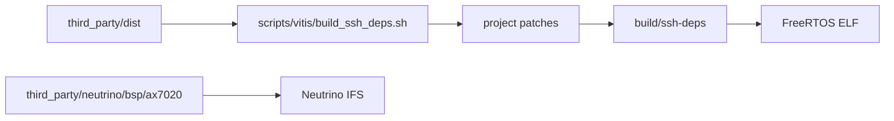

# Сторонние зависимости

Каталог содержит исходные архивы, которые нужны для offline-сборки опциональной
FreeRTOS SSH/SCP/SFTP-подсистемы и для Neutrino BSP snapshot.

## 1. Состав

| Компонента | Источник | Использование |
|---|---|---|
| wolfSSL | `dist/wolfssl-5.9.2.tar.gz` | wolfCrypt, SHA-256, RSA |
| wolfSSH | `dist/wolfssh-1.5.0.tar.gz` | SSH server, SCP, SFTP |
| AX7020 BSP | `neutrino/bsp/ax7020/` | Neutrino install tree и image base |

Pinned revisions архивов:

| Архив | Revision |
|---|---|
| `wolfssl-5.9.2.tar.gz` | `5b22fa901e81d925a70ab1584ae792c8e92e34a5` |
| `wolfssh-1.5.0.tar.gz` | `6f0cbe3f137fb3c074730acc1dd2cdbfd685d8f5` |

## 2. Build flow

SSH dependencies распаковываются в `build/ssh-deps/`. Производные библиотеки
в каталог `third_party/` не записываются.

## 3. Лицензии и поставка

Архивы содержат исходные license files wolfSSL и wolfSSH. Перед поставкой
продукта следует проверить условия GPL/commercial licensing по файлам внутри
соответствующих архивов и выбранной модели лицензирования.

## 4. Правила хранения

| Данные | Размещение |
|---|---|
| исходный архив | `third_party/dist/` |
| проектный patch | `scripts/vitis/` |
| compiler output | `build/ssh-deps/` |
| host keys и secrets | локальное защищённое хранилище |

Компиляторные результаты, host keys и пароли в этот каталог не помещаются.
